# CardioGood Fitness: Treadmill Customer Profiling

> _Descriptive analytics to build a buyer profile for each of three treadmill product lines_

## Overview

We set out to describe what kind of shopper buys each of the company's three treadmill models.

- AdRight's market research team must define the typical customer profile for each CardioGood Fitness treadmill: TM195, TM498, and TM798.
- Goal is to learn whether buyer characteristics differ meaningfully across the three product lines.
- Insights guide targeted marketing and help match each model to the right audience.
- Pure exploratory and descriptive analytics, no predictive modeling required.

## Methodology


## The Data

_We analyzed records from 180 recent treadmill buyers, each described by nine attributes._

- 180 customers who purchased a treadmill in-store over the prior three months, with no missing values.
- Nine variables: Product, Age, Gender, Education, MaritalStatus, Usage, Fitness, Income, and Miles.
- Product mix is uneven: TM195 (80 buyers), TM498 (60), and premium TM798 (40).
- Buyers skew male (104 of 180) and partnered (107 of 180); average age is about 29 years.
- Self-rated fitness runs on a 1-to-5 scale; income ranges from about $29.6K to $104.6K.

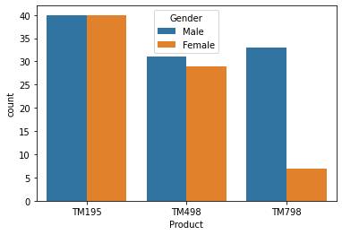

## Exploratory Analysis

_We looked at how age, income, usage, and miles are distributed and how they relate._

- Average income is about $53.7K (median $50.6K) and planned weekly miles average 103, with a long right tail to 360.
- Customers plan to use the treadmill about 3.5 times per week on average (range 2 to 7).
- Distributions for age, income, and miles are right-skewed, with most buyers clustered at the lower end.
- Boxplots by gender and product reveal the spread and outliers behind these averages.
- A pairplot maps the joint structure across all numeric variables at once.

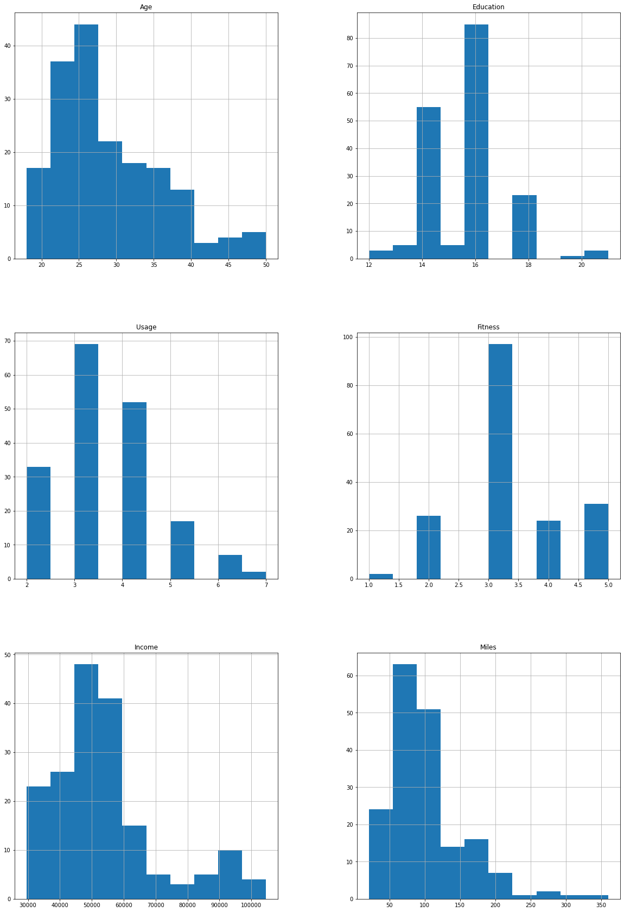

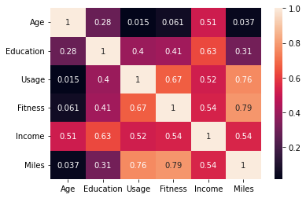

## Key Drivers & Relationships

_A few attributes move together strongly and explain who the heavy users are._

- Miles is most strongly tied to self-rated Fitness (r = 0.79) and weekly Usage (r = 0.76).
- Income correlates with Education (r = 0.63) and moderately with Usage and Fitness (about 0.52 to 0.54).
- Age is largely independent of usage and miles, so older buyers are not necessarily lighter users.
- Fitter, more frequent users plan to log far more weekly miles, marking a distinct high-engagement segment.
- These relationships point to fitness intensity, not demographics, as the main behavioral driver.

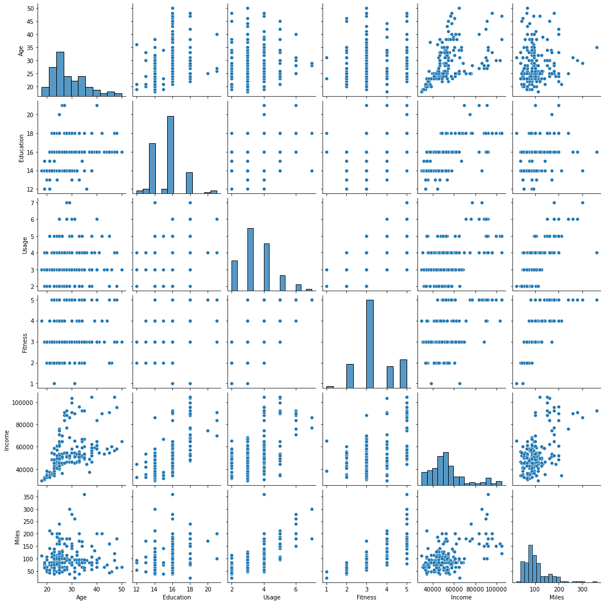

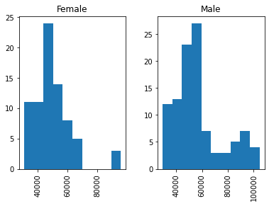

## Insights & Recommendations

_Each model attracts a clearly different buyer, so marketing can be tailored per product._

- TM195 (entry) and TM498 (mid) draw a balanced gender mix; TM798 skews heavily male (33 of 40 buyers).
- TM798 is the premium product: buyers earn far more (often $80K+ vs. roughly $46K-$50K for TM195/TM498).
- TM798 buyers are the fittest and highest-mileage segment, e.g. partnered women averaging 215 weekly miles.
- Position TM798 to affluent, high-fitness enthusiasts; market TM195/TM498 to value-focused, casual users.
- Use income, education, and fitness level, not age, as the primary segmentation levers.

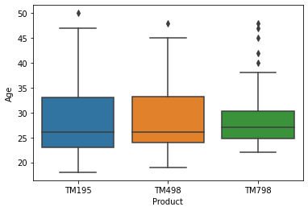

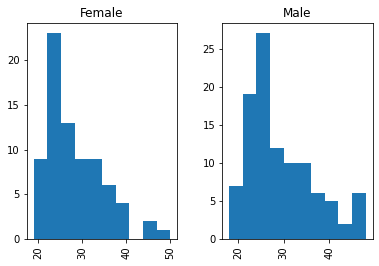

## Key Takeaways

_Clear, data-backed customer profiles now distinguish all three treadmill lines._

- Three distinct profiles emerged across 180 buyers, validating that product lines serve different audiences.
- Fitness and usage intensity, captured by weekly miles, separate premium TM798 buyers from the rest.
- Income and education, not age, are the strongest demographic differentiators.
- Descriptive analytics alone delivered actionable, segment-specific marketing direction.
- Built with: pandas, numpy, matplotlib, seaborn, scikit-learn

## More Visualizations

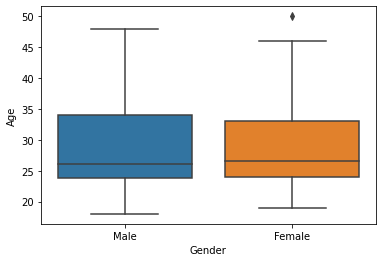
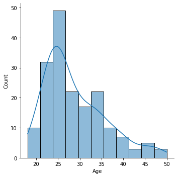
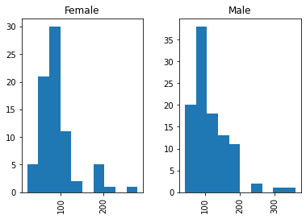
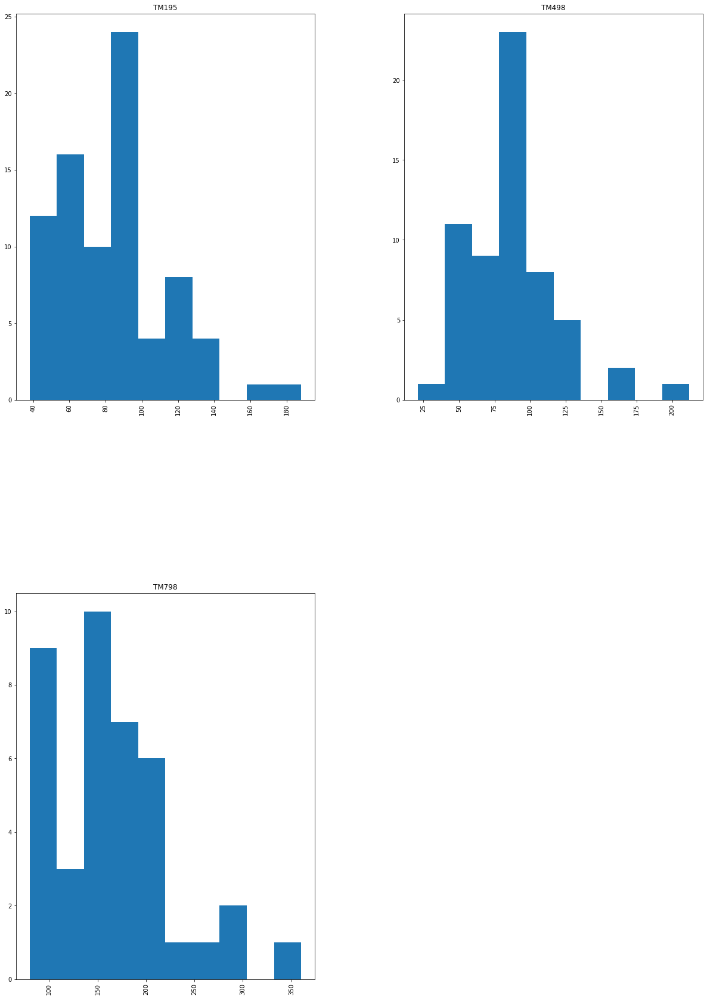


## Tech Stack

- **pandas** — data wrangling and tabular manipulation
- **numpy** — fast numerical arrays
- **scikit-learn** — modeling, pipelines, and evaluation
- **seaborn** — statistical visualization
- **matplotlib** — plotting

## How to Run

```bash
python -m venv .venv && source .venv/Scripts/activate  # Windows: .venv\\Scripts\\activate
pip install -r requirements.txt
jupyter notebook "Notebook+-+CardioGood+Fitness+Data+Analysis.ipynb"
```

> Note: large image/zip datasets are not committed; a `data/` note or download link is provided where applicable.

## Notes & Limitations

- Built on a program-provided case study; scope follows the original brief.
- Some deep-learning notebooks were re-run with reduced epochs locally (CPU) — see training curves.
- Metrics reflect the dataset as provided; production use would add monitoring and retraining.

## Attribution

This project was completed as part of the **MIT Applied Data Science Program** (MIT IDSS / Great Learning). The program provided the case-study scaffolding; the analysis, code, and results are my own. Published with permission, for portfolio use only.
