# FIFA World Cup Analysis

> _Mining 80+ years of World Cup history to guide a new football club's strategy_

## Overview

A brand-new football club asked us to dig through World Cup history to learn what drives winning nations, attendance, and goals.

- Newly inaugurated club 'Brussels United FC' needs data-driven insight into World Cup performance and trends.
- Goal: identify which countries win most, and analyze attendance, goals scored, and host-city patterns.
- Scope spans every World Cup in history through 2014 across three linked datasets.
- Framed as a foundational exploratory data analysis (EDA), not a predictive modeling task.

## Methodology


## The Data

_We combined three official datasets covering every tournament, every match, and every player up to 2014._

- WorldCups dataset: 20 tournaments (rows) across 10 columns of summary stats.
- WorldCupMatches and WorldCupPlayers datasets capture per-match results and player line-ups.
- Fields include Year, GoalsScored, MatchesPlayed, QualifiedTeams, Attendance, Stadium, City, and Stage.
- Cleaning: mode imputation for missing Position/Event, mean/median imputation on numeric match fields.
- GoalsScored averages 118.95 per tournament with a standard deviation of 32.97 across the 20 cups.

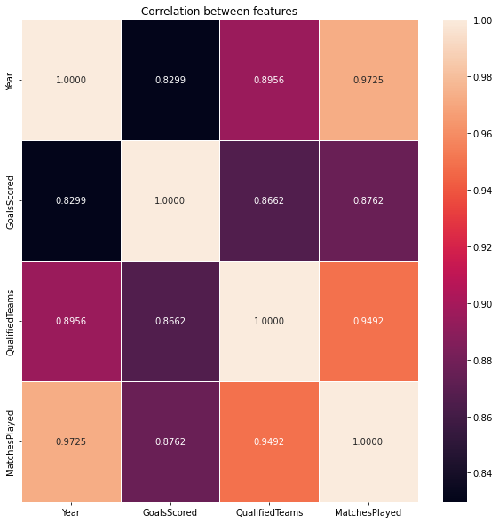

## Exploratory Analysis

_We checked distributions, spotted outliers with box plots, and mapped how the key numbers relate to each other._

- Box plots used to detect and remove outliers via the IQR rule (Q1-1.5*IQR, Q3+1.5*IQR).
- Distribution checks guided whether to use mean vs median imputation on skewed columns.
- Correlation heatmap shows MatchesPlayed and Year are strongly positively correlated.
- Univariate and bivariate analysis (scatter, line) explored goals, matches, and year together.
- Both Matplotlib and Seaborn compared as visualization tools throughout the workflow.

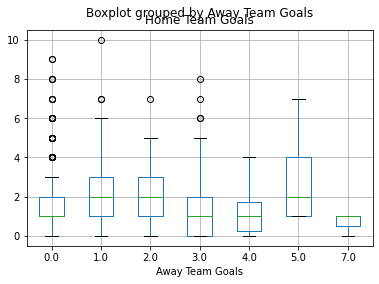

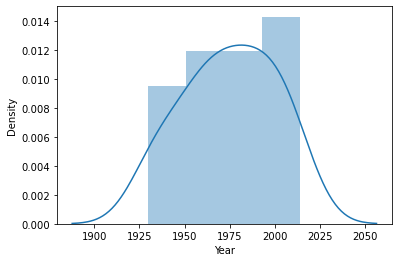

## Key Findings & Drivers

_More goals over the years come from playing more matches, not from teams actually scoring more per game._

- Year and GoalsScored are positively correlated, but Year and AverageGoal are negatively correlated.
- The rise in total goals is driven by more MatchesPlayed, not higher per-match scoring.
- Tournament size grew from 13-16 teams (1934-1978) to larger fields in later cups.
- Mexico City has the highest average match attendance at roughly 93,807 spectators.
- One city hosted as many as 23 World Cup matches, the maximum in the dataset.

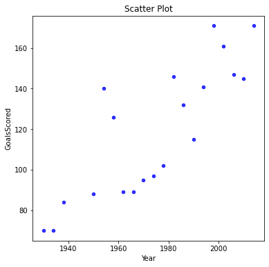

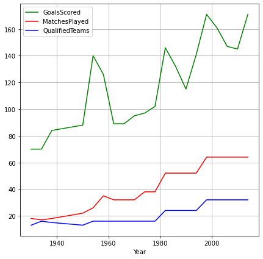

## Insights & Recommendations

_A handful of nations dominate the trophy, and host cities and attendance show clear, actionable patterns._

- Only eight nations have won the 20 tournaments; Brazil leads with five titles (1958, 1962, 1970, 1994, 2002).
- Germany and Italy follow with four titles each; Argentina and Uruguay with two each.
- Brazil is the only team to have played in every World Cup tournament.
- Home teams win a notable share of matches, an edge the club should factor into strategy.
- Target high-attendance host cities like Mexico City for maximum match exposure.

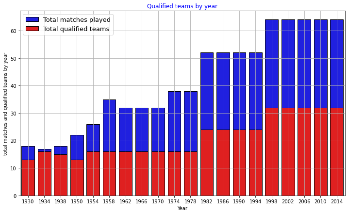

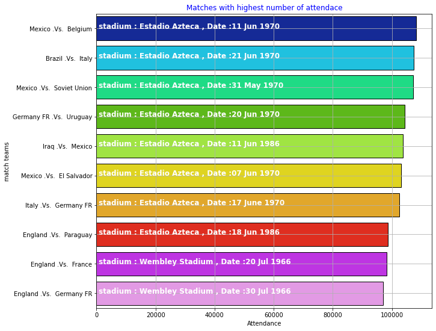

## Key Takeaways

_The analysis turns decades of raw results into a clear, evidence-based picture of what wins and what fills stadiums._

- Winning is concentrated in a few elite nations, led decisively by Brazil.
- Goal totals rise with more matches, not with sharper scoring per game.
- Attendance and host-city analysis reveal where the sport draws the biggest crowds.
- End-to-end EDA workflow: cleaning, imputation, outlier handling, and rich visualization.
- Built with: pandas, NumPy, Matplotlib, Seaborn

## More Visualizations

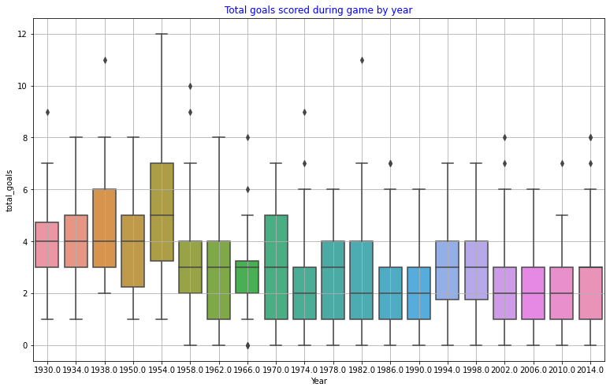
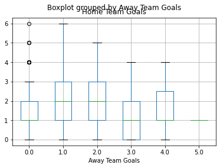
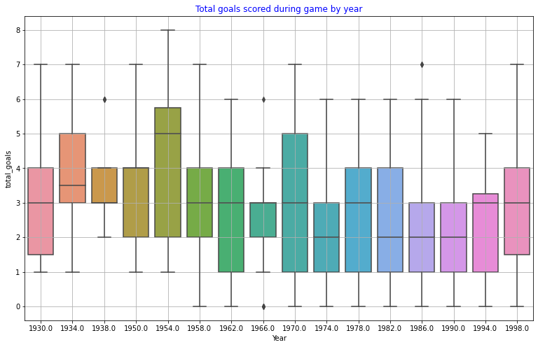
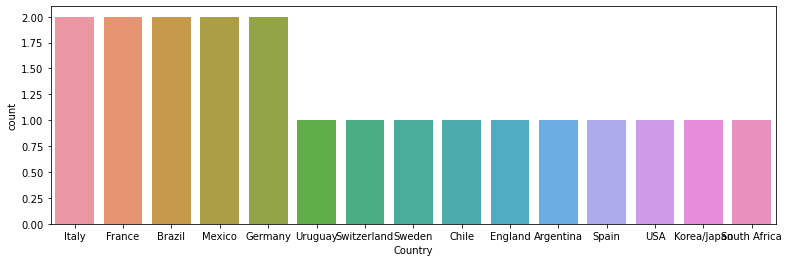


## Tech Stack

- **pandas** — data wrangling and tabular manipulation
- **numpy** — fast numerical arrays
- **seaborn** — statistical visualization
- **matplotlib** — plotting

## How to Run

```bash
python -m venv .venv && source .venv/Scripts/activate  # Windows: .venv\\Scripts\\activate
pip install -r requirements.txt
jupyter notebook "FIFA+World+Cup+Solution.ipynb"
```

> Note: large image/zip datasets are not committed; a `data/` note or download link is provided where applicable.

## Notes & Limitations

- Built on a program-provided case study; scope follows the original brief.
- Some deep-learning notebooks were re-run with reduced epochs locally (CPU) — see training curves.
- Metrics reflect the dataset as provided; production use would add monitoring and retraining.

## Attribution

This project was completed as part of the **MIT Applied Data Science Program** (MIT IDSS / Great Learning). The program provided the case-study scaffolding; the analysis, code, and results are my own. Published with permission, for portfolio use only.
