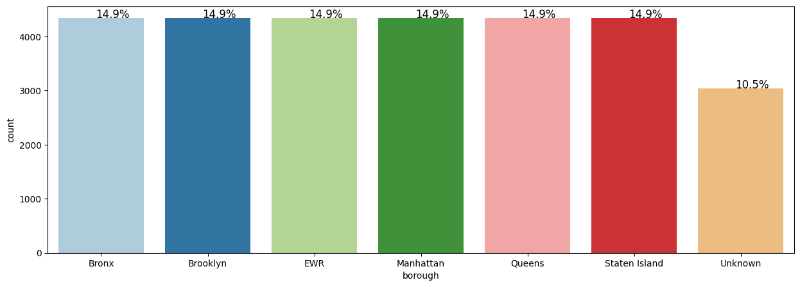
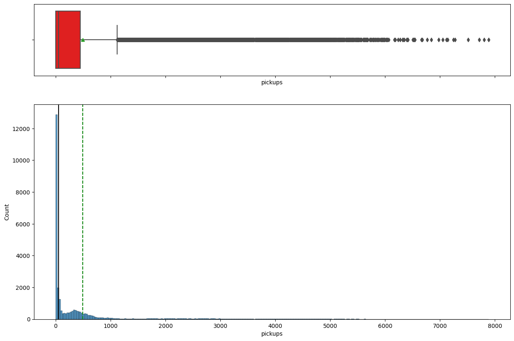
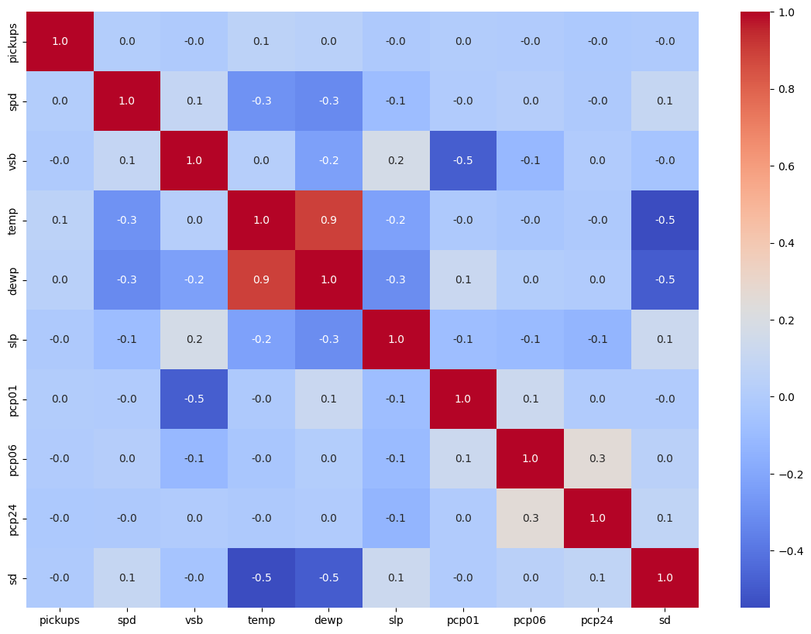
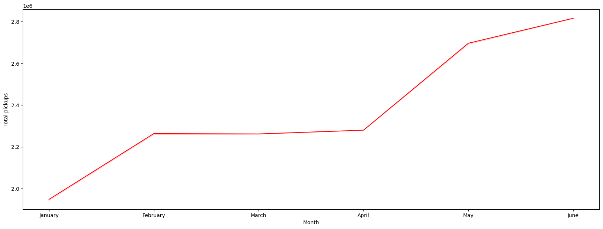
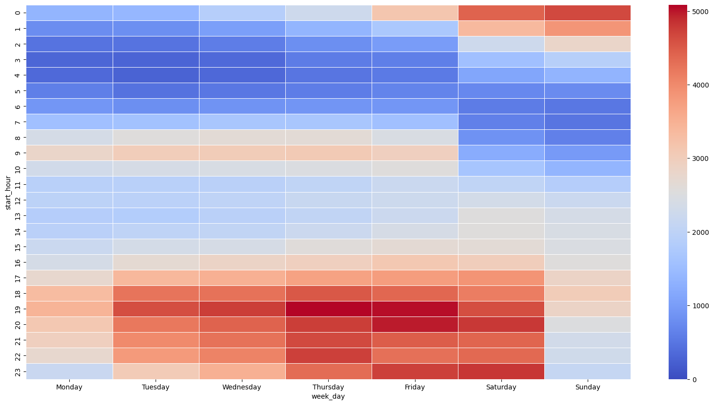
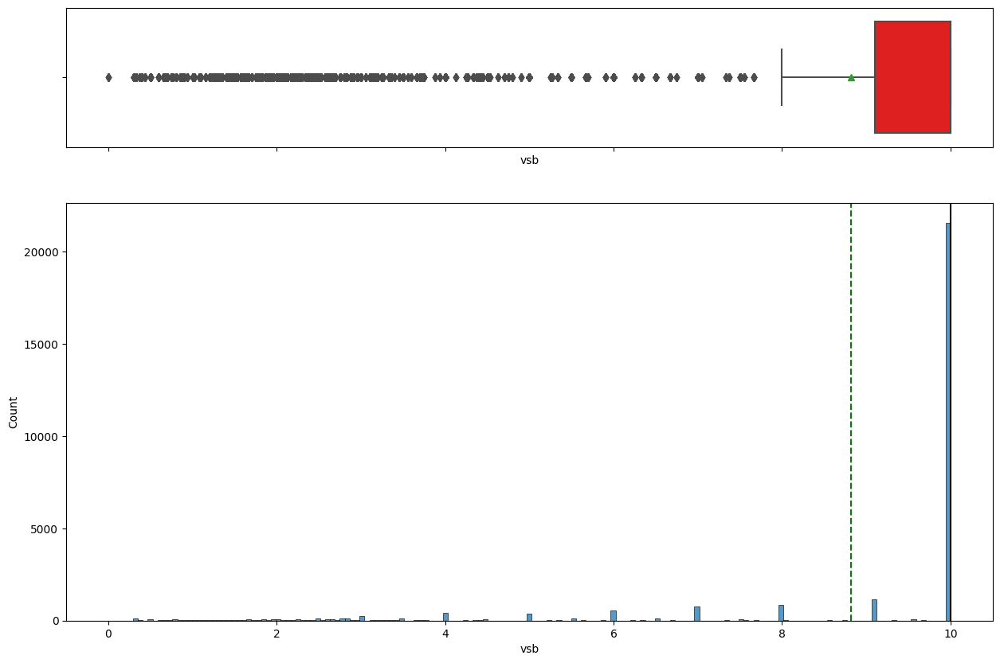
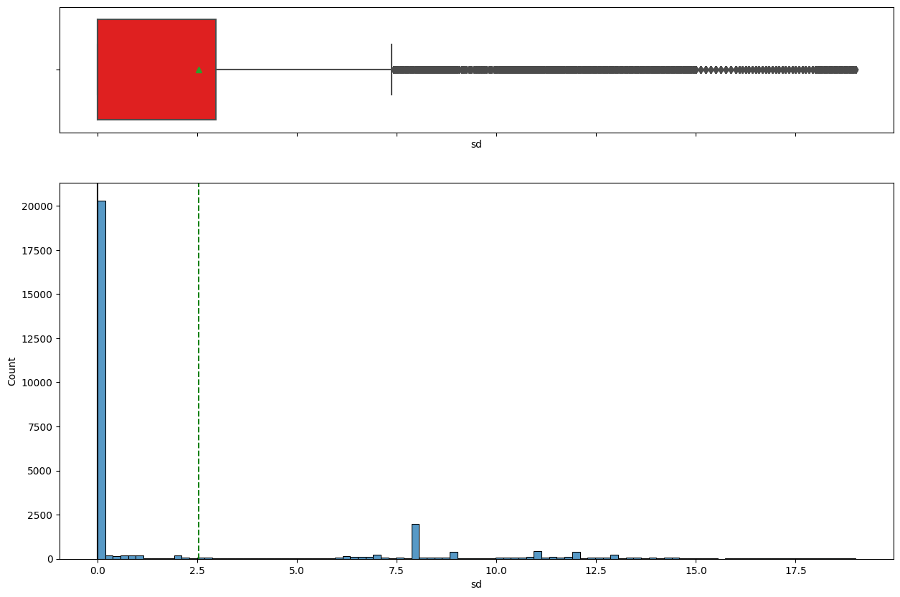
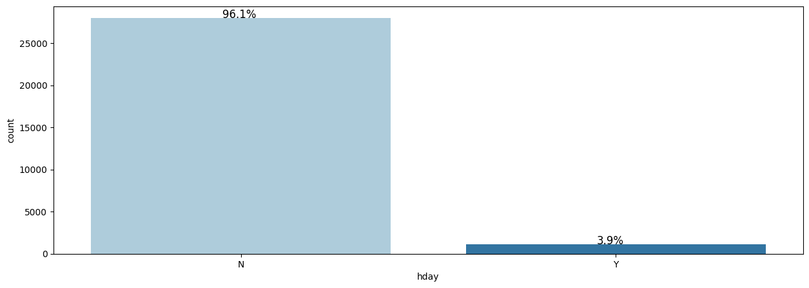
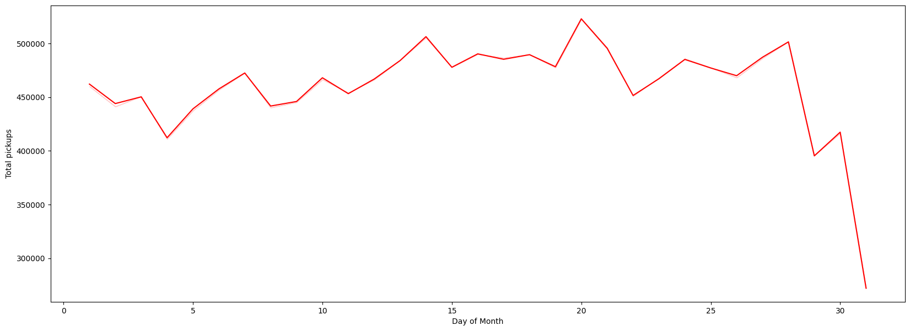

# Uber NYC Trip Demand Analysis

> _Exploring six months of NYC Uber pickups to understand when and where ride demand peaks_

## Overview

We studied half a year of New York Uber pickups to learn what times, places, and weather drive rider demand.

- Uber operates in ~72 countries and 10,500 cities, with 118M monthly active users as of Q4 2021.
- Goal: find patterns in hourly NYC pickups across boroughs, time, and weather.
- Identify peak hours, peak days, and the busiest boroughs to guide driver supply.
- Turn raw hourly logs into actionable demand insights for operations planning.

## Methodology


## The Data

_The dataset is 29,101 hourly records of NYC Uber pickups from January to June 2015, with weather and location fields._

- 29,101 rows and 13 columns spanning Jan 1 to Jun 30, 2015 (six months).
- Fields include pickupdt timestamp, borough, hourly pickups, plus weather (temp, visibility, snow depth).
- Borough had 3,043 missing values (~15%), treated as a separate 'Unknown' category.
- Six boroughs are nearly evenly represented; only 3.9% of days were holidays.
- pickupdt converted to DateTime; borough and hday set as categorical.



## Exploratory Analysis

_We charted how pickups vary and how weather and ride variables relate to each other._

- Hourly pickups are highly right-skewed: median is 0 but mean is ~500, with many high outliers.
- Visibility is left-skewed and generally good, with a few very-low-visibility outlier days.
- Snow depth shows snowfall in the period with outliers, expected to suppress pickups.
- Temperature shows high correlation with dew point; visibility is negatively correlated with precipitation.





## Key Findings

_Demand grew month over month and was heavily concentrated in Manhattan and in evening commute hours._

- Monthly bookings rose steadily; June pickups were almost 1.5x January.
- Pickups peak around the 20th of the month and drop near month-end (29th-31st).
- Demand rises through the week, peaks around Saturday, then drops; Mondays are lowest.
- Manhattan dominates pickups; Brooklyn and Queens trail; EWR, Staten Island, Unknown are negligible.
- Mean pickups are lower on holidays overall, though Queens sees higher holiday demand.



## Insights & Recommendations

_Pickups peak in the evening commute, so drivers should be concentrated in Manhattan during those hours._

- Bookings peak at the 19th-20th hour (evening commute) and bottom out around 5 AM.
- A secondary morning rise from 5-10 AM reflects the office commute.
- Late-night demand stays high on Friday and Saturday, especially in Manhattan.
- All four major boroughs share the same hourly pattern (clear on a log scale); EWR demand is near-random.
- Allocate the most drivers to Manhattan during weekday evenings and weekend late nights.



## Key Takeaways

_Uber NYC demand is predictable by hour, day, borough, and weather, enabling smarter driver allocation._

- Analyzed ~30K hourly pickup records across six NYC boroughs over six months of 2015.
- Demand is concentrated in Manhattan and peaks during evening commute hours.
- Weekly, monthly, and holiday patterns provide a basis for supply planning.
- Weather (snow, visibility) and time of day are key levers on ride demand.
- Built with: pandas, numpy, matplotlib, seaborn, datetime

## More Visualizations







## Tech Stack

- **pandas** — data wrangling and tabular manipulation
- **numpy** — fast numerical arrays
- **seaborn** — statistical visualization
- **matplotlib** — plotting

## How to Run

```bash
python -m venv .venv && source .venv/Scripts/activate  # Windows: .venv\\Scripts\\activate
pip install -r requirements.txt
jupyter notebook "Uber_Case_Study.ipynb"
```

> Note: large image/zip datasets are not committed; a `data/` note or download link is provided where applicable.

## Notes & Limitations

- Built on a program-provided case study; scope follows the original brief.
- Some deep-learning notebooks were re-run with reduced epochs locally (CPU) — see training curves.
- Metrics reflect the dataset as provided; production use would add monitoring and retraining.

## Attribution

This project was completed as part of the **MIT Applied Data Science Program** (MIT IDSS / Great Learning). The program provided the case-study scaffolding; the analysis, code, and results are my own. Published with permission, for portfolio use only.
