# CAVIAR Criminal Network Analysis

> _Tracking how a Montreal drug-trafficking network reorganized under repeated police seizures_

## Overview

We studied how a real criminal drug network kept operating even as police repeatedly seized its product.

- CAVIAR was a 1994-1996 Montreal Police / RCMP operation targeting a drug-trafficking network over two years.
- Unusual mandate: seize drugs without arresting anyone until the very end, so the network stayed live and observable.
- Drugs were seized on 11 occasions, with trafficker losses estimated at 32 million dollars.
- Objective: map the network across time and see who stayed central as police pressure forced it to reorganize.

## Methodology


## The Data

_The evidence was 11 snapshots of who was talking to whom, captured from court-authorized wiretaps._

- 11 wiretap warrants, each valid ~2 months, define 11 sequential phases of the investigation.
- Each phase is stored as an adjacency matrix in a DataFrame capturing communication links between actors.
- Cleaning step: set the node index correctly and convert column labels to integers to match row indices.
- Each matrix was converted to a graph with NetworkX's from_pandas_adjacency for analysis.
- Seizures were uneven across phases, e.g. Phase 10 alone was 18.7M dollars and 2,200 kg of marijuana.

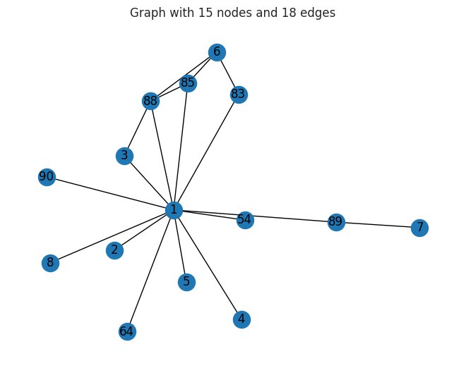

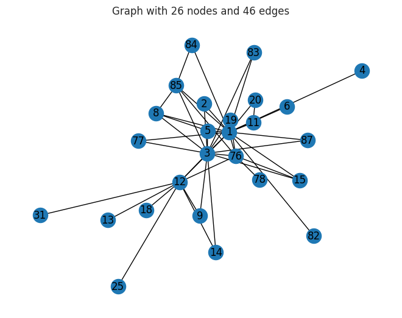

## Exploratory Analysis

_We drew the network for every phase to watch its shape change as the investigation progressed._

- Visualized all 11 phase graphs to see how the network expanded, contracted, and rewired over time.
- Phases varied widely: some had no seizures while others had multiple disruptions in a single window.
- Early phases show a tighter core; later phases reflect reorganization in response to product losses.
- Visual inspection set up the need for quantitative centrality measures to rank actor importance.

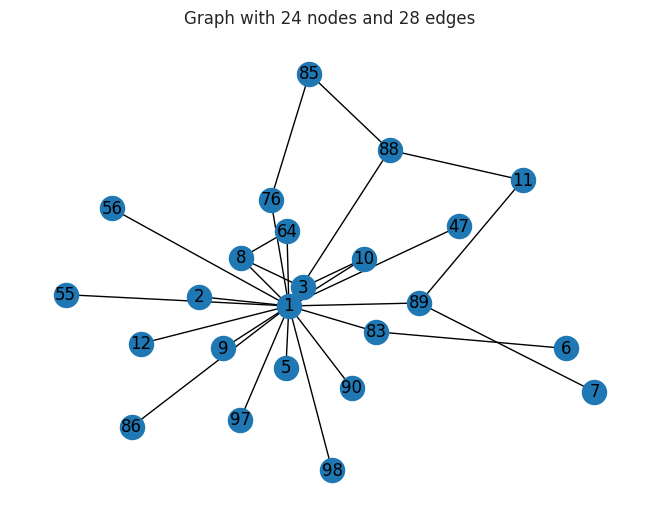

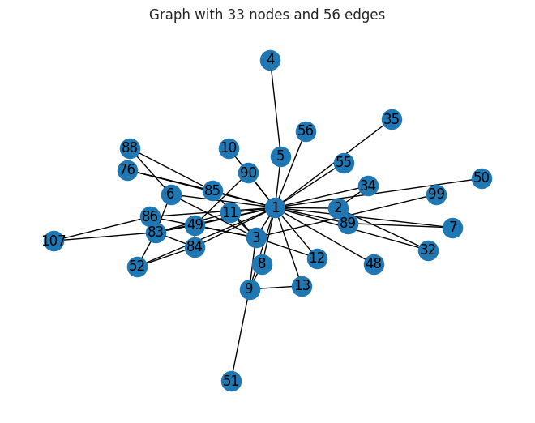

## Key Actors & Centrality

_Math on the network pointed to a small set of people who consistently held it together._

- Computed degree, eigenvector, betweenness, and closeness centrality (deg_cen, eig_cen, betw_cen, clo_cen) per phase.
- Sorted each measure to surface the top 5 most important nodes in every phase.
- Three actors recur as central: N1 (Daniel Serero), N3 (Pierre Perlini), and N12 (Ernesto Morales).
- Betweenness flagged actors acting as brokers bridging otherwise disconnected parts of the network.
- The Phase 2 graph highlights nodes 1, 3, and 12 in red to make the core players visible.

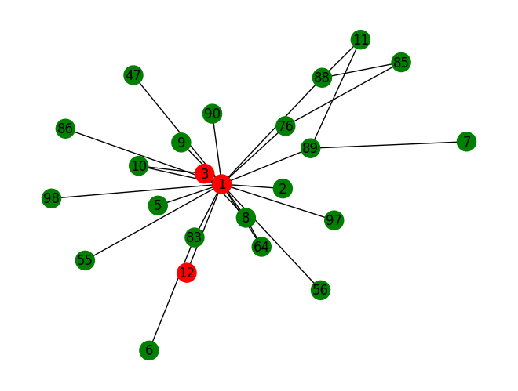

## How the Network Evolved

_We tracked the key players phase by phase to see how their roles shifted under police pressure._

- Plotted degree and betweenness centrality for nodes 1, 3, and 12 across all 11 phases.
- Importance was not static: actors rose and fell in influence as seizures disrupted operations.
- Centrality dips and recoveries trace how the network reoriented to keep moving product.
- The trajectories show resilience, with central roles being reassigned rather than the network collapsing.

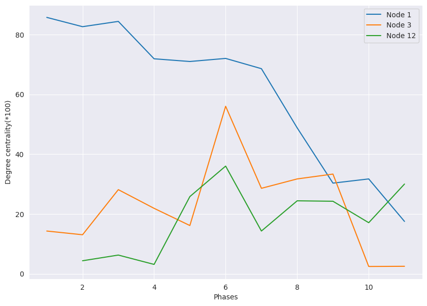

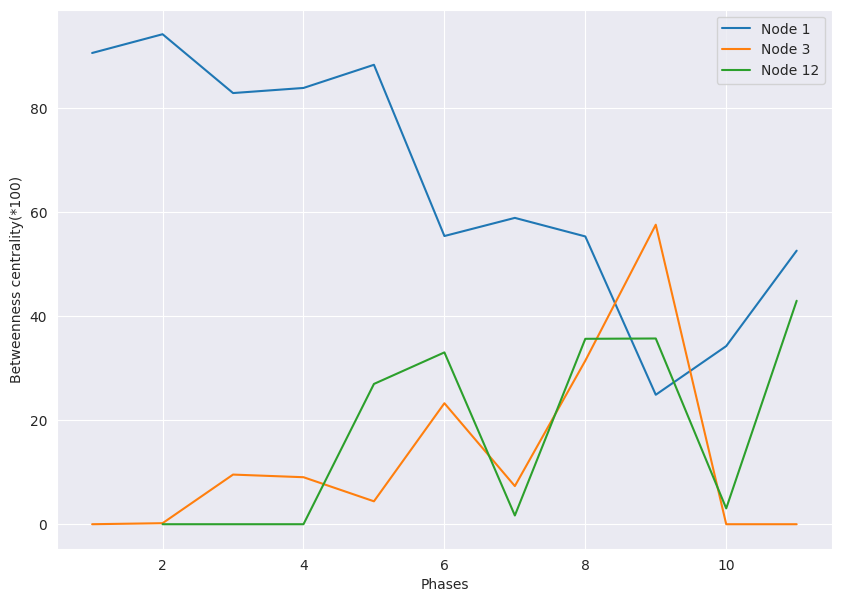

## Key Takeaways

_Network analysis turned raw wiretap matrices into a clear story of who mattered and how the network adapted._

- Adjacency matrices from 11 wiretap phases can be read directly into graphs for time-varying analysis.
- Centrality measures reliably identified the network's key brokers across the two-year operation.
- Three individuals (Serero, Perlini, Morales) remained pivotal despite repeated 32M-dollar disruptions.
- Tracking centrality over time reveals network resilience and reorganization, not just static structure.
- Built with: networkx, pandas, numpy, matplotlib, seaborn

## More Visualizations

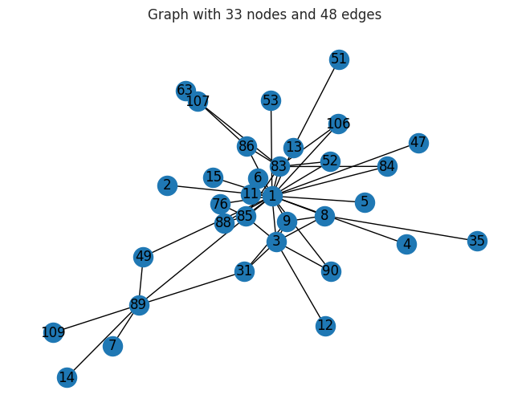
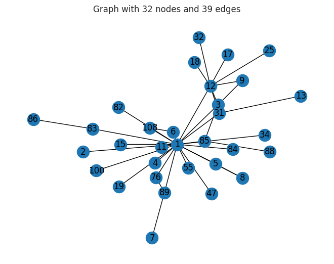
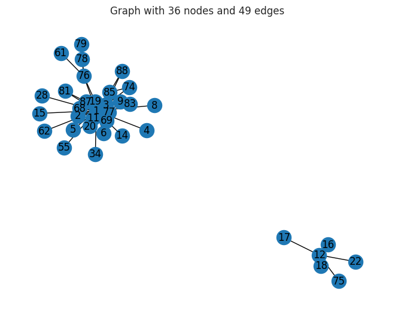
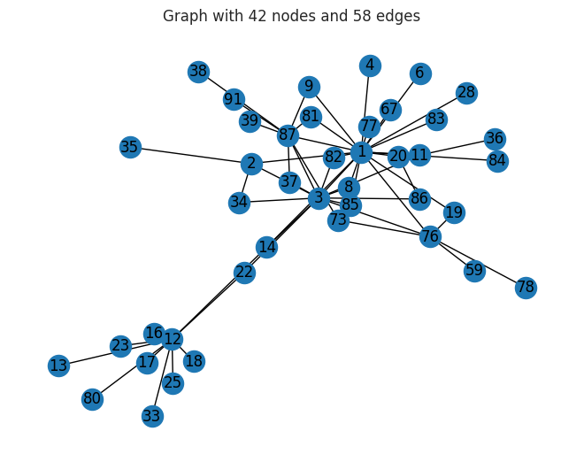


## Tech Stack

- **pandas** — data wrangling and tabular manipulation
- **numpy** — fast numerical arrays
- **seaborn** — statistical visualization
- **matplotlib** — plotting
- **networkx** — graph / network analysis

## How to Run

```bash
python -m venv .venv && source .venv/Scripts/activate  # Windows: .venv\\Scripts\\activate
pip install -r requirements.txt
jupyter notebook "LVC+2+Practical+Application+Case+Study_CAVIAR-1.ipynb"
```

> Note: large image/zip datasets are not committed; a `data/` note or download link is provided where applicable.

## Notes & Limitations

- Built on a program-provided case study; scope follows the original brief.
- Some deep-learning notebooks were re-run with reduced epochs locally (CPU) — see training curves.
- Metrics reflect the dataset as provided; production use would add monitoring and retraining.

## Attribution

This project was completed as part of the **MIT Applied Data Science Program** (MIT IDSS / Great Learning). The program provided the case-study scaffolding; the analysis, code, and results are my own. Published with permission, for portfolio use only.
