# Clustering Countries by Socio-Economic Profile

> _Grouping 167 nations by health, trade, and income indicators to guide aid and development decisions_

## Overview

We wanted to sort countries into meaningful groups based on how developed and well-off they are.

- Governments and NGOs need data-driven ways to identify which countries most need development aid.
- Goal: group 167 countries by socio-economic and health indicators using unsupervised clustering.
- No labels exist, so clusters must be discovered purely from patterns in the data.
- Compare multiple algorithms to find groupings that are distinct and actionable.

## Methodology


## The Data

_Each country is described by nine numbers covering its economy, trade, and population health._

- 167 countries, 10 columns (9 numeric features plus country name), with no missing values or duplicates.
- Features include child mortality, exports, imports, health spend, income, inflation, life expectancy, fertility, GDP per capita.
- Child mortality ranges widely from 2.6 to 208 deaths per 1000 live births (mean approx. 38).
- Most variables are right-skewed with outliers; life expectancy is the only left-skewed feature.
- Features were standardized before clustering since distance-based methods are scale-sensitive.

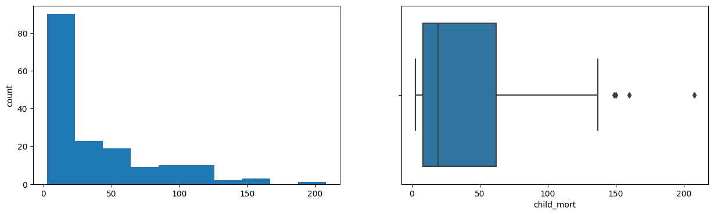

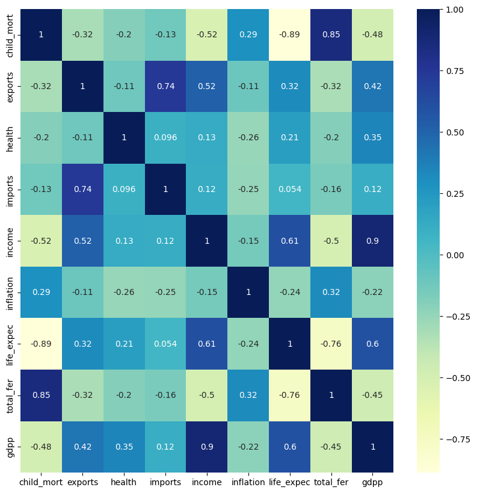

## Exploratory Analysis

_Richer countries clearly tend to be healthier, and poverty tracks closely with high child mortality._

- Strong positive correlation between GDP per capita and income, as expected.
- Life expectancy rises with GDP per capita: people live longer in richer countries.
- Life expectancy is strongly negatively correlated with child mortality.
- High-fertility countries tend to have larger populations and lower per-capita income.
- Exports and imports span a huge range, with maxima near 200% of GDP.


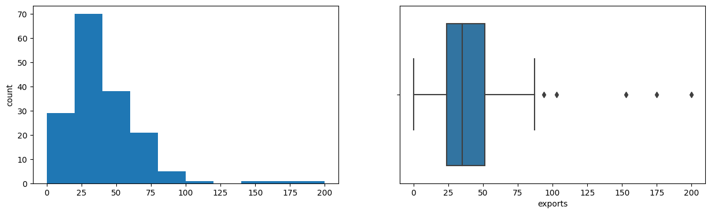

## Clusters Discovered

_Several methods all pointed to roughly three groups: rich, poor, and a large middle._

- K-Means elbow plot dipped steadily from 2 to 8 with no clear elbow; silhouette score peaked at K=3.
- K-Means gave a skewed split: a tiny 3-country high-income cluster versus 100+ in the largest group.
- K-Medoids, GMM each found 3 clusters: high income, low income, and a large 'everything else' group.
- Hierarchical (complete linkage) dendrogram cut at distance approx. 9 yielded 4 clusters.
- DBSCAN returned 4 clusters, isolating extreme outliers (cluster -1) from compact core groups.

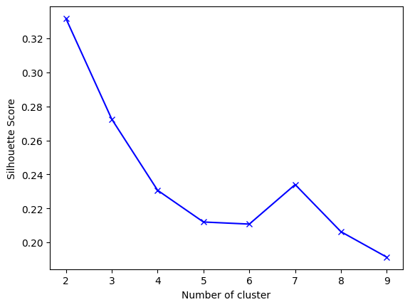

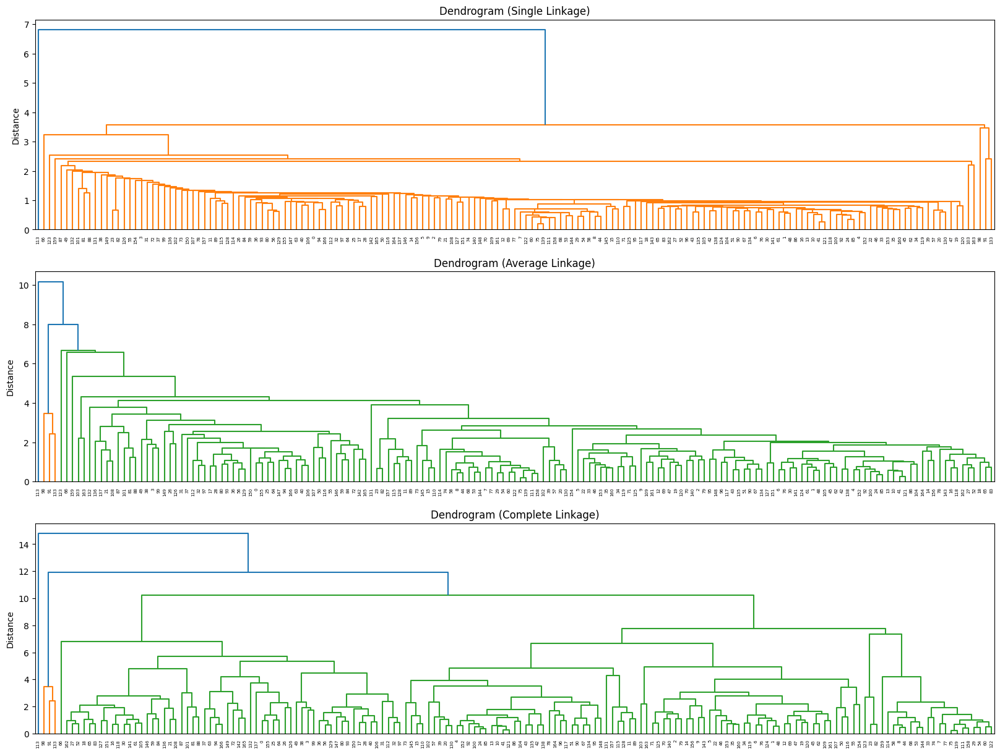

## Interpretation & Recommendations

_The cleanest grouping separates struggling countries that need aid from prosperous trade hubs._

- High-income cluster: 3 outlier trade hubs (Luxembourg, Malta, Singapore) with the highest import/export ratios.
- Low-income cluster: highest child mortality, trade deficits, inflation, and lowest GDP and net income.
- Hierarchical clustering isolated Nigeria alone, driven by its extreme 104% inflation rate.
- K-Medoids recommended as the practical choice: its extreme clusters are the most distinct from each other.
- Aid and development efforts should prioritize the low-income cluster's high-mortality, low-GDP nations.

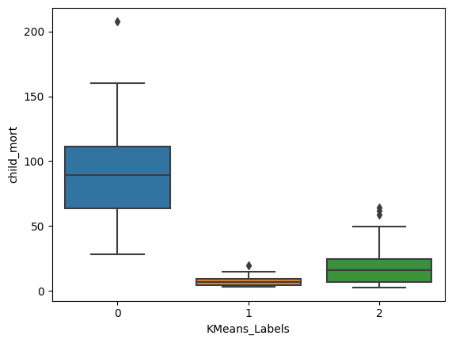

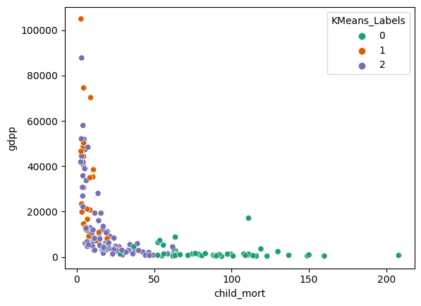

## Key Takeaways

_Comparing five clustering methods produced a robust, three-tier view of global development._

- Five algorithms (K-Means, K-Medoids, GMM, Hierarchical, DBSCAN) converged on a rich/poor/middle structure.
- Best algorithm depends on use case, but K-Medoids gave the most distinct, interpretable clusters.
- Scaling and outlier awareness were essential since distance metrics drive every method.
- A few extreme economies (tiny trade hubs, high-inflation Nigeria) repeatedly split off as their own groups.
- Built with: pandas, numpy, matplotlib, seaborn, scikit-learn, scikit-learn-extra, scipy

## More Visualizations

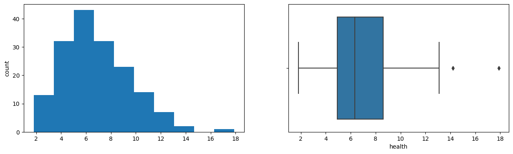
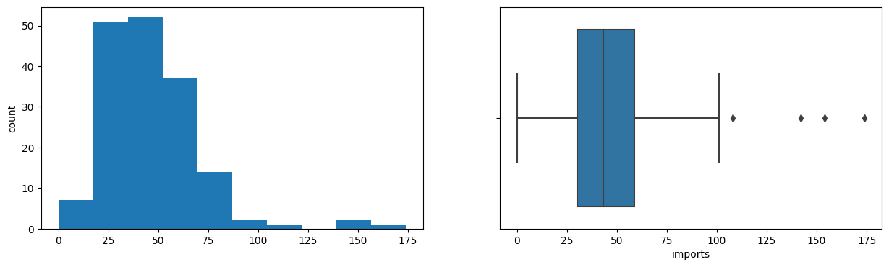
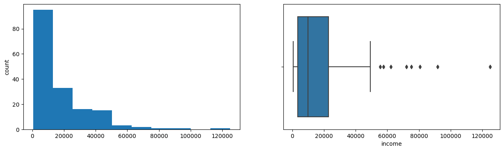
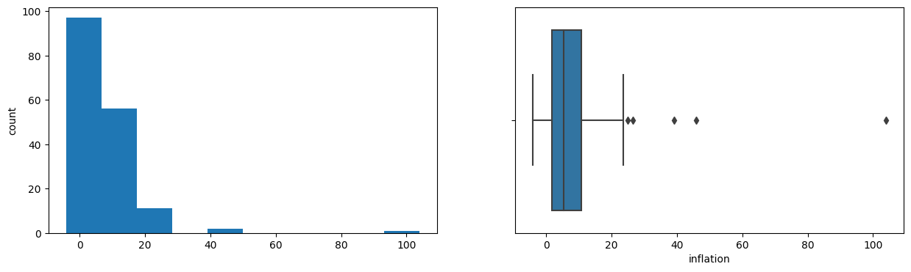


## Tech Stack

- **pandas** — data wrangling and tabular manipulation
- **numpy** — fast numerical arrays
- **scikit-learn** — modeling, pipelines, and evaluation
- **seaborn** — statistical visualization
- **matplotlib** — plotting
- **scipy** — scientific computing

## How to Run

```bash
python -m venv .venv && source .venv/Scripts/activate  # Windows: .venv\\Scripts\\activate
pip install -r requirements.txt
jupyter notebook "Practice_Case_Study_Clustering.ipynb"
```

> Note: large image/zip datasets are not committed; a `data/` note or download link is provided where applicable.

## Notes & Limitations

- Built on a program-provided case study; scope follows the original brief.
- Some deep-learning notebooks were re-run with reduced epochs locally (CPU) — see training curves.
- Metrics reflect the dataset as provided; production use would add monitoring and retraining.

## Attribution

This project was completed as part of the **MIT Applied Data Science Program** (MIT IDSS / Great Learning). The program provided the case-study scaffolding; the analysis, code, and results are my own. Published with permission, for portfolio use only.
