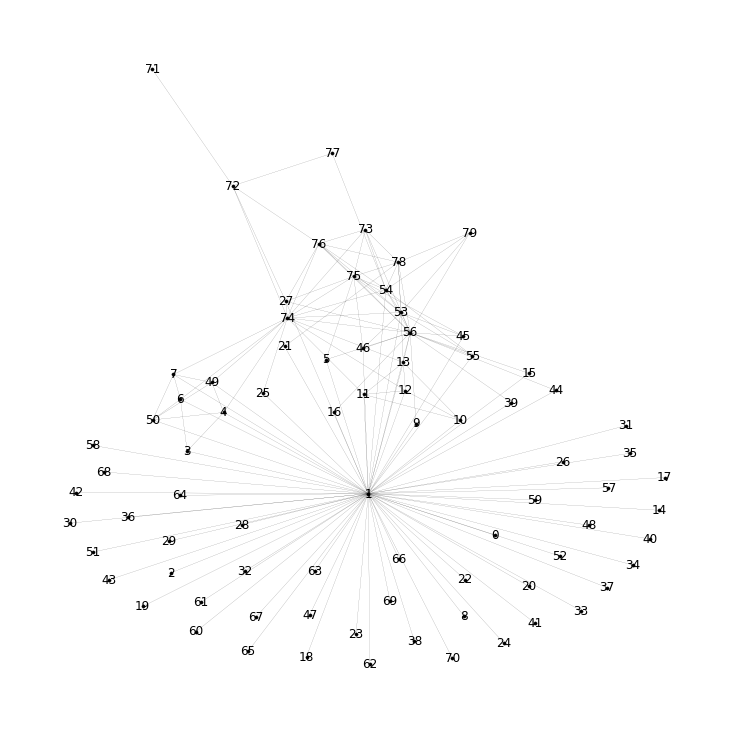
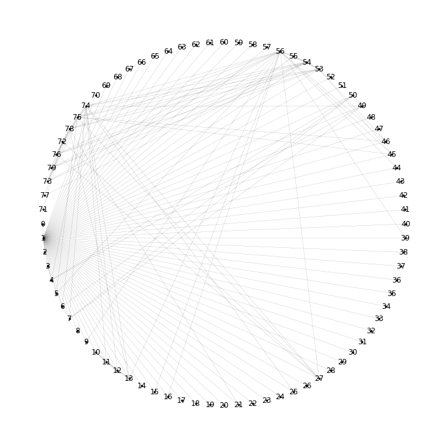
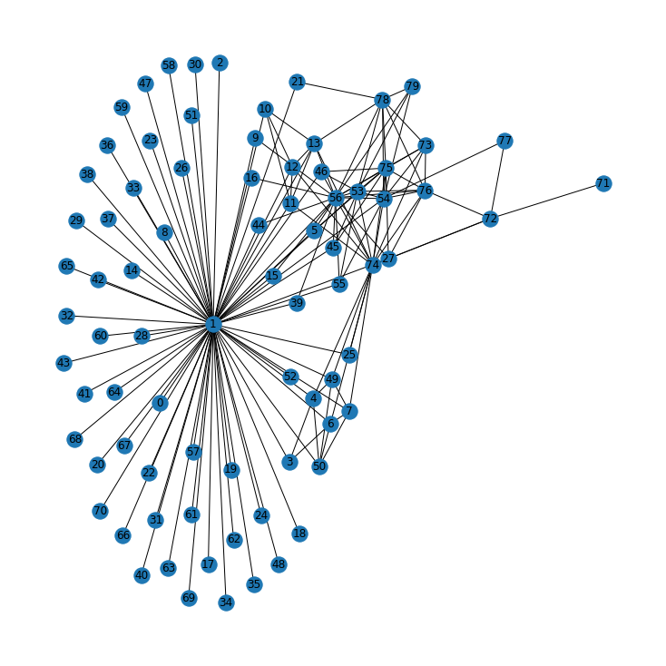
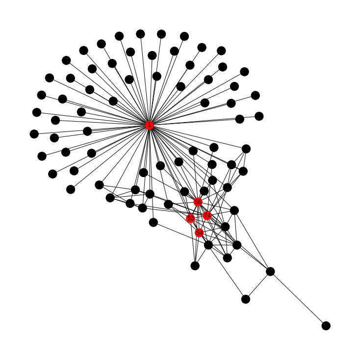
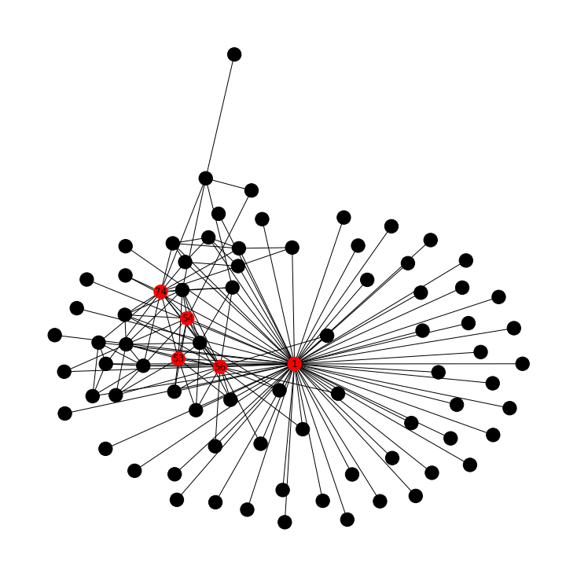
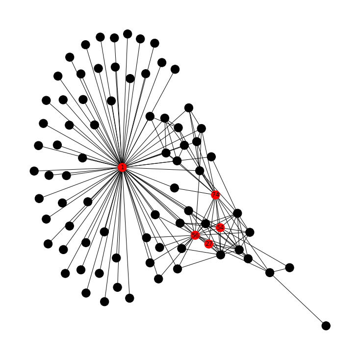
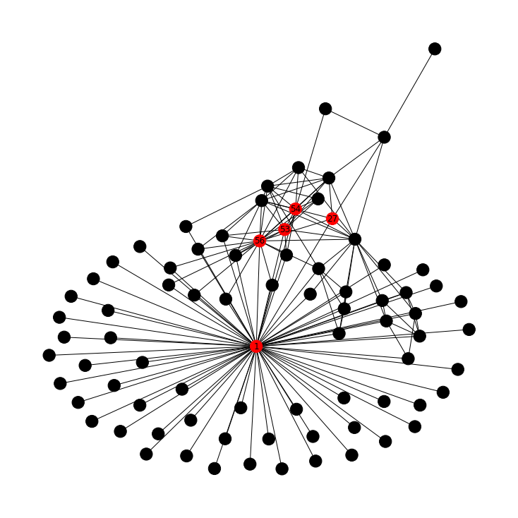

# Enron Email Network Analysis

> _Using social network analysis to surface the key actors in Enron's senior leadership_

## Overview

We studied who emailed whom among Enron's top executives to find the most influential people in the group.

- Enron rose to become one of the largest US firms before a sudden collapse, bankruptcy, and one of the biggest corporate fraud cases ever.
- Goal: build a network from emails sent and received by senior officials to expose connections and the most important actors.
- Subset of 50 senior officials drawn from the public Enron email corpus (cs.cmu.edu/~enron).
- Approach: load emails as a graph, visualize structure, then quantify importance with centrality measures.
- Findings help explain organizational influence and which nodes acted as hubs and bridges.

## Methodology


## The Data

_The raw data is a simple list of who sent an email to whom, which we turn into a network of people._

- EmailEnron.csv holds 304 directed From-To email edges between senior officials.
- Two columns only: 'From' and 'To', each a numeric node ID representing an official.
- Loaded into an undirected graph of 80 nodes using NetworkX's from_pandas_edgelist.
- Node degrees range from isolated single-link officials up to one node connected to 70 others.
- Minimal schema makes this a pure structural (topology) analysis rather than a content analysis.

## Exploratory Analysis

_We drew the network several ways to see its overall shape and spot the busiest people at a glance._

- Visualized with three layouts: standard spring draw, shell (circular), and spring_layout.
- Degree inspection shows one dominant node (degree 70) connected to nearly everyone in the group.
- Next-busiest nodes by raw degree: 56 (20), 74 (16), 53 (11), 54 (11), 75 (11).
- Long tail of low-degree nodes (degree 1) indicates peripheral officials with few contacts.
- Circular layout proved clearest for highlighting the hub nodes against the periphery.





## Key Actors / Network Structure

_A handful of people consistently sit at the center of the network, with one clear hub above the rest._

- Node 1 is the central hub, linked to all others; interpreted as a CEO-level figure.
- Nodes 56 and 54 ranked important across every centrality measure computed.
- Other recurring key actors include 74, 53, 27, and 50 across the measures.
- Visualizations suggest internal team structures, though exact team membership stayed unclear.
- Color-coding the top-5 nodes per measure made the influence hierarchy visible on the graph.





## Approach & Results

_We ranked people four different ways to confirm who truly mattered in the network._

- Degree centrality top-5: nodes 1, 56, 74, 53, 54 (most direct connections).
- Eigenvector centrality top-5: nodes 1, 56, 74, 53, 54 (connected to other well-connected nodes).
- Betweenness centrality top-5: nodes 1, 56, 54, 27, 74 (bridges on shortest paths between others).
- Closeness centrality top-5: nodes 1, 56, 53, 54, 27 (shortest average distance to all others).
- Node 1 ranked first on all four measures, confirming it as the unambiguous central authority.





## Key Takeaways

_Network analysis turned a plain email log into a clear map of who held influence at Enron._

- Graph visualization plus centrality measures pinpointed the most important officials objectively.
- Convergence of all four measures on node 1 strongly identifies the top decision-maker.
- Nodes 56 and 54 are consistent secondary power brokers worth deeper investigation.
- Different centralities reveal different roles: hubs (degree) versus connectors (betweenness).
- Built with: pandas, NetworkX, Matplotlib

## More Visualizations




## Tech Stack

- **pandas** — data wrangling and tabular manipulation
- **matplotlib** — plotting
- **networkx** — graph / network analysis

## How to Run

```bash
python -m venv .venv && source .venv/Scripts/activate  # Windows: .venv\\Scripts\\activate
pip install -r requirements.txt
jupyter notebook "Practice_Case_Study_Enron_Network_Analysis.ipynb"
```

> Note: large image/zip datasets are not committed; a `data/` note or download link is provided where applicable.

## Notes & Limitations

- Built on a program-provided case study; scope follows the original brief.
- Some deep-learning notebooks were re-run with reduced epochs locally (CPU) — see training curves.
- Metrics reflect the dataset as provided; production use would add monitoring and retraining.

## Attribution

This project was completed as part of the **MIT Applied Data Science Program** (MIT IDSS / Great Learning). The program provided the case-study scaffolding; the analysis, code, and results are my own. Published with permission, for portfolio use only.
