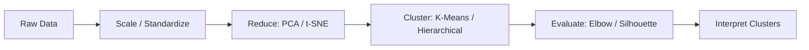
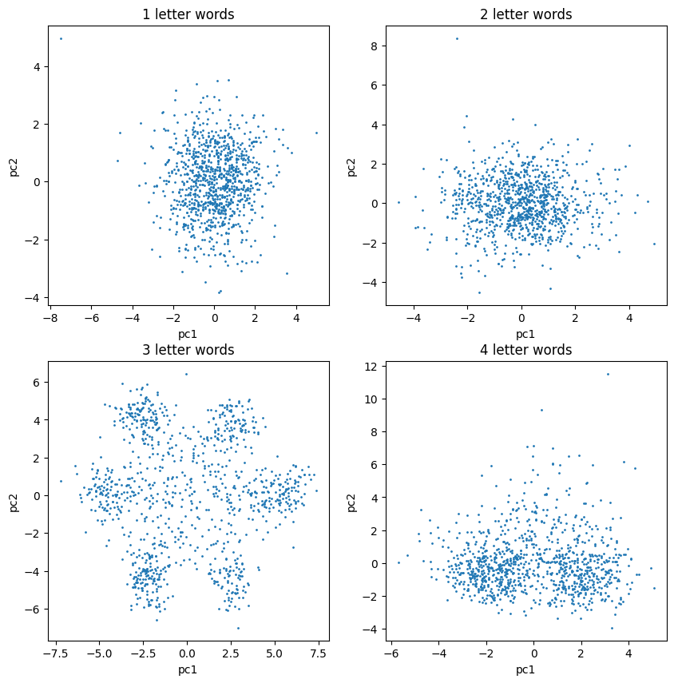
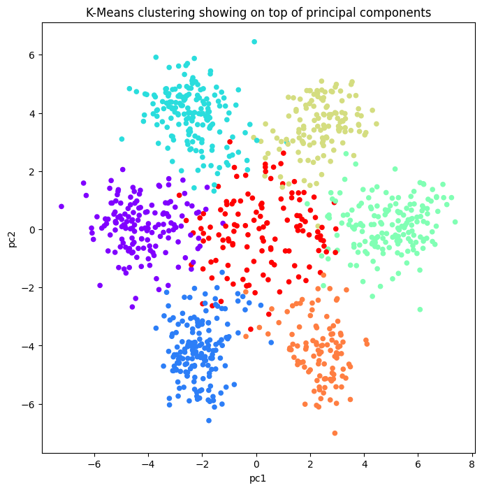

# Genomic Data Clustering: Decoding the Genetic Code

> _Using unsupervised learning to rediscover that DNA reads in three-letter codons_

## Overview

We wanted to see whether a computer could spot hidden patterns in raw DNA without being told what to look for.

- DNA stores all the information a living cell needs, but a raw sequence is just an unbroken string of A, C, G, and T letters.
- With no spaces between words, it is unclear what the meaningful units of the genetic code actually are.
- Objective: let an unsupervised model find structure in the genome of the bacterium Caulobacter crescentus (ccrescentus).
- Success means surfacing biological organization purely from letter patterns, with no labels or prior domain knowledge.

## Methodology



## The Data

_The input is a single bacterial genome stored as a plain text file of DNA letters._

- The ccrescentus genome is supplied in FASTA format, the standard text encoding used in bioinformatics.
- We read the file, stripped out headers and unwanted characters, and stored the genome as one continuous string.
- The only alphabet present is the four DNA bases A, C, G, and T, with no natural word boundaries.
- This single long sequence becomes the raw material for building numerical features.

## Approach: From Letters to Features

_We turned the DNA text into numbers by counting how often short letter combinations appear, then compressed those counts into a 2-D map._

- Split the genome into fragments and counted the frequency of every possible word for word lengths of 1, 2, 3, and 4 letters.
- Built a frequency matrix (a DataFrame) where each column is a k-mer and each value is its count per fragment.
- Standardized every column with StandardScaler so all features share a common scale for these distance-based methods.
- Applied PCA to reduce the high-dimensional frequency tables to the first two principal components for visualization.
- Tried multiple word lengths because, without domain knowledge, the most meaningful unit was not known in advance.



## Clusters Discovered

_When we looked at three-letter words, the data fell into clear, separate groups all on its own._

- Only the 3-letter word frequencies produced clearly identifiable point clouds in the first two principal components.
- Six distinct outer poles emerged, plus a central group of points sitting near the middle.
- Ran K-means clustering on the standardized 3-letter frequency tables with n_clusters set to 7.
- The seventh, central cluster captures fragments far from the six outer centroids, hinting at genes that carry no information.
- 1- and 4-letter words showed no comparable structure, isolating 3 letters as the meaningful length.



## Interpretation

_The three-letter groups the model found match the codons that biology already knows DNA is read in._

- These 3-letter words are exactly what biologists call codons, the units the cell reads to build proteins.
- Six clean clusters correspond to reading-frame and strand structure inherent in how codons are arranged.
- The central cluster aligns with non-coding stretches that do not translate into a clear codon signal.
- An unsupervised model independently recovered a known biological fact straight from raw letter statistics.

## Key Takeaways

_Simple counting plus clustering let a machine rediscover the structure of the genetic code on its own._

- Unsupervised learning (K-means) and dimensionality reduction (PCA) revealed real biology with no labels.
- Feature engineering mattered most: counting 3-letter k-mers was the key that exposed the codon structure.
- Standardizing features before PCA and K-means is essential because both are distance-based algorithms.
- The workflow validates a known discovery and shows how to probe an unknown sequence for hidden units.
- Built with: pandas, numpy, tqdm, scikit-learn (PCA, KMeans, StandardScaler), matplotlib

## Tech Stack

- **pandas** — data wrangling and tabular manipulation
- **numpy** — fast numerical arrays
- **scikit-learn** — modeling, pipelines, and evaluation
- **matplotlib** — plotting

## How to Run

```bash
python -m venv .venv && source .venv/Scripts/activate  # Windows: .venv\\Scripts\\activate
pip install -r requirements.txt
jupyter notebook "Genomic_Data_Clustering.ipynb"
```

> Note: large image/zip datasets are not committed; a `data/` note or download link is provided where applicable.

## Notes & Limitations

- Built on a program-provided case study; scope follows the original brief.
- Some deep-learning notebooks were re-run with reduced epochs locally (CPU) — see training curves.
- Metrics reflect the dataset as provided; production use would add monitoring and retraining.

## Attribution

This project was completed as part of the **MIT Applied Data Science Program** (MIT IDSS / Great Learning). The program provided the case-study scaffolding; the analysis, code, and results are my own. Published with permission, for portfolio use only.
