# Unsupervised Pattern Discovery with PCA and t-SNE

> _Compressing high-dimensional education and air-pollution data to reveal hidden structure_

## Overview

We wanted to see whether squeezing many measurements down to a few dimensions could reveal natural groupings in the data.

- Many real datasets have so many columns that patterns stay hidden and visualization is impossible.
- Objective: apply PCA and t-SNE to compress two contrasting datasets and surface any underlying structure.
- Dataset A: 777 US colleges with 18 educational and financial attributes.
- Dataset B: 403 daily records with 27 pollutant and meteorological readings spanning ~13 months for a city.
- Goal is to learn when these techniques find clusters and when the data itself simply has none.

## Methodology

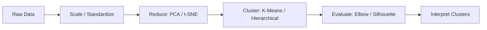

## The Data

_We cleaned two datasets, dropping useless ID columns and filling in the gaps where readings were missing._

- Education data: 777 rows, no missing values; dropped the unique 'Names' column leaving 17 numeric features.
- Air-pollution data: 403 rows, 27 columns; dropped Date/SrNo and one-hot encoded the categorical Weather field.
- Missing pollution values imputed with mode for categoricals and median/mean for numeric columns.
- PM10 median ran near 250 and PM2.5 near 108 ug/m3, well above healthy norms of ~100 and ~60.
- All features standardized (scaled) before PCA and t-SNE so no single variable dominates.

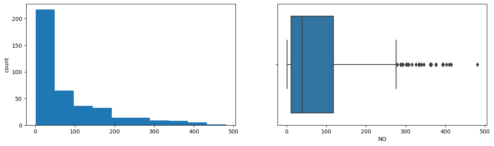

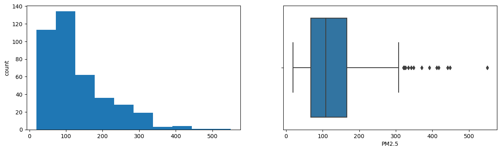

## Exploratory Analysis

_Before reducing anything, we checked how each measurement was distributed and which ones moved together._

- Boxplots showed Apps, Accept, Enroll, FUndergrad, Books, Personal and Expend are highly right-skewed with many outliers.
- Pollution variables PDCO, PDSO2, NH3, PDPM2.5, NOx and PM2.5 were also strongly right-skewed.
- Strong positive correlations: Apps-Accept-Enroll-FUndergrad cluster, and PhD-Terminal, Top10perc-Top25perc.
- In pollution data NO2-PDNO2 and PM2.5/PM10-PDPM2.5 were tightly correlated; Temp and NO2 were negatively related.
- Heavy correlation between features signaled real redundancy that PCA could exploit.

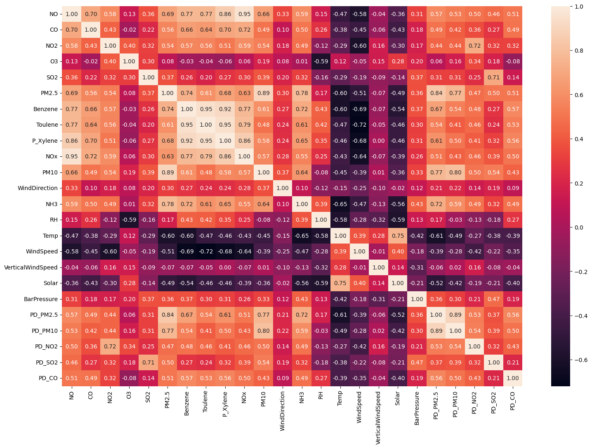

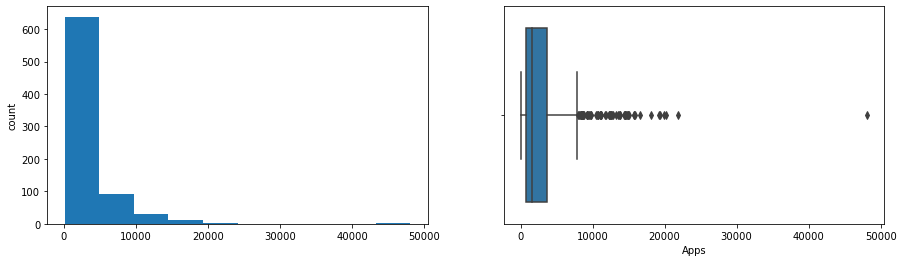

## Dimensionality Reduction (PCA)

_PCA recombined the columns into a handful of summary scores that still carry most of the information._

- On the education data, 17 features collapsed to 4 principal components capturing ~70% of total variance.
- That is roughly a 76% reduction in dimensionality with little information lost.
- Each component is a weighted blend of originals, e.g. PC1 loads heavily on Top10perc, Outstate, PhD and Expend.
- For pollution, PC1 tracked combustion hydrocarbons (Benzene, Toluene, Xylene); PC2 tracked humidity, ozone and rain.
- Scree and loading plots confirmed the first components carry the dominant signal.

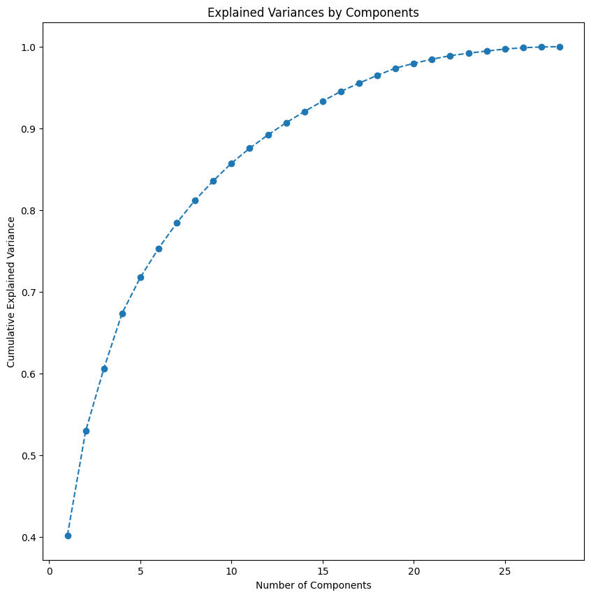

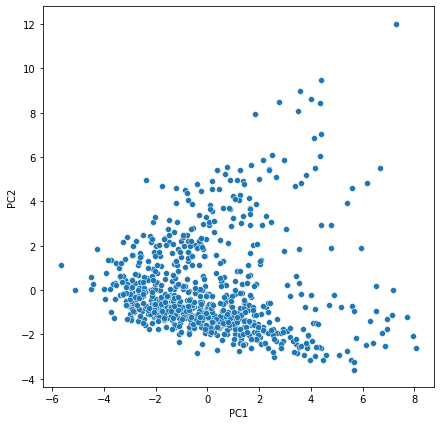

## Visualization & Clusters (t-SNE)

_t-SNE laid the data out on a flat map so we could literally see which records group together._

- t-SNE preserves local structure, embedding the high-dimensional data into 2D and 3D maps.
- Education data showed no clusters at any perplexity, points stayed scattered with no underlying pattern.
- Pollution data was different: perplexity values of 35 and 45 captured clear structure.
- At perplexity 35 the pollution map separated into 4 distinct, well-defined groups.
- Lesson: whether projections reveal clusters depends on the nature of the data and on tuning perplexity.

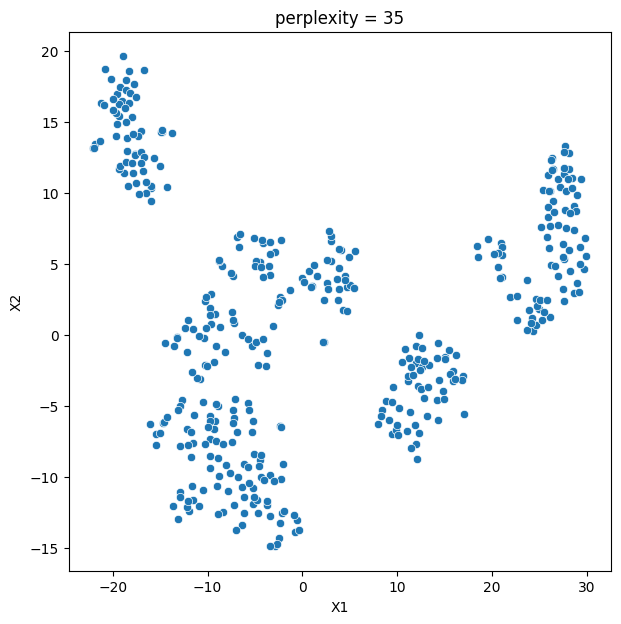

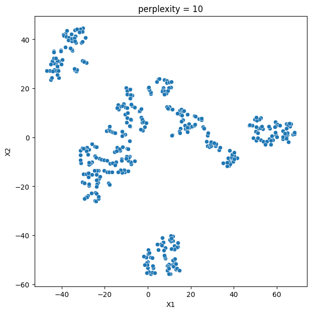

## Key Takeaways

_PCA shrank the data efficiently and t-SNE exposed four real pollution profiles, but only where structure truly existed._

- PCA cut education features by ~76% (17 to 4 components) while retaining ~70% of variance.
- t-SNE at perplexity 35 revealed 4 interpretable pollution groups, e.g. Group 1 = hot, humid, low-wind, rain-washed areas.
- Identical methods found nothing in the education data, proving patterns are a property of the data, not the algorithm.
- Perplexity is a critical knob; the wrong setting hides genuine clusters.
- Built with: Python, pandas, NumPy, scikit-learn, Matplotlib, Seaborn

## More Visualizations


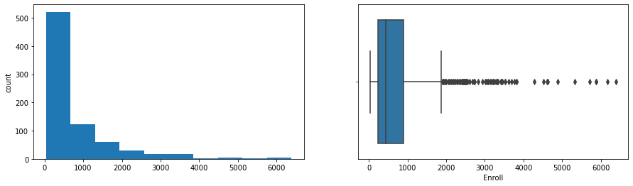
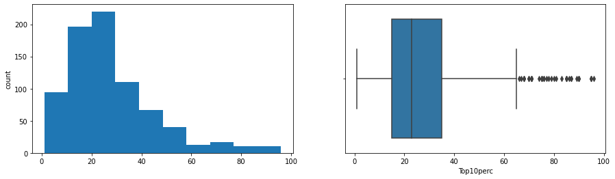
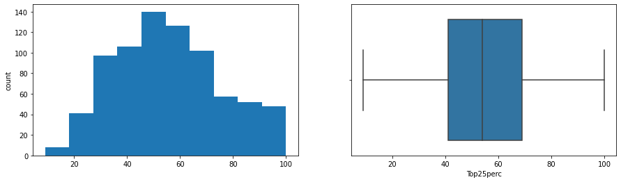


## Tech Stack

- **pandas** — data wrangling and tabular manipulation
- **numpy** — fast numerical arrays
- **scikit-learn** — modeling, pipelines, and evaluation
- **seaborn** — statistical visualization
- **matplotlib** — plotting

## How to Run

```bash
python -m venv .venv && source .venv/Scripts/activate  # Windows: .venv\\Scripts\\activate
pip install -r requirements.txt
jupyter notebook "Case_Study_PCA_and_TSNE.ipynb"
```

> Note: large image/zip datasets are not committed; a `data/` note or download link is provided where applicable.

## Notes & Limitations

- Built on a program-provided case study; scope follows the original brief.
- Some deep-learning notebooks were re-run with reduced epochs locally (CPU) — see training curves.
- Metrics reflect the dataset as provided; production use would add monitoring and retraining.

## Attribution

This project was completed as part of the **MIT Applied Data Science Program** (MIT IDSS / Great Learning). The program provided the case-study scaffolding; the analysis, code, and results are my own. Published with permission, for portfolio use only.
