# BigMart Sales Prediction

> _Predicting item-level outlet sales with interpretable linear regression_

## Overview

We wanted to predict how much each product would sell at each store so the retailer can plan demand.

- BigMart records item-level sales across outlets to forecast demand and understand what drives revenue.
- Goal: predict ItemOutletSales for products at different stores, a continuous-target regression task.
- Train data has both inputs and the sales target; the held-out test set must have its sales predicted.
- Beyond accuracy, the aim was an interpretable model that explains which factors lift or lower sales.
- Findings should translate into stocking and store-strategy recommendations management can act on.

## Methodology


## The Data

_We used two store-sales tables and cleaned up messy categories and missing entries before modeling._

- Train set of 8,523 rows and 10 columns; separate test set of 5,681 rows to predict on.
- ID columns ItemIdentifier and OutletIdentifier were dropped as they carry no predictive power.
- ItemWeight was ~17% missing and OutletSize ~28% missing, requiring careful imputation.
- ItemFatContent had inconsistent labels (low fat, LF, reg) standardized to Low Fat and Regular.
- Mix of numeric (ItemMRP, ItemVisibility, ItemWeight) and categorical (ItemType, OutletType) features.

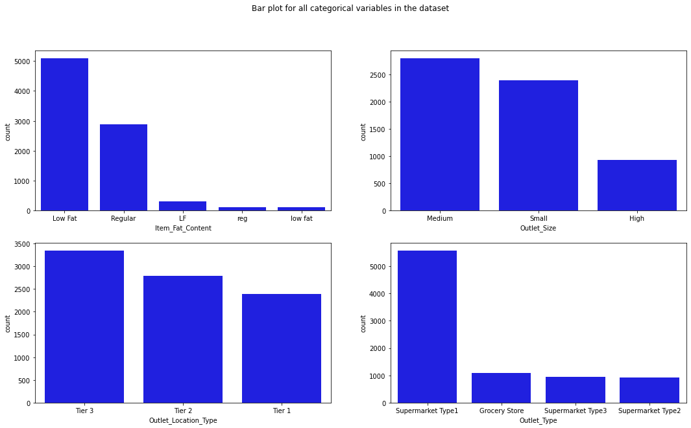

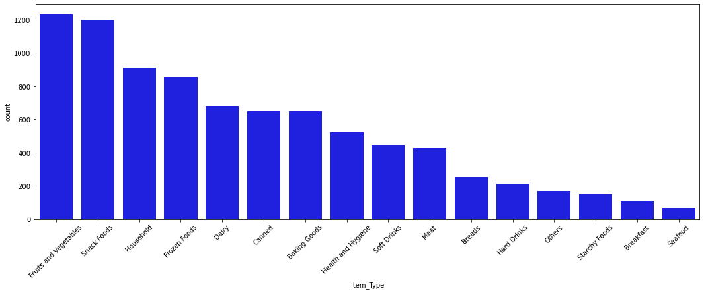

## Exploratory Analysis

_We charted each variable and how they relate, finding price is the main thing tied to sales._

- Univariate plots show Fruits and Vegetables, Snack Foods, and Household are the top-selling item types.
- ItemVisibility is right-skewed while ItemWeight is roughly uniform across its range.
- Average sales are nearly flat across outlet establishment years, with a dip in 1998.
- Correlation heatmap shows only ItemMRP has a moderate linear relationship with ItemOutletSales.
- Scatter plots confirm ItemWeight and ItemVisibility show little to no relationship with sales.

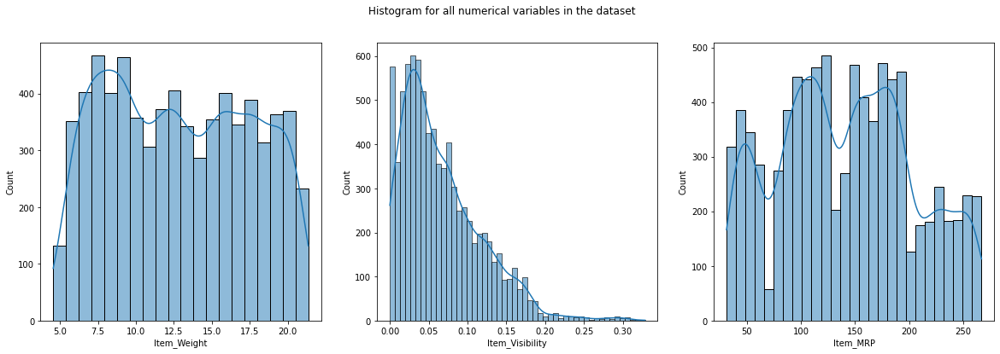

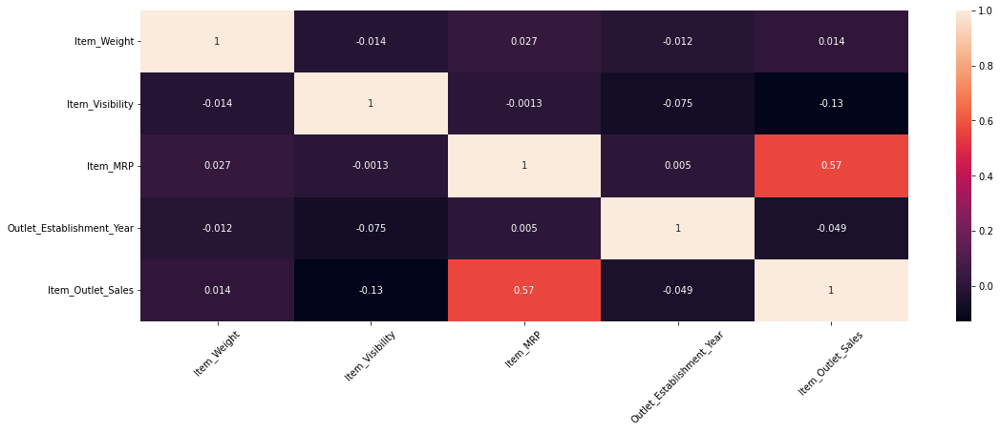

## Key Drivers of Sales

_Item price and store type were the strongest factors pushing sales up or down._

- ItemMRP is the dominant driver: higher-priced items sell at much higher value (coefficient 1.9555).
- Supermarket Type 3 outlets have the largest sales lift (coefficient 2.4837) over the baseline store.
- Supermarket Type 1 and Type 2 also boost sales (coefficients 1.9550 and 1.7737 in log scale).
- OutletAge was dropped for high VIF; ItemWeight, ItemVisibility, OutletSize, location were insignificant.
- Final features all clear p < 0.05 and VIF < 5, confirming significant, non-collinear predictors.

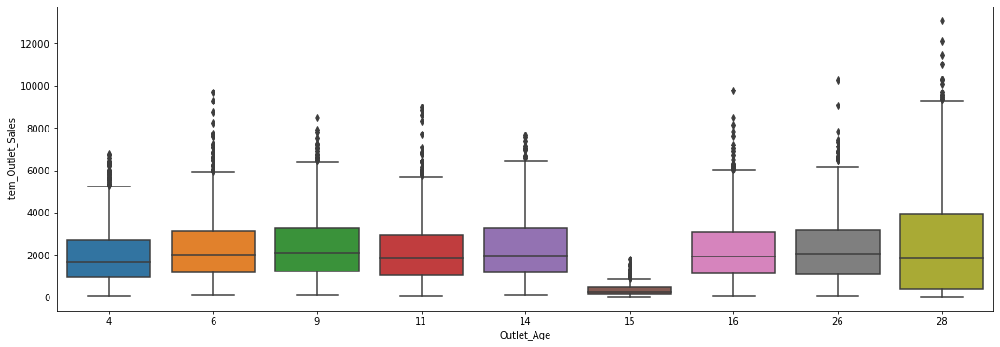

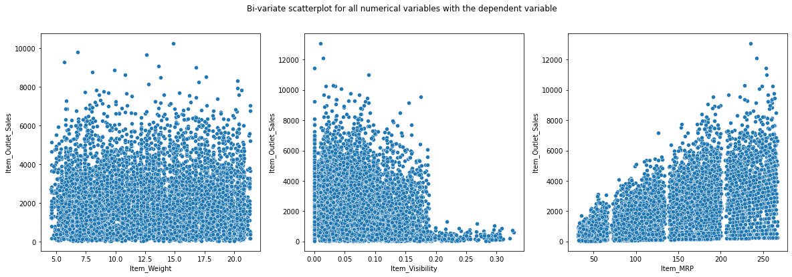

## Modeling & Results

_A log-transformed linear regression met all statistical assumptions and predicted sales reliably._

- Built ordinary least squares regression with statsmodels after dummy-encoding and scaling features.
- Initial model reached R-squared 0.563; log-transforming the target raised it to 0.720.
- Log transform fixed the linearity issue; residuals are mean-zero, normal, and homoscedastic.
- Cross-validation R-squared of 0.718 (MSE 0.290) matches training, indicating a well-generalized fit.
- Final equation predicts log(ItemOutletSales) from ItemMRP, OutletType, and ItemFatContent.

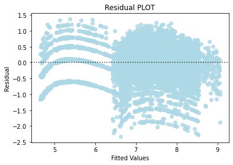

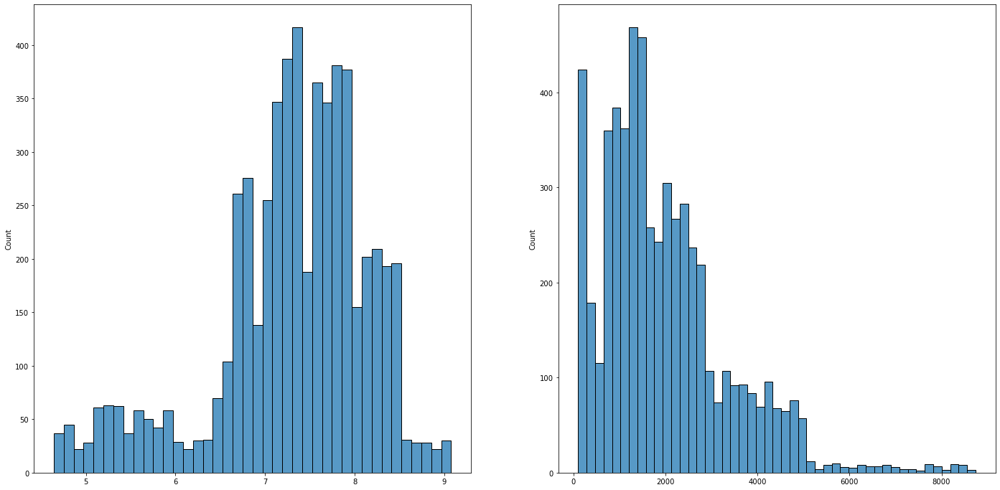

## Key Takeaways

_Stock high-priced items in visible spots and grow large supermarket-type stores to raise sales._

- ItemMRP is the single biggest lever: stocking higher-MRP items in high-visibility areas can lift sales.
- Large Supermarket Type 3 stores outsell all other outlet types and warrant continued investment.
- Validated all regression assumptions, giving a transparent, defensible model for business decisions.
- Non-linear models could capture remaining patterns and improve beyond the linear baseline in future.
- Built with: pandas, numpy, matplotlib, seaborn, statsmodels, scikit-learn, scipy.

## More Visualizations

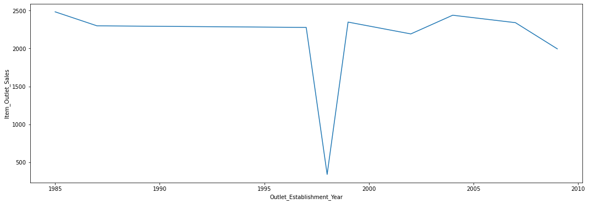
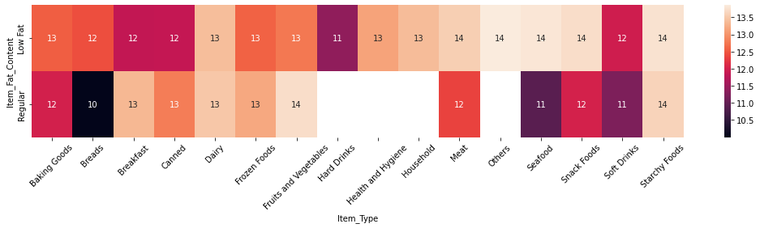
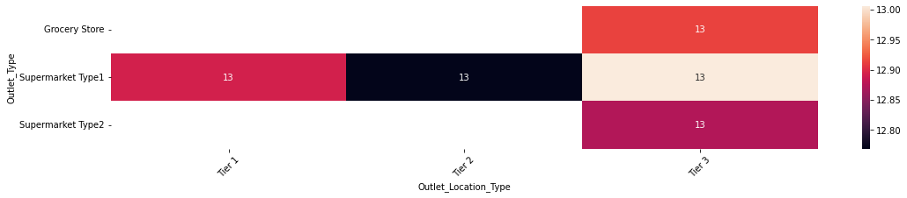
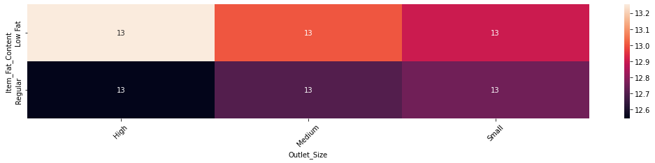


## Tech Stack

- **pandas** — data wrangling and tabular manipulation
- **numpy** — fast numerical arrays
- **scikit-learn** — modeling, pipelines, and evaluation
- **seaborn** — statistical visualization
- **matplotlib** — plotting
- **statsmodels** — OLS / statistical inference & VIF

## How to Run

```bash
python -m venv .venv && source .venv/Scripts/activate  # Windows: .venv\\Scripts\\activate
pip install -r requirements.txt
jupyter notebook "Case_Study_BigMart_Sales_Prediction.ipynb"
```

> Note: large image/zip datasets are not committed; a `data/` note or download link is provided where applicable.

## Notes & Limitations

- Built on a program-provided case study; scope follows the original brief.
- Some deep-learning notebooks were re-run with reduced epochs locally (CPU) — see training curves.
- Metrics reflect the dataset as provided; production use would add monitoring and retraining.

## Attribution

This project was completed as part of the **MIT Applied Data Science Program** (MIT IDSS / Great Learning). The program provided the case-study scaffolding; the analysis, code, and results are my own. Published with permission, for portfolio use only.
