# Employee Attrition Prediction

> _Why employees leave — and predicting who is at risk_

## Overview

Losing employees is expensive — this finds why people leave and flags who might.

- McCurr Healthcare Consultancy (a global MNC) wants to retain its best talent and curb costly turnover.
- Attrition drives rehiring cost, lost institutional knowledge, and team disruption.
- Objective 1 - identify the key factors that drive an employee to leave.
- Objective 2 - build a model that predicts whether an employee will attrite.

## Methodology

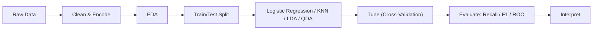

## The Data

_One row per employee, mixing personal details with work-life metrics._

- 2,940 employees described by 34 attributes, with no missing values.
- Demographics (age, distance from home) plus work metrics (income, overtime, tenure, role).
- Target: a binary Attrition flag - stayed vs left.
- Dropped non-informative fields: EmployeeNumber (ID), Over18 and StandardHours (single value).

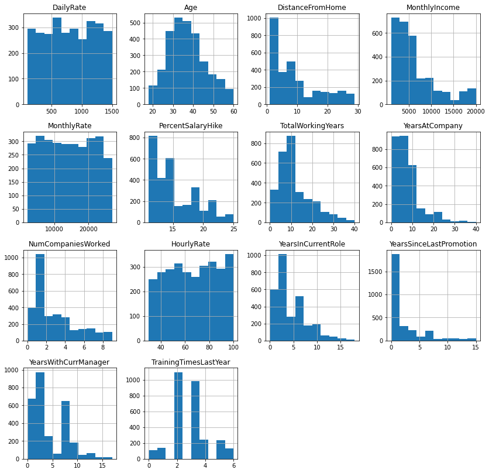

## Exploratory Analysis

_What the data looks like before any modeling._

- Overall attrition rate is 16% - a minority class, which is the real-world difficulty.
- About 28% of employees work overtime; most have traveled only rarely for work.
- Age is roughly normal (most 25-50); many employees live close to the office.
- Income, total experience, tenure, and age are strongly correlated with one another.

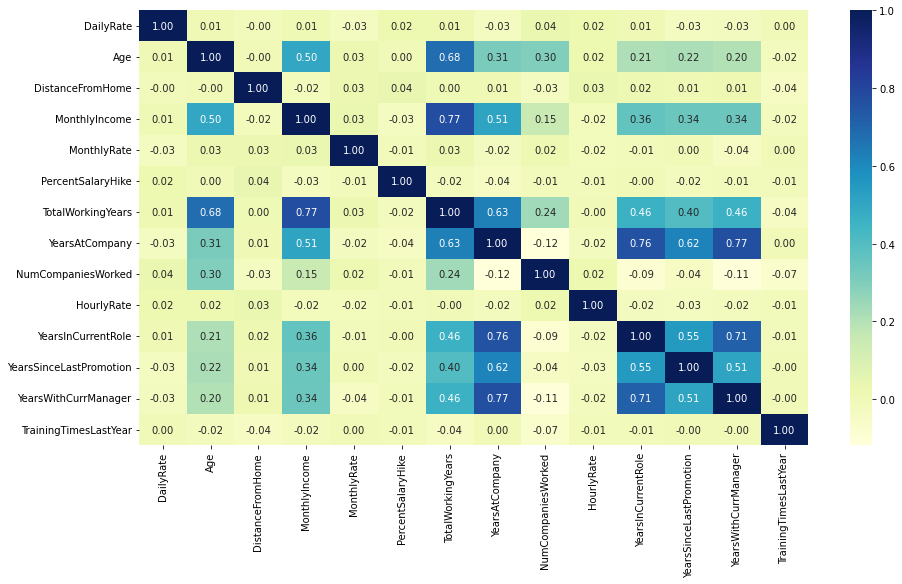

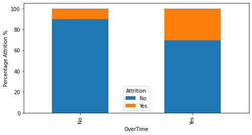

## Key Drivers of Attrition

_The factors that most separate leavers from stayers._

- Overtime is the strongest signal: >30% of overtime employees leave vs ~10% of those who do not.
- Leavers earn ~30% less income and have ~30% less work experience on average.
- Early-tenure employees and those living further from work are likelier to go.
- SHAP confirms OverTime, monthly income, and tenure as the top predictors.

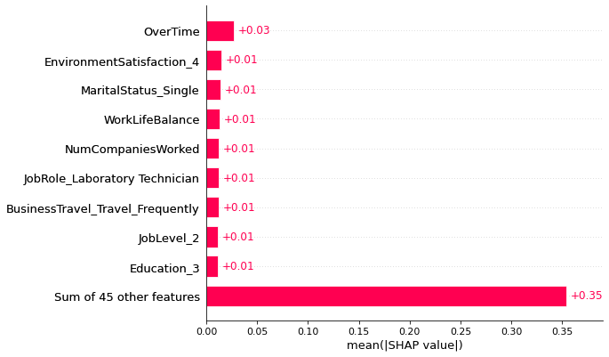

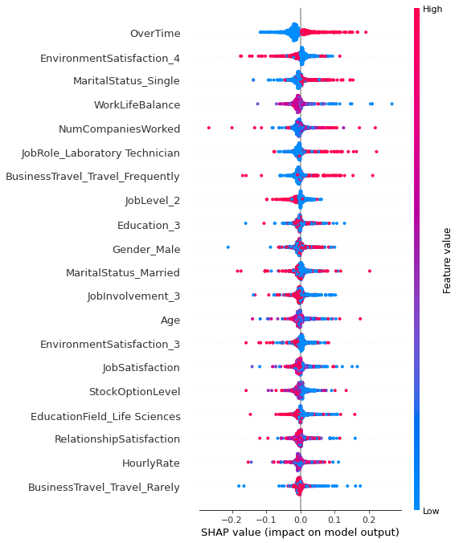

## Modeling & Results

_How the prediction model was built and how well it performed._

- Pipeline: clean -> encode categoricals -> train/test split -> model -> tune -> interpret.
- Compared Logistic Regression, KNN, and Discriminant Analysis (LDA/QDA), tuned with GridSearchCV.
- Recall was prioritized - catching real leavers matters more than a few false alarms.
- SHAP used to explain predictions, not just score them.

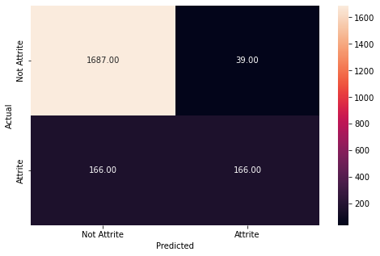

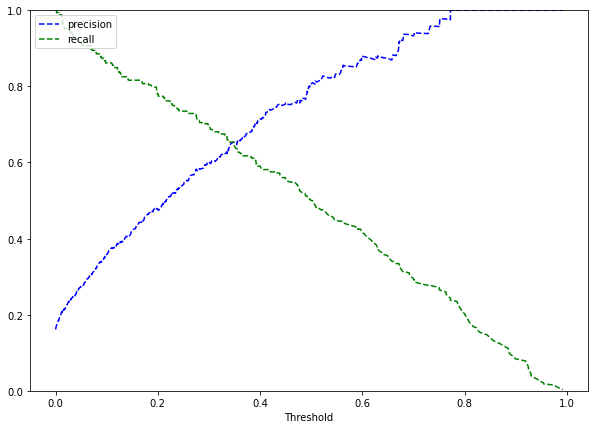

## Key Takeaways

_What HR should actually do with this._

- Focus retention on overtime-heavy, lower-paid, and early-tenure employees.
- Use the model to flag at-risk staff early so managers can intervene.
- With only 16% positives, recall and threshold choice matter more than raw accuracy.
- Built with: pandas, scikit-learn, SHAP, seaborn / matplotlib.

## More Visualizations

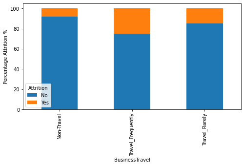
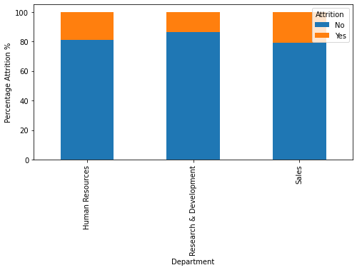
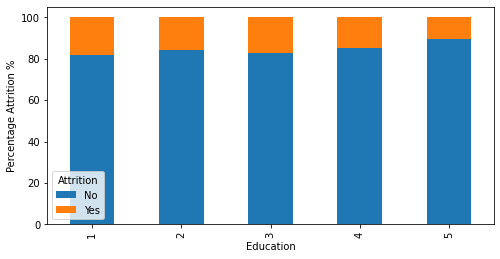
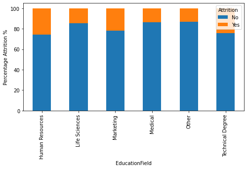


## Tech Stack

- **pandas** — data wrangling and tabular manipulation
- **numpy** — fast numerical arrays
- **scikit-learn** — modeling, pipelines, and evaluation
- **seaborn** — statistical visualization
- **matplotlib** — plotting
- **shap** — model explainability

## How to Run

```bash
python -m venv .venv && source .venv/Scripts/activate  # Windows: .venv\\Scripts\\activate
pip install -r requirements.txt
jupyter notebook "Case_Study_Employee_Attrition.ipynb"
```

> Note: large image/zip datasets are not committed; a `data/` note or download link is provided where applicable.

## Notes & Limitations

- Built on a program-provided case study; scope follows the original brief.
- Some deep-learning notebooks were re-run with reduced epochs locally (CPU) — see training curves.
- Metrics reflect the dataset as provided; production use would add monitoring and retraining.

## Attribution

This project was completed as part of the **MIT Applied Data Science Program** (MIT IDSS / Great Learning). The program provided the case-study scaffolding; the analysis, code, and results are my own. Published with permission, for portfolio use only.
