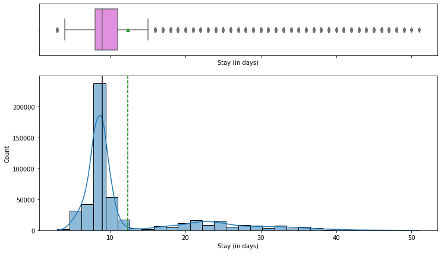
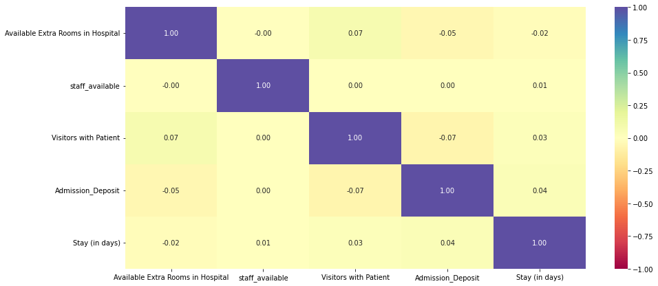
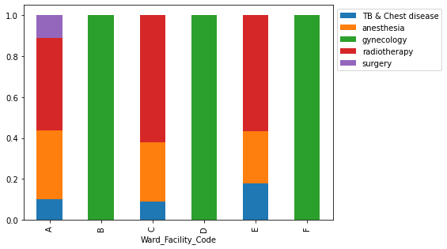
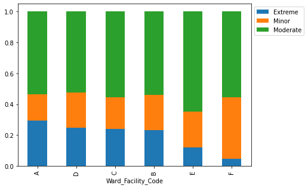
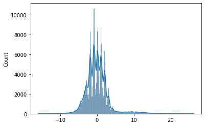
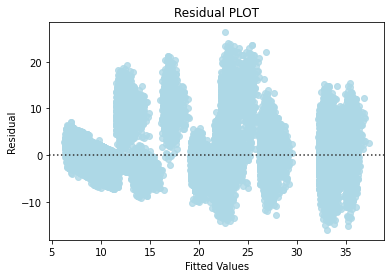
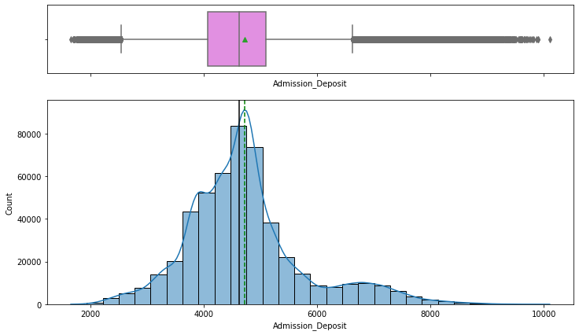
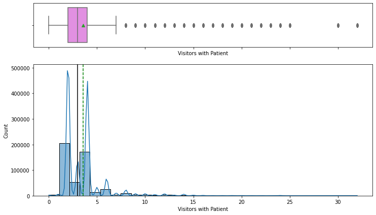
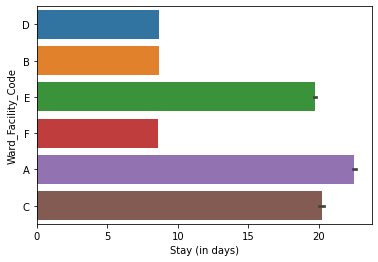
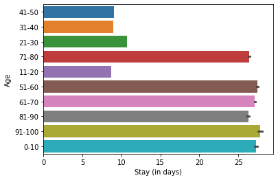

# Predicting Hospital Length of Stay

> _Forecasting patient length-of-stay at admission to help HealthPlus plan beds, staff, and resources_

## Overview

We built a model that estimates how many days a patient will stay so the hospital can plan beds and staff in advance.

- Poor allocation of beds, ventilators, and staff causes complications, a risk made vivid during the COVID-19 pandemic.
- HealthPlus hired us to find what drives length of stay (LOS) and predict it from data captured at admission.
- Accurate LOS forecasts let management pre-position resources, smooth patient flow, and reduce costly bottlenecks.
- Goal: identify the strongest LOS drivers and deliver an interpretable, statistically valid prediction model.

## Methodology


## The Data

_We started with half a million admission records, each describing a patient and their hospital visit._

- Dataset of 500,000 patient admission records across 15 columns, with no missing values and all rows unique.
- Mix of numeric fields (extra rooms, staff available, visitors, admission deposit, stay) and categorical fields.
- A single patient was admitted up to 21 times; on average ~3 rooms and ~5 staff were available per admission.
- About 82% of patients arrive with moderate or minor illness; gynecology receives ~68% of all patients.
- Target variable is Stay (in days), available only after admission and a few tests.

## Exploratory Analysis

_We looked at how long patients typically stay and how the main numeric factors are distributed._

- Most patients stay 8-9 days; few stay beyond 10 days and very few beyond 40, matching the mild-illness mix.
- Admission deposit is roughly normally distributed with outliers paying unusually high or low fees.
- Number of visitors is highly right-skewed, with 2 and 4 being the most common visitor counts.
- Correlation heatmap shows almost no correlation among numeric features or with LOS.
- Weak numeric correlations signaled that categorical features (ward, department, severity) would drive prediction.





## Key Drivers of Length-of-Stay

_Stay length is shaped mostly by which ward and department a patient is in, plus illness severity and age._

- Wards A and C have the longest stays, suggesting they handle the most serious cases.
- Ward A holds the most extreme cases and the only surgery patients, demanding more staff and resources.
- Wards B, D, and F are dedicated to gynecology; A, C, and E cover all other diseases.
- Patients aged 1-10 and 51-100 stay longest, while the 21-50 group skews toward shorter gynecology stays.
- 9 doctors staff the hospital, with 4 in high-volume gynecology; Dr. Sarah and Olivia treat the most patients.





## Modeling & Results

_A linear regression model predicts stay within about two days, and adding complexity did not improve it._

- Linear Regression reached an adjusted R-squared of ~0.84, explaining 84% of variance in length of stay.
- Mean Absolute Error of ~2.15 days on test data, with train and test metrics close, so no overfitting.
- Ridge, Lasso, and Elastic Net (tuned via GridSearchCV) gave no improvement over ordinary least squares.
- All linear regression assumptions held: zero-mean normal residuals, linearity, and homoscedasticity.
- Forward feature selection cut features from 42 to 8 (~81% fewer) while keeping R-squared at 0.840.





## Key Takeaways

_We delivered an accurate, easy-to-explain LOS model and pinpointed the few factors that matter most._

- LOS can be predicted at admission within ~2.15 days, supporting proactive bed and staff planning.
- Ward, department, severity, and age are the dominant drivers; numeric variables add little signal.
- A simple 8-feature linear model matches the full model, easing deployment, storage, and interpretation.
- Verified statistical assumptions make the model trustworthy for inference, not just prediction.
- Built with: pandas, numpy, matplotlib, seaborn, scikit-learn, statsmodels, mlxtend

## More Visualizations







## Tech Stack

- **pandas** — data wrangling and tabular manipulation
- **numpy** — fast numerical arrays
- **scikit-learn** — modeling, pipelines, and evaluation
- **seaborn** — statistical visualization
- **matplotlib** — plotting
- **statsmodels** — OLS / statistical inference & VIF

## How to Run

```bash
python -m venv .venv && source .venv/Scripts/activate  # Windows: .venv\\Scripts\\activate
pip install -r requirements.txt
jupyter notebook "Hospital_LOS_Prediction_Part+1.ipynb"
```

> Note: large image/zip datasets are not committed; a `data/` note or download link is provided where applicable.

## Notes & Limitations

- Built on a program-provided case study; scope follows the original brief.
- Some deep-learning notebooks were re-run with reduced epochs locally (CPU) — see training curves.
- Metrics reflect the dataset as provided; production use would add monitoring and retraining.

## Attribution

This project was completed as part of the **MIT Applied Data Science Program** (MIT IDSS / Great Learning). The program provided the case-study scaffolding; the analysis, code, and results are my own. Published with permission, for portfolio use only.
