# SuperKart Retail Sales Forecasting

> _Predicting per-product store sales for the upcoming quarter with linear regression_

## Overview

SuperKart wants to forecast how much revenue each product will bring in at each store next quarter.

- SuperKart, a supermarket chain, needs accurate quarterly sales forecasts to plan inventory, staffing, and revenue targets.
- Goal: predict Product_Store_Sales_Total, the revenue a given product generates at a given outlet.
- A reliable forecast turns historical sales into a planning tool for the next quarter across all 4 stores.
- Framed as a supervised regression problem on product and store attributes.

## Methodology

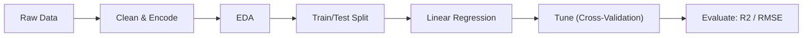

## The Data

_I worked with about 8,800 product-store sales records covering product details and store characteristics._

- 8,763 records across 12 columns, with no missing values and no duplicate rows.
- Numeric features: Product_Weight, Product_Allocated_Area, Product_MRP, Store_Establishment_Year, plus the sales target.
- Categorical features: Product_Sugar_Content, Product_Type (16 types), Store_Id, Store_Size, Store_Location_City_Type, Store_Type.
- Cleaned messy labels (merged 'reg' into 'Regular') and dropped the unique Product_Id identifier.
- Target sales range from 33 to ~8000, roughly normal around 3500.

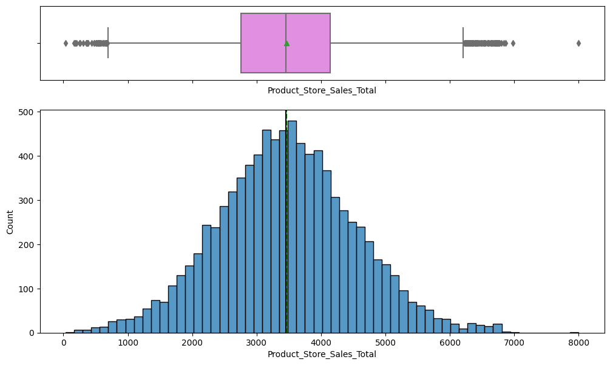

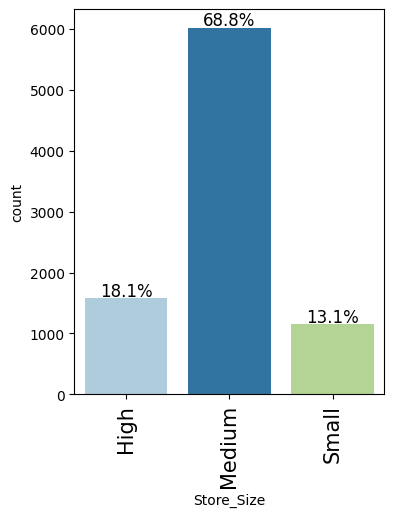

## Exploratory Analysis

_I explored how each product and store feature relates to sales before building any model._

- Product_Weight and Product_MRP are the features most strongly correlated with total sales.
- Store_Establishment_Year is strongly negatively related to sales, so newer stores tend to sell more.
- Low-sugar products make up ~56% of items and drive the most revenue; no-sugar items contribute least.
- Fruits & Vegetables (14%) and Snack Foods (13%) are the top product types; Seafood is the smallest (~1%).
- Outliers were retained as legitimate values rather than removed.

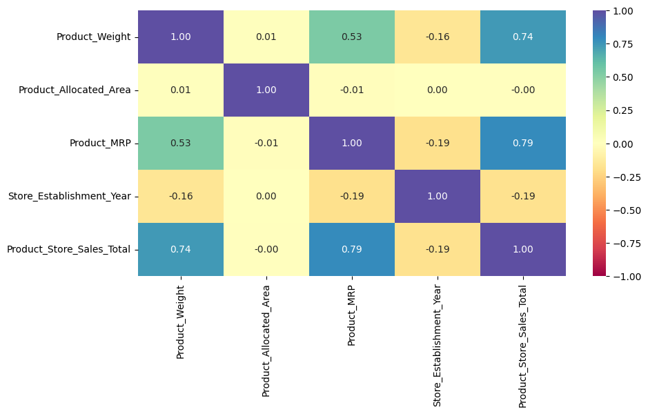

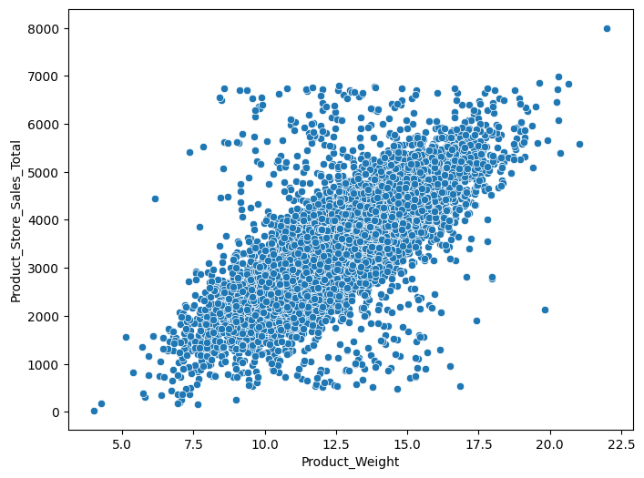

## Key Drivers of Sales

_A handful of store and product traits explain most of the differences in sales._

- OUT004 (Supermarket Type2, Tier 2, medium) is the top performer at ~15.4M revenue, more than double any other store.
- OUT002 (small Food Mart, Tier 3) is the weakest store at ~2.0M revenue.
- Medium-sized stores and Tier 2 city locations contribute the bulk of company revenue.
- Product_MRP and Product_Weight are the dominant numeric drivers of per-product sales.
- Engineered Store_Age_Years and grouped 16 product types into perishable vs non-perishable.

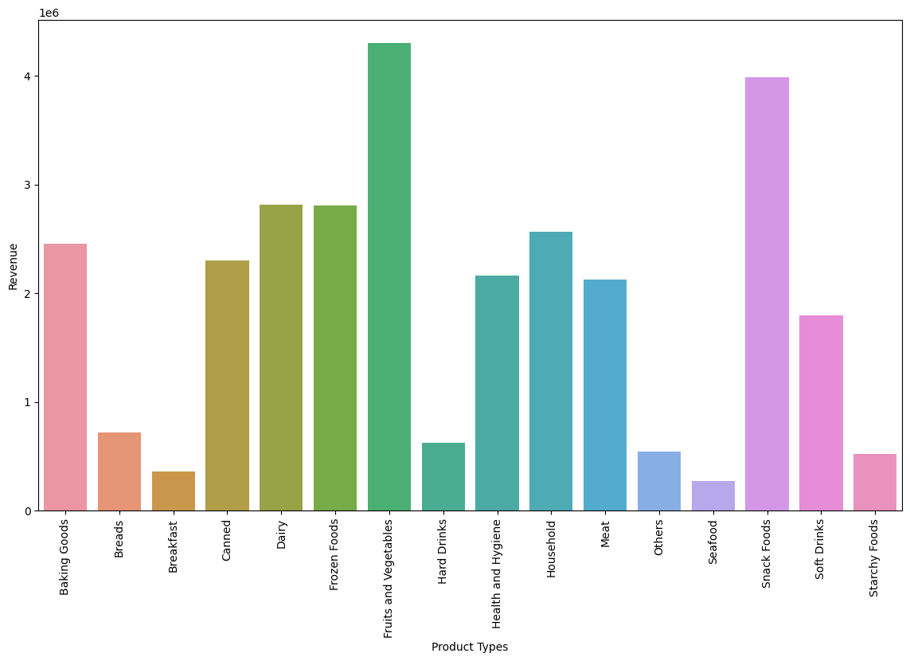

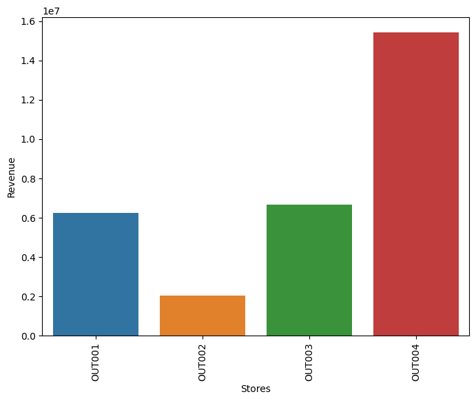

## Modeling & Results

_I built a linear regression model that predicts sales accurately and passes statistical checks._

- OLS linear regression after one-hot encoding, VIF multicollinearity checks (drop features VIF >= 5), and dropping insignificant variables (p > 0.05).
- Model achieves R-squared of 0.824 (Adj. 0.823) on the full fit.
- Test performance: RMSE ~447, MAE ~267, R2 ~0.79, with train and test scores nearly identical (no overfitting).
- All four regression assumptions held: zero-mean residuals, homoscedasticity, linearity, and normal errors.
- Cross-validation confirmed stable, comparable performance across folds.

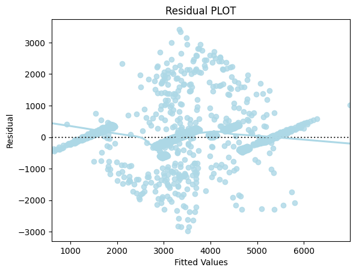

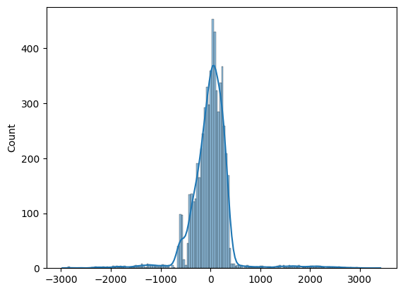

## Key Takeaways

_The model can forecast next quarter's sales and points to where SuperKart should focus._

- The final model explains about 79% of the variation in product-store sales and is ready for quarterly forecasting.
- OUT004's Supermarket Type2 / Tier 2 / medium-size formula is the strongest blueprint for expansion.
- Boost the underperforming OUT002 and lean into Fruits & Vegetables and Snack Foods, the top revenue categories.
- Product_MRP and Product_Weight are the levers most tied to sales and should guide pricing and assortment.
- Built with: pandas, numpy, matplotlib, seaborn, scikit-learn, statsmodels, scipy

## More Visualizations

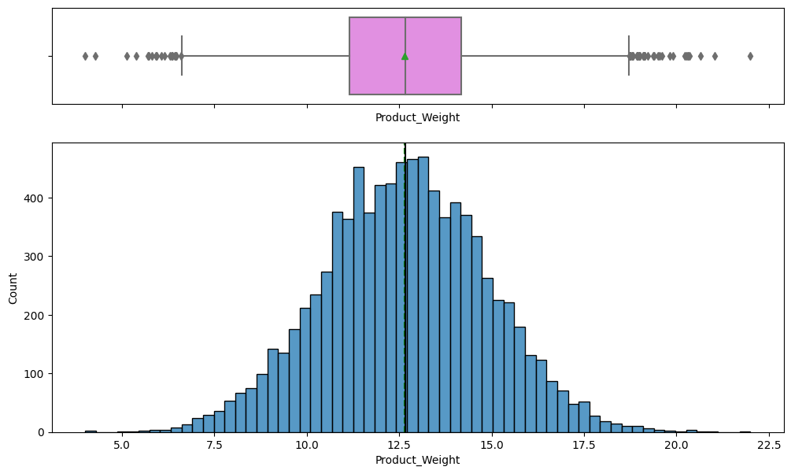
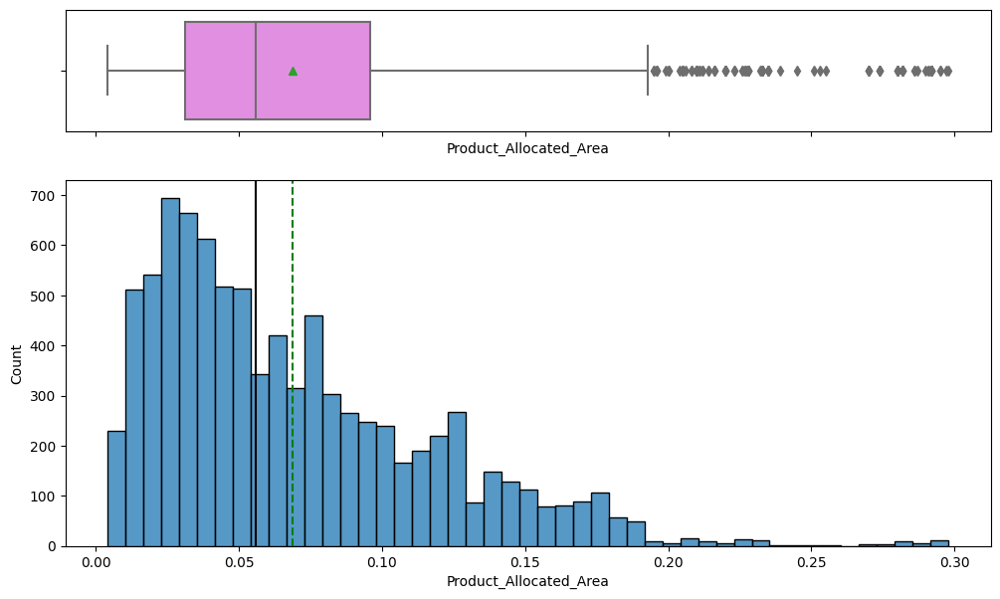
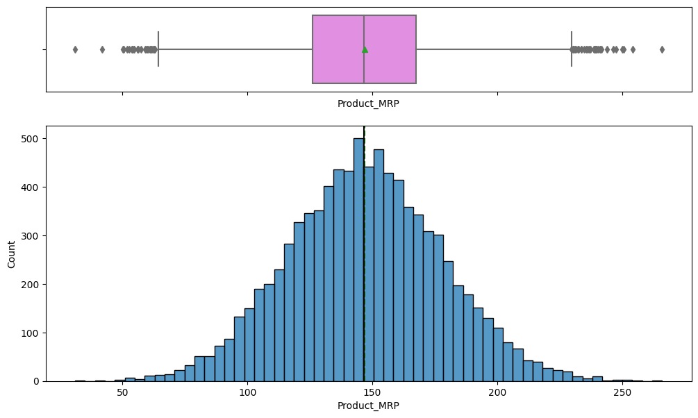
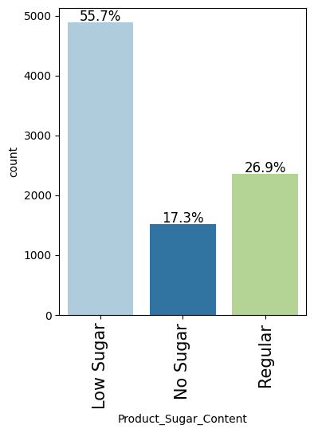


## Tech Stack

- **pandas** — data wrangling and tabular manipulation
- **numpy** — fast numerical arrays
- **scikit-learn** — modeling, pipelines, and evaluation
- **seaborn** — statistical visualization
- **matplotlib** — plotting
- **statsmodels** — OLS / statistical inference & VIF
- **scipy** — scientific computing

## How to Run

```bash
python -m venv .venv && source .venv/Scripts/activate  # Windows: .venv\\Scripts\\activate
pip install -r requirements.txt
jupyter notebook "Learner_Notebook_Machine_Learning_Practice_Project.ipynb"
```

> Note: large image/zip datasets are not committed; a `data/` note or download link is provided where applicable.

## Notes & Limitations

- Built on a program-provided case study; scope follows the original brief.
- Some deep-learning notebooks were re-run with reduced epochs locally (CPU) — see training curves.
- Metrics reflect the dataset as provided; production use would add monitoring and retraining.

## Attribution

This project was completed as part of the **MIT Applied Data Science Program** (MIT IDSS / Great Learning). The program provided the case-study scaffolding; the analysis, code, and results are my own. Published with permission, for portfolio use only.
