# Bitcoin Price Prediction

> _Forecasting monthly Bitcoin closing prices with classical time-series models_

## Overview

We tried to predict where Bitcoin's price would go next using only its own price history.

- Bitcoin is a volatile, decentralized cryptocurrency whose price has risen and fluctuated dramatically since 2017.
- Goal: forecast monthly Bitcoin closing prices using only the historical price series itself.
- Approach: classical univariate time-series modeling (AR, MA, ARMA, ARIMA).
- Hold out the last 12 months as a test set to honestly measure out-of-sample forecast accuracy.
- Challenge acknowledged up front: extreme volatility limits how far a price-only model can see.

## Methodology

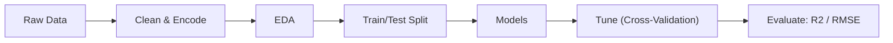

## The Data

_We worked with about nine years of monthly Bitcoin closing prices, with no gaps in the record._

- Dataset has 112 monthly observations across 2 columns: Timestamp and closing price.
- Timestamp was object-typed and converted to datetime, then set as the series index.
- Closing price stored as float; no missing values anywhere in the dataset.
- Split: final 12 months held out as test data, the rest used for training.
- Prices show a strong upward trend with rapid fluctuations, especially during 2021.

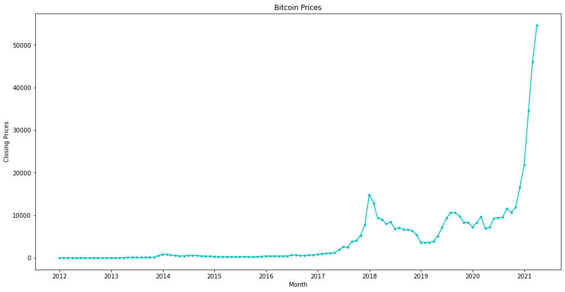

## Exploratory Analysis

_We checked whether the price pattern was stable over time, and it clearly was not._

- Rolling mean and standard deviation revealed a clear upward trend, signaling a non-stationary series.
- Augmented Dickey-Fuller test gave a p-value of about 0.36, far above 0.05.
- We failed to reject the null hypothesis, confirming the raw series is non-stationary.
- Decomposition exposed distinct trend, seasonality, and residual components.
- Seasonality showed prices spiking from December to January, then declining steadily through May.

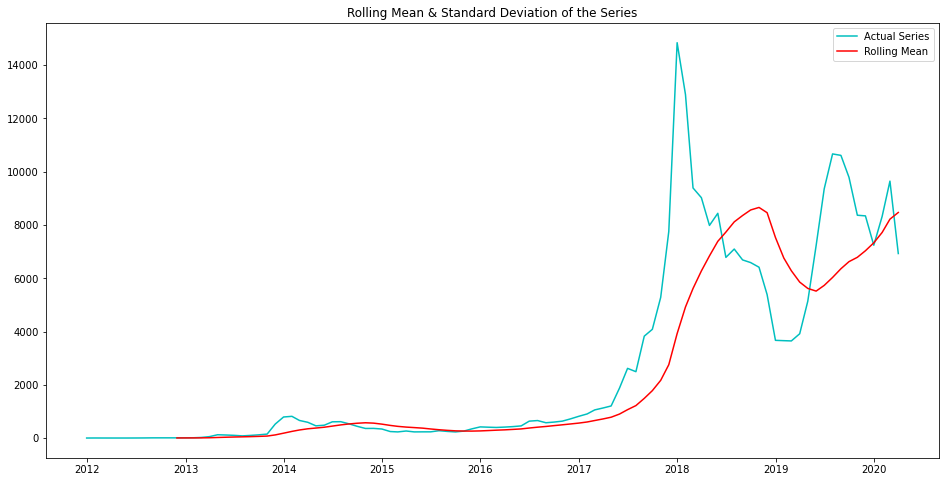

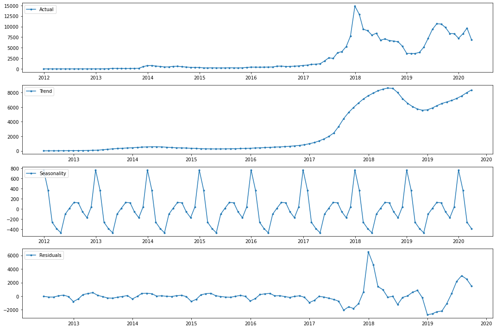

## Time-Series Patterns

_We transformed the data until the price pattern became stable enough to model._

- Log transformation stabilized variance but left the upward trend intact, so still non-stationary.
- Differencing by lag 1 (one month) produced a constant mean and standard deviation.
- Post-differencing ADF p-value fell well below 0.05, confirming the series was now stationary.
- PACF plot's last significant lag was 7, suggesting an AR order of p = 7.
- ACF plot similarly indicated q = 7, setting the orders for the ARMA and ARIMA models.

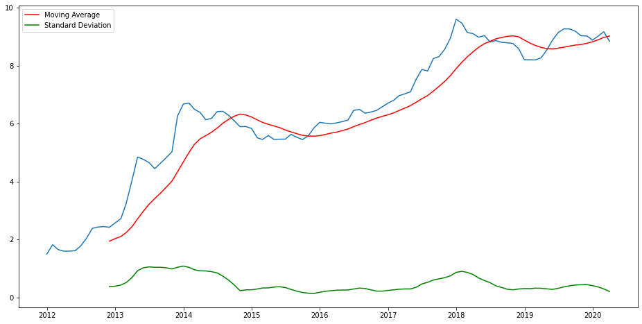

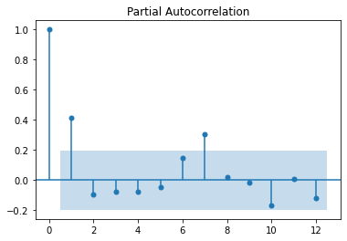

## Modeling & Results

_We compared four forecasting models and the ARMA model gave the most accurate predictions._

- AR model (p=7) achieved an RMSE of 0.2112 on the log-differenced series.
- MA model scored a slightly higher RMSE than AR but a lower AIC, fitting the training data better.
- ARMA model (p=7, q=7) delivered the lowest RMSE of all four models.
- ARIMA model (p=7, d=1, q=7) gave the highest RMSE and much higher AIC, so it was dropped.
- ARMA chosen as the final model: best RMSE and second-lowest AIC overall.

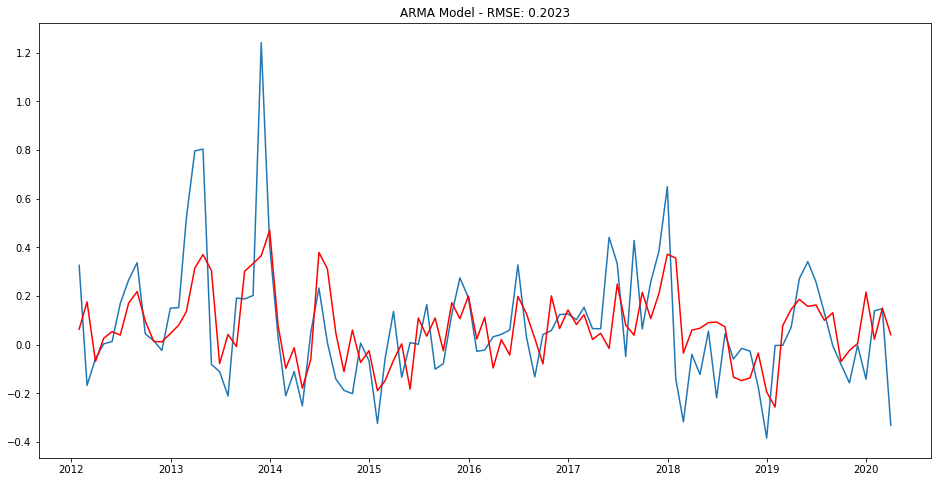

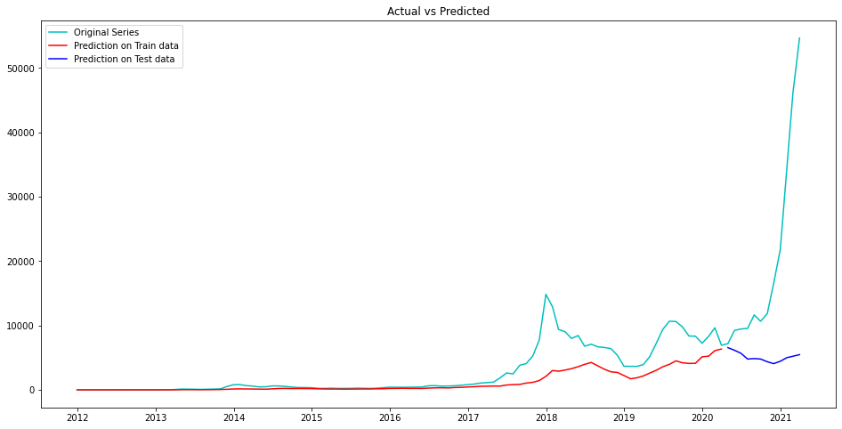

## Key Takeaways

_The model fit history well but struggled to forecast the future, which is expected for such a volatile asset._

- Training-data predictions tracked actual prices closely, except for spikes in 2018 and late 2019.
- On the 12-month test set the forecast drifted far from actuals, with RMSE much higher than training.
- The gap reflects Bitcoin's extreme volatility and external drivers a price-only model cannot capture.
- Honest conclusion: classical models capture trend and seasonality but cannot reliably predict crypto prices.
- Built with: pandas, numpy, matplotlib, statsmodels 0.12.1

## More Visualizations

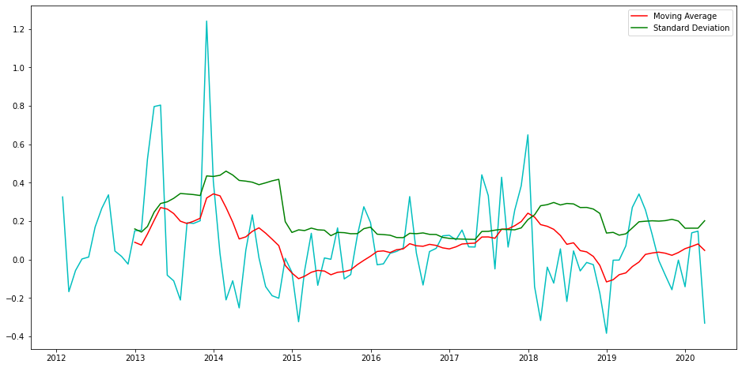
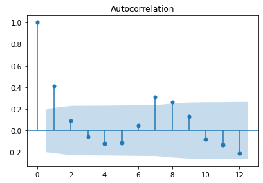
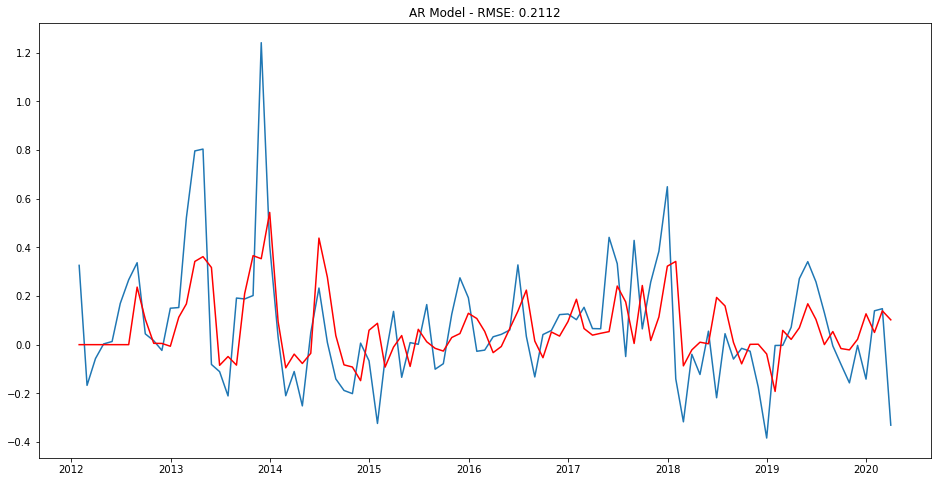
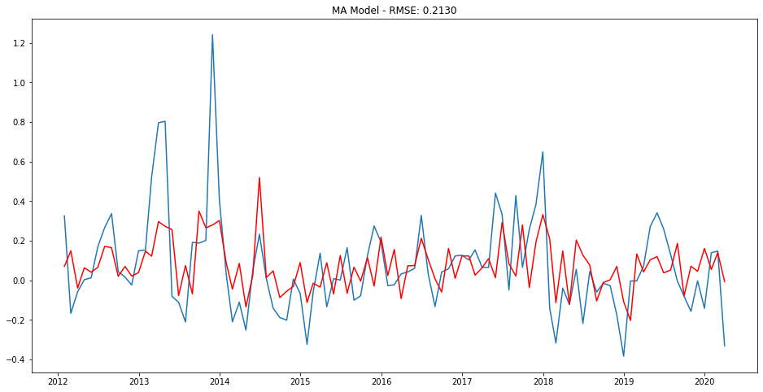


## Tech Stack

- **pandas** — data wrangling and tabular manipulation
- **numpy** — fast numerical arrays
- **scikit-learn** — modeling, pipelines, and evaluation
- **seaborn** — statistical visualization
- **matplotlib** — plotting
- **statsmodels** — OLS / statistical inference & VIF

## How to Run

```bash
python -m venv .venv && source .venv/Scripts/activate  # Windows: .venv\\Scripts\\activate
pip install -r requirements.txt
jupyter notebook "Case_Study_Bitcoin_Price_Prediction+_282_29.ipynb"
```

> Note: large image/zip datasets are not committed; a `data/` note or download link is provided where applicable.

## Notes & Limitations

- Built on a program-provided case study; scope follows the original brief.
- Some deep-learning notebooks were re-run with reduced epochs locally (CPU) — see training curves.
- Metrics reflect the dataset as provided; production use would add monitoring and retraining.

## Attribution

This project was completed as part of the **MIT Applied Data Science Program** (MIT IDSS / Great Learning). The program provided the case-study scaffolding; the analysis, code, and results are my own. Published with permission, for portfolio use only.
