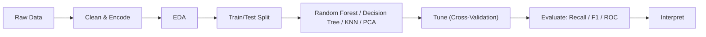
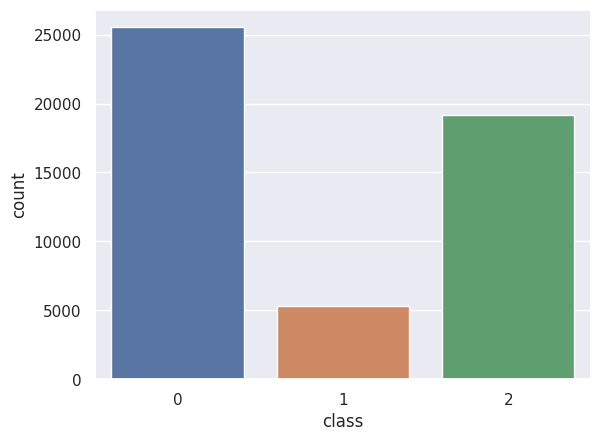
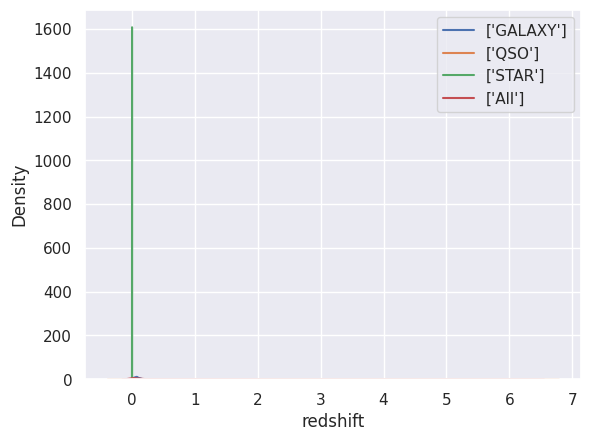
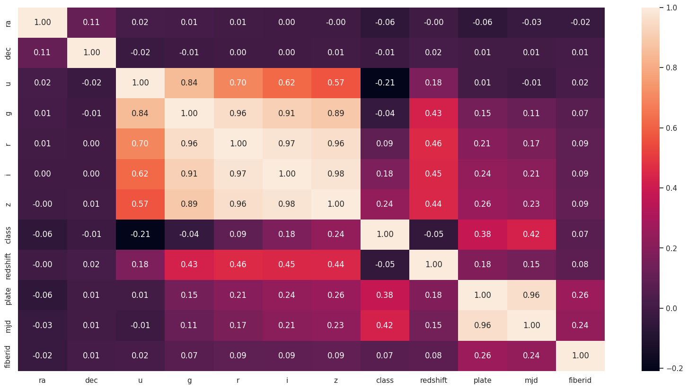
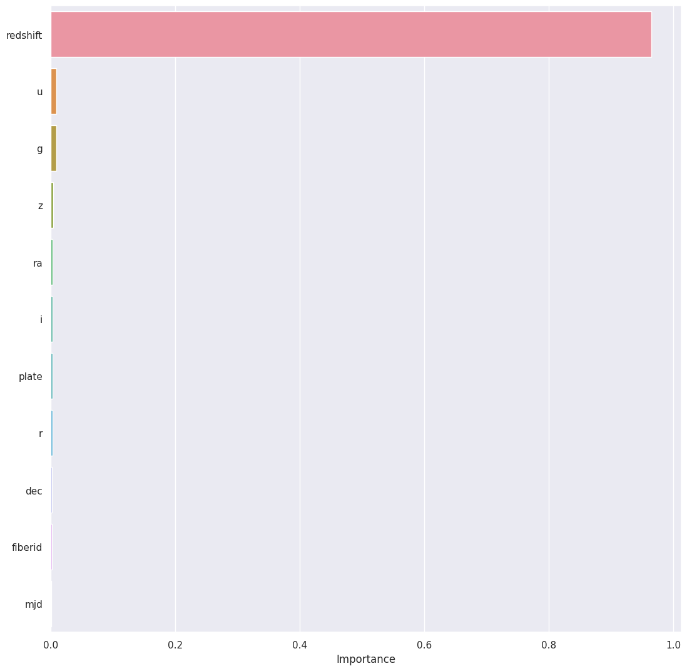
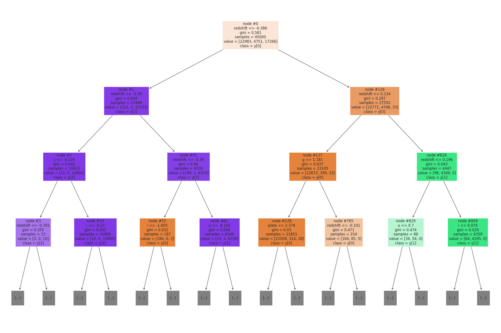
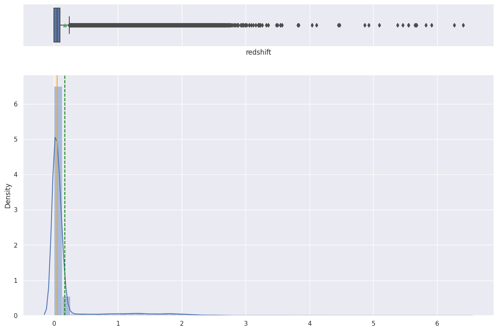
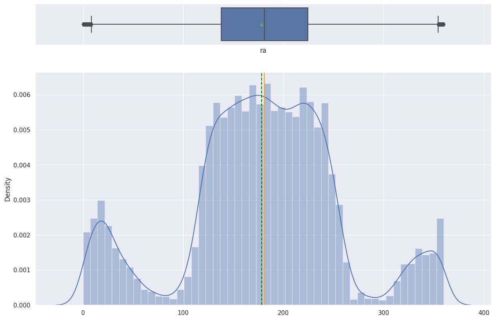
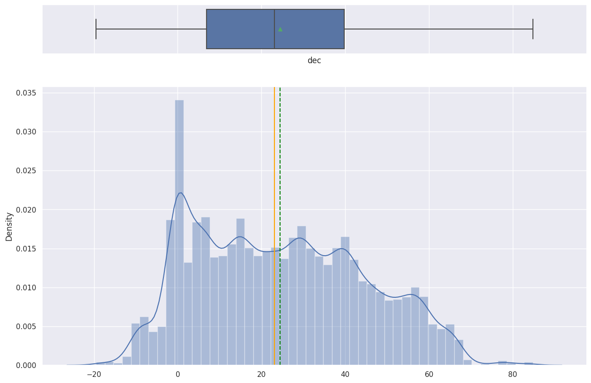
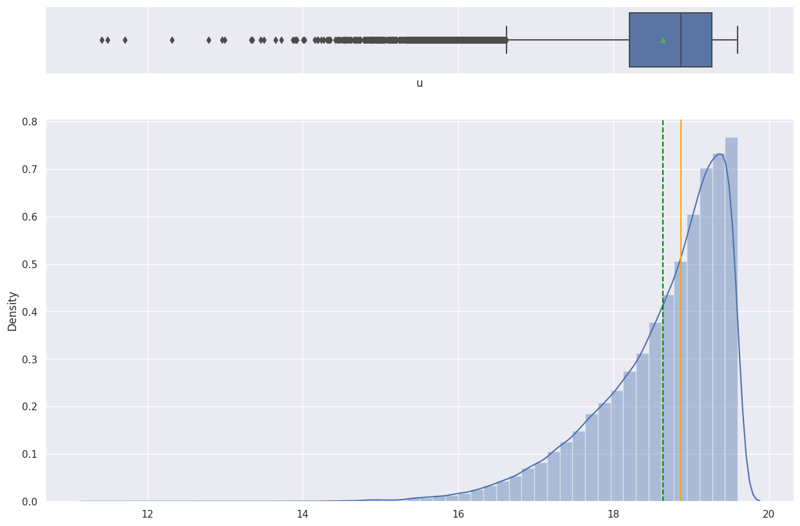

# Celestial Object Detection

> _Classifying stars, galaxies, and quasars from Sloan Digital Sky Survey photometry_

## Overview

We taught a computer to look at telescope measurements and tell whether each object in the sky is a star, a galaxy, or a quasar.

- Goal: multiclass classification of every observed object into Star, Galaxy, or Quasar (QSO) from tabular sky-survey features.
- Astronomy generates vast datasets, making manual labeling impractical and machine learning a natural fit for the task.
- Quasars are rare, supermassive-black-hole-powered objects distinguished mainly by their extreme redshift.
- Approach: supervised non-linear methods, comparing k-Nearest Neighbors against a Decision Tree classifier.

## Methodology



## The Data

_We used a quarter-million real sky observations from a major astronomical survey, each described by 17 measured features._

- Source: Sloan Digital Sky Survey (SDSS) with 250,000 observations across 18 columns and zero missing or duplicate rows.
- Features include photometric filters (u, g, r, i, z), sky coordinates (ra, dec), redshift, and survey metadata.
- Class balance is uneven: 51.1% Galaxy, 38.4% Star, 10.6% Quasar.
- Sampled 50,000 rows for modeling; dropped ID columns (objid, specobjid) that carry no predictive value.



## Exploratory Analysis

_We charted each measurement to see how the three object types differ and which features actually carry useful signal._

- Univariate plots showed plate, field, dec, and redshift are right-skewed with visible outliers.
- Redshift needed a log transform to be readable; its distribution clearly separates the quasar class.
- Photometric filters r, i, and z share near-identical distributions, while u and g are slightly left-skewed.
- Correlation heatmap revealed strong positive links among filters (z-g, z-r, i-r) and redshift negatively correlated with class.





## Key Drivers / Features

_One measurement, redshift, turned out to matter far more than any other for telling the objects apart._

- Redshift dominated feature importance and was the Decision Tree's very first (root) split.
- This matches known astronomy: high redshift is a defining trait of distant quasars in the expanding universe.
- Low-signal columns (rerun, run, field, camcol, fiberid) showed no class separation and were dropped.
- After pruning, 11 features remained for the final models, keeping photometric filters and redshift.



## Modeling & Results

_A simple decision tree read the data almost perfectly, beating the alternative method by a wide margin._

- k-Nearest Neighbors reached only ~0.82 accuracy and ~0.80 weighted F1 on test, falling short of the 90%+ target.
- Applying PCA hurt kNN, dropping test accuracy to ~0.78 weighted F1.
- The Decision Tree achieved ~0.99 weighted precision, recall, and F1 on the test set.
- 5-fold cross-validation confirmed robustness with an average score of 0.983; scaling made no difference.



## Key Takeaways

_A fast, easy-to-explain model can sort sky objects with near-perfect accuracy, making it a practical second opinion for astronomers._

- Decision Trees outperformed kNN while being more computationally efficient on large astronomical data.
- The model rediscovered domain knowledge unaided: redshift is the key to classifying celestial objects.
- At 90%+ performance, the tree is recommended as a quick screening tool over costlier ensemble methods.
- Tree splits at orthogonal boundaries suit naturally bounded feature ranges of stars, galaxies, and quasars.
- Built with: pandas, NumPy, scikit-learn, Matplotlib, seaborn

## More Visualizations







## Tech Stack

- **pandas** — data wrangling and tabular manipulation
- **numpy** — fast numerical arrays
- **scikit-learn** — modeling, pipelines, and evaluation
- **seaborn** — statistical visualization
- **matplotlib** — plotting

## How to Run

```bash
python -m venv .venv && source .venv/Scripts/activate  # Windows: .venv\\Scripts\\activate
pip install -r requirements.txt
jupyter notebook "Celestial_Object_Detection_Final.ipynb"
```

> Note: large image/zip datasets are not committed; a `data/` note or download link is provided where applicable.

## Notes & Limitations

- Built on a program-provided case study; scope follows the original brief.
- Some deep-learning notebooks were re-run with reduced epochs locally (CPU) — see training curves.
- Metrics reflect the dataset as provided; production use would add monitoring and retraining.

## Attribution

This project was completed as part of the **MIT Applied Data Science Program** (MIT IDSS / Great Learning). The program provided the case-study scaffolding; the analysis, code, and results are my own. Published with permission, for portfolio use only.
