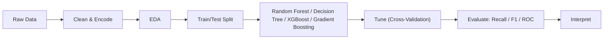
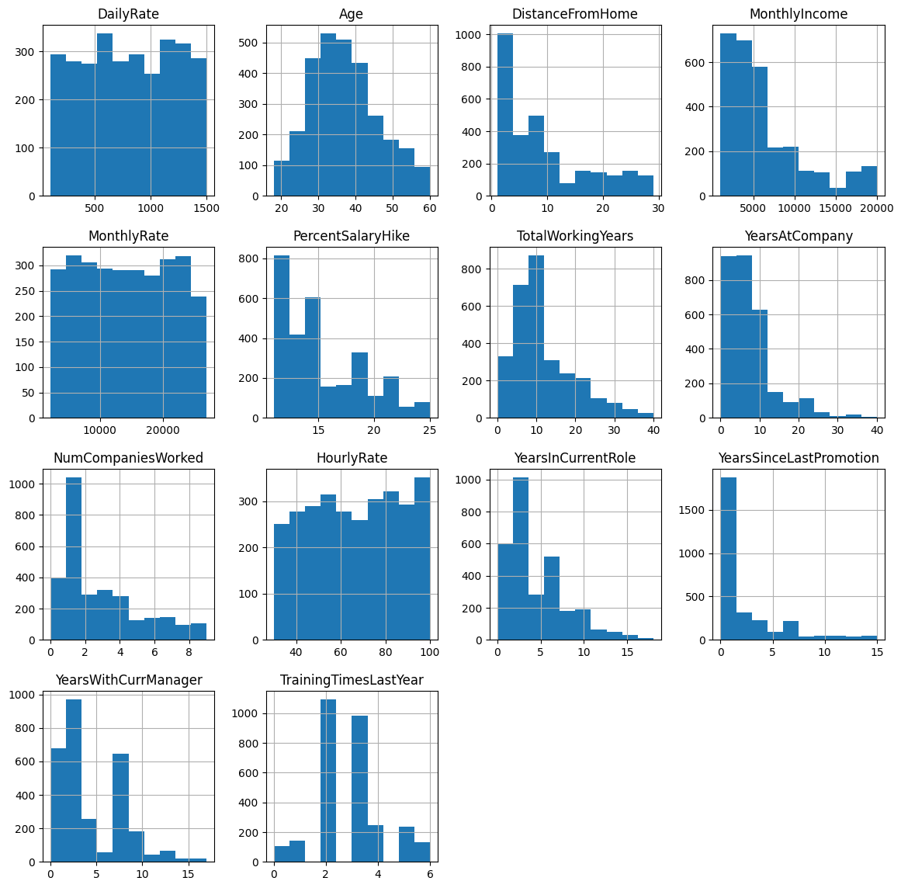
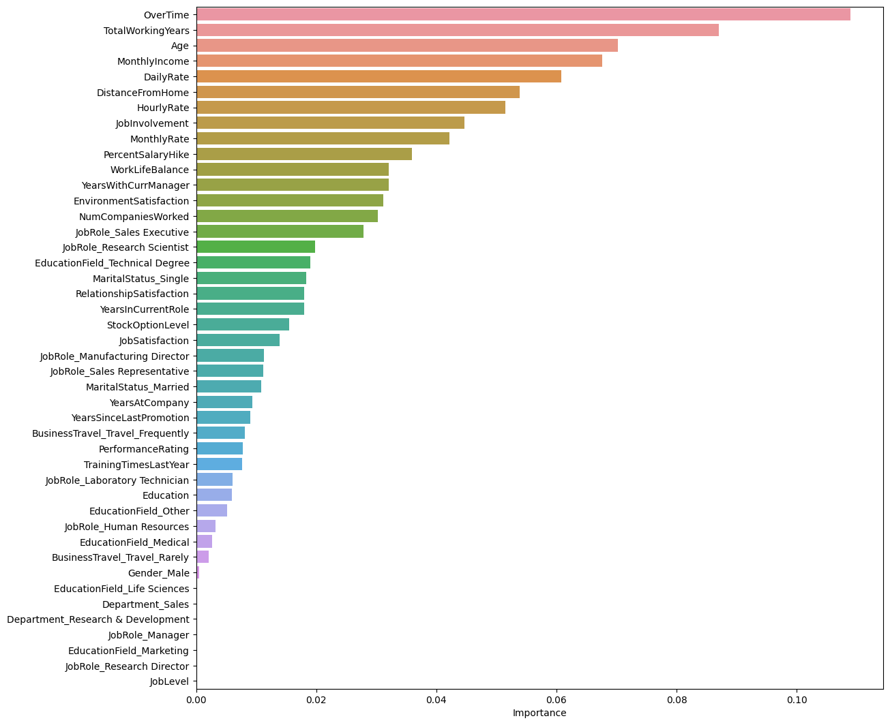
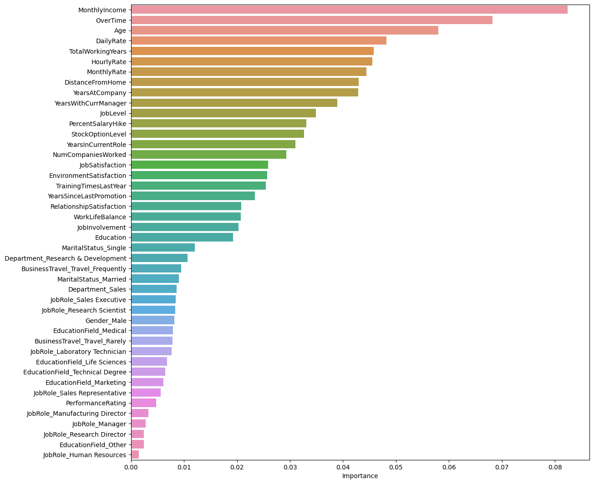
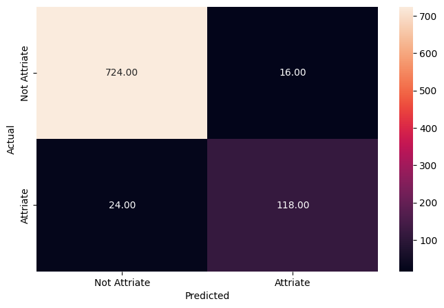
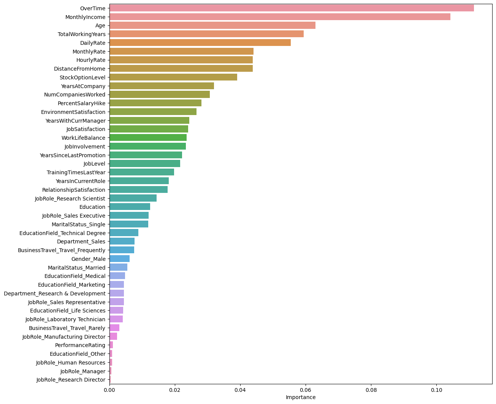
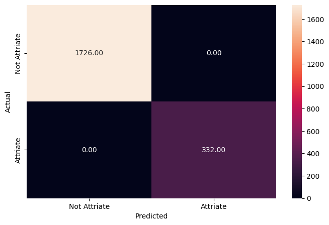
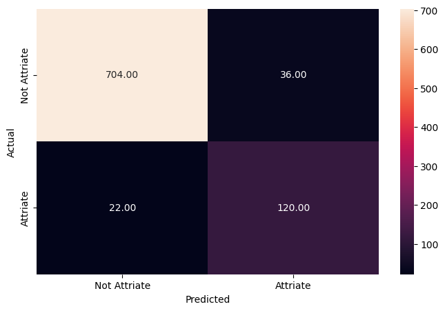
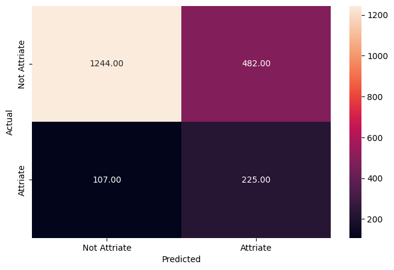
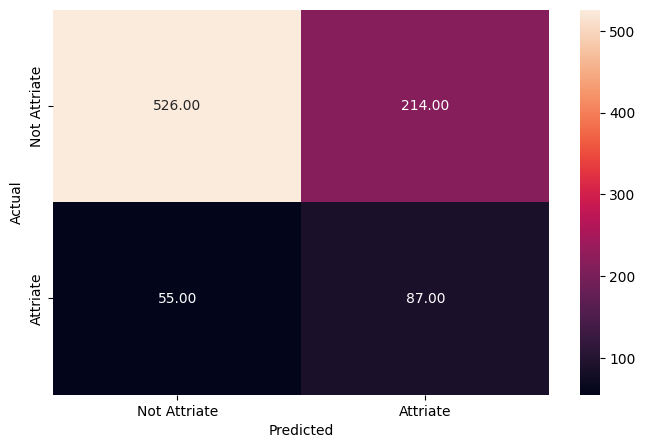

# Predicting Employee Attrition at McCurr Health Consultancy

> _An end-to-end classification pipeline to flag at-risk employees before they leave_

## Overview

We built a tool that predicts which employees are likely to quit so the company can act early to keep them.

- McCurr Health Consultancy spends heavily to retain talent, yet ~16% of its workforce still attrites.
- Goal: predict which employees will leave so HR can intervene before resignations happen.
- Recall on leavers is the priority metric: missing a true leaver (false negative) is the costliest error.
- Framed as a supervised binary classification problem on labeled HR records.

## Methodology



## The Data

_We started with HR records for nearly 3,000 employees described by dozens of personal and job-related details._

- 2,940 employee records across 34 columns, with zero missing values throughout.
- Dropped non-informative fields: EmployeeNumber (unique ID), Over18 and StandardHours (single value).
- Mix of numeric drivers (age, income, distance, tenure) and categorical factors (overtime, travel, role).
- Categorical variables one-hot encoded; data split 70% train / 30% test before modeling.

## Exploratory Analysis

_We profiled the workforce to understand who works there and where early warning signs of leaving appear._

- Average employee age is ~37, ranging 18 to 60, showing strong age diversity across the organization.
- Age is near-normally distributed; DistanceFromHome, MonthlyIncome and tenure are right-skewed.
- Roughly 28% of employees work overtime, a high share that may signal a stressed work-life balance.
- 71% travel rarely and ~19% travel frequently; baseline attrition sits at about 16%.



## Key Drivers of Attrition

_The models agree that overtime, low pay, younger age, and short tenure are the biggest red flags for quitting._

- OverTime is consistently the single strongest predictor of attrition across all models.
- MonthlyIncome, Age, and TotalWorkingYears round out the top drivers of who leaves.
- Profile of risk: employees doing overtime with low salaries and limited experience tend to leave.
- Secondary signals include DailyRate, DistanceFromHome, StockOptionLevel, and YearsAtCompany.





## Modeling & Results

_We tested several models and the tuned Random Forest best balanced catching real leavers without too many false alarms._

- Built Decision Tree and Random Forest models; untuned versions hit 100% on training but overfit.
- GridSearch tuning reduced Decision Tree overfitting but cut precision sharply (0.75 to 0.29).
- Tuned Random Forest is the best model, reaching ~83% recall on leavers on the held-out test set.
- Boosting models (AdaBoost, XGBoost) were also compared; XGBoost scored well among ensembles.





## Key Takeaways

_HR can now flag likely leavers in advance and focus retention efforts on overtime and pay._

- The tuned Random Forest catches ~83% of employees who will actually attrite on unseen data.
- Top lever: reduce excessive overtime to protect work-life balance and lower attrition risk.
- Review compensation, since low MonthlyIncome and DailyRate strongly correlate with leaving.
- Deploy the model to score employees ahead of time and target retention spend where it matters.
- Built with: pandas, numpy, matplotlib, seaborn, scikit-learn, XGBoost

## More Visualizations







## Tech Stack

- **pandas** — data wrangling and tabular manipulation
- **numpy** — fast numerical arrays
- **scikit-learn** — modeling, pipelines, and evaluation
- **seaborn** — statistical visualization
- **matplotlib** — plotting
- **xgboost** — gradient-boosted trees

## How to Run

```bash
python -m venv .venv && source .venv/Scripts/activate  # Windows: .venv\\Scripts\\activate
pip install -r requirements.txt
jupyter notebook "Case_Study+-+Employee_Attrition_Prediction.ipynb"
```

> Note: large image/zip datasets are not committed; a `data/` note or download link is provided where applicable.

## Notes & Limitations

- Built on a program-provided case study; scope follows the original brief.
- Some deep-learning notebooks were re-run with reduced epochs locally (CPU) — see training curves.
- Metrics reflect the dataset as provided; production use would add monitoring and retraining.

## Attribution

This project was completed as part of the **MIT Applied Data Science Program** (MIT IDSS / Great Learning). The program provided the case-study scaffolding; the analysis, code, and results are my own. Published with permission, for portfolio use only.
