# Predicting Hospital Length of Stay for HealthPlus

> _A deployable regression model that forecasts patient length of stay at admission to plan beds, staff, and resources_

## Overview

We built a tool that estimates how many days a patient will stay in the hospital so the hospital can plan beds and staff ahead of time.

- Hospital management gained urgency during COVID-19, when poor allocation of beds and ventilators caused serious complications.
- HealthPlus hired us to find what drives length of stay (LOS) and predict it from data available at admission plus a few tests.
- Accurate LOS at admission lets the hospital pre-allocate beds, staff, and equipment instead of reacting to overcrowding.
- Goal extends beyond analysis: deliver a model that can actually be serialized and deployed into hospital operations.

## Methodology

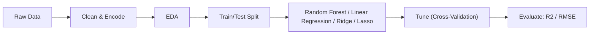

## The Data

_We used records of half a million hospital admissions, each describing the patient, their ward, department, and their actual stay._

- Dataset of 500,000 patient admission records across 15 columns, with no missing values and all rows unique.
- Numeric fields include Available Extra Rooms, staff available, Visitors with Patient, Admission Deposit, and target Stay (in days).
- Categorical fields capture age band, department, ward type, severity of illness, and treating doctor.
- Same patient could be readmitted up to 21 times; ~3 spare rooms and ~5 staff available on average per admission.
- Target is continuous days of stay, so this is framed as a regression problem.

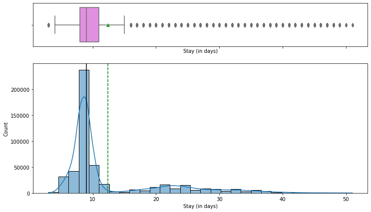

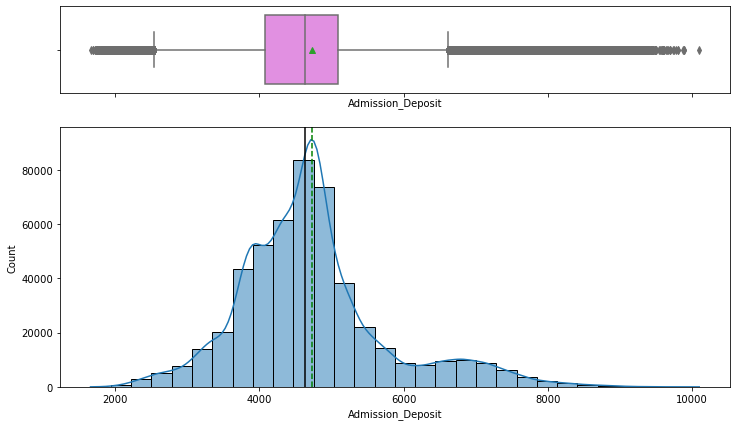

## Exploratory Analysis

_We looked at patterns in the data and found that the department and ward, not the numeric measurements, explain how long patients stay._

- Most patients stay 8-9 days; few exceed 10 days and very few exceed 40, consistent with mostly moderate or minor illness (~82%).
- Correlation heatmap shows almost no linear relationship between numeric features and LOS, pointing to categorical drivers.
- Wards A and C have the longest stays and house serious cases; Ward A holds the most extreme cases and all surgical patients.
- Gynecology is the busiest department (~68% of patients); patients aged 1-10 and 51-100 tend to stay the longest.
- Admission Deposit is near-normal with two-sided outliers; visitor counts are right-skewed (2 and 4 most common).

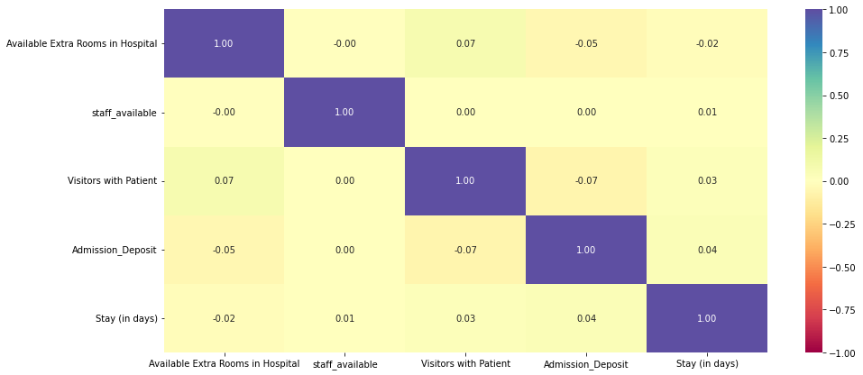

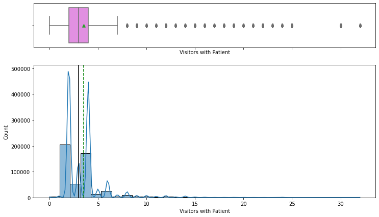

## Modeling & Results

_We tested several prediction methods and a Random Forest, after fine-tuning, gave the most accurate length-of-stay estimates._

- Encoded categorical features, split into train/test, and evaluated with RMSE, MAE, R-squared, Adjusted R-squared, and MAPE.
- Compared Decision Tree, Bagging, Random Forest, AdaBoost, Gradient Boosting, and XGBoost regressors.
- Random Forest Regressor won with the lowest RMSE and MAE; hyperparameter tuning slightly improved its RMSE and R-squared.
- Decision tree root split on Department=gynecology, confirming department is the highest information-gain feature.
- Top features: Department gynecology, Age 41-50, Age 31-40, then anesthesia, radiotherapy, and Admission Deposit.

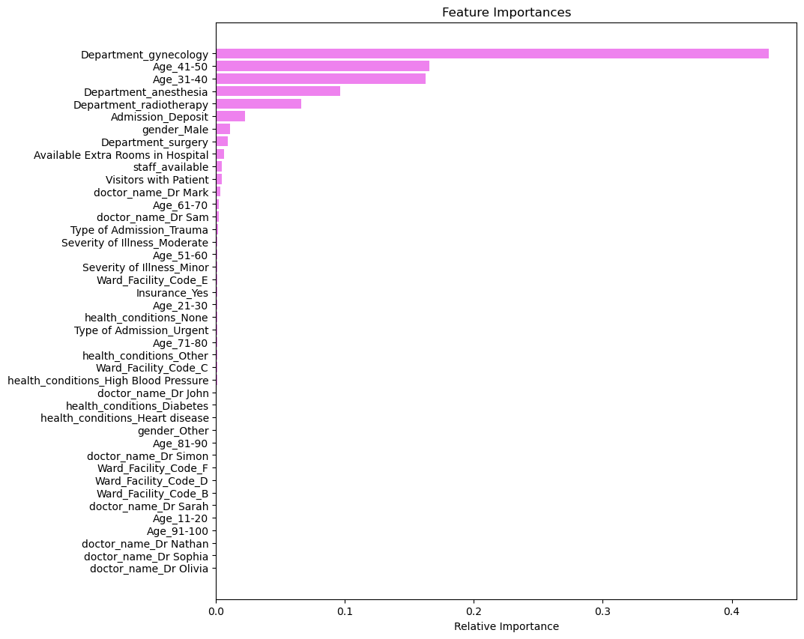

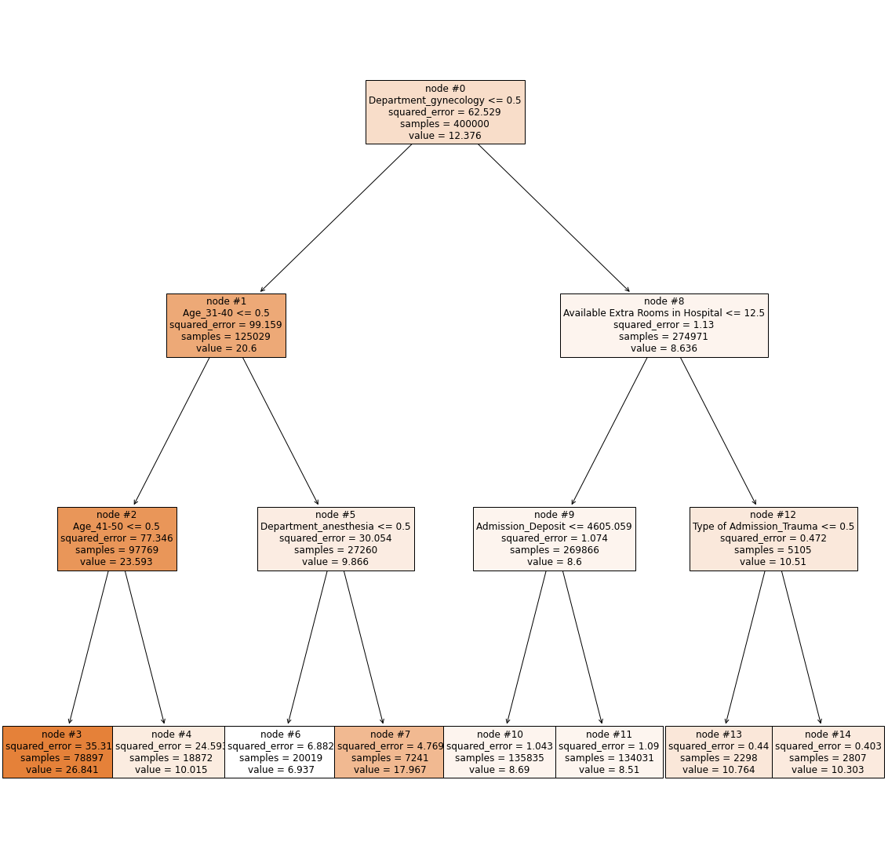

## Productionizing the Model

_We packaged the trained model into a file so it can be saved, shared, and loaded by a live system to make predictions on new patients._

- Wrapped preprocessing and the model in a single scikit-learn Pipeline with a ColumnTransformer so raw admission data feeds straight in.
- Serialized the trained model to disk with Pickle (model.pkl) using pickle.dump, reloaded via pickle.load for inference.
- Also persisted with Joblib (model.joblib), which is more efficient for the large NumPy arrays inside the Random Forest.
- A serialized pipeline can be loaded behind a service at admission to return a live LOS estimate without retraining.
- Pipeline packaging makes the artifact reusable as a starting point for future deployment and further model development.

## Key Takeaways

_Knowing a patient's likely length of stay at admission helps the hospital staff its busiest departments and manage resources._

- Gynecology handles 68.7% of all patients and needs ample dedicated staffing and resources to run smoothly.
- Department, age band, and ward drive LOS far more than numeric measures, so capacity planning should center on them.
- Tuned Random Forest, served via a Pickle/Joblib pipeline, gives operations an at-admission LOS forecast.
- Visitor counts reach up to 32 per patient; capping visitors is a low-cost operational recommendation.
- Built with: pandas, numpy, matplotlib, seaborn, scikit-learn, xgboost, pickle, joblib

## More Visualizations

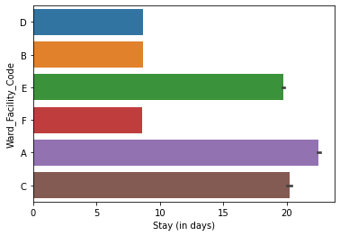
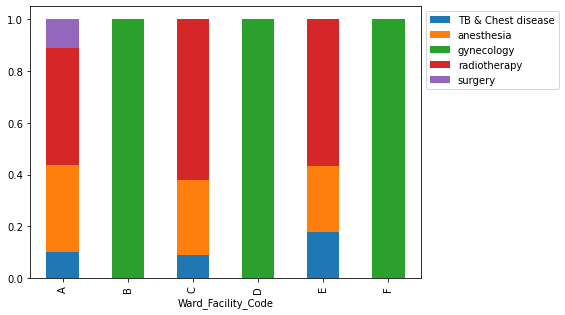
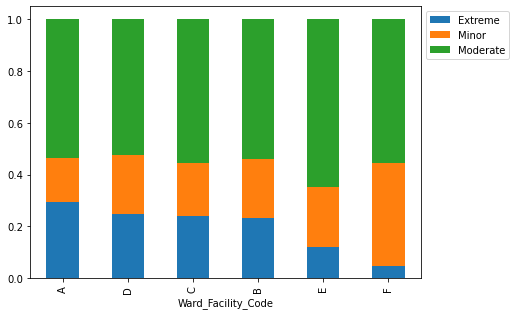
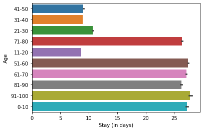


## Tech Stack

- **pandas** — data wrangling and tabular manipulation
- **numpy** — fast numerical arrays
- **scikit-learn** — modeling, pipelines, and evaluation
- **seaborn** — statistical visualization
- **matplotlib** — plotting
- **xgboost** — gradient-boosted trees

## How to Run

```bash
python -m venv .venv && source .venv/Scripts/activate  # Windows: .venv\\Scripts\\activate
pip install -r requirements.txt
jupyter notebook "Hospital_LOS_Prediction.ipynb"
```

> Note: large image/zip datasets are not committed; a `data/` note or download link is provided where applicable.

## Notes & Limitations

- Built on a program-provided case study; scope follows the original brief.
- Some deep-learning notebooks were re-run with reduced epochs locally (CPU) — see training curves.
- Metrics reflect the dataset as provided; production use would add monitoring and retraining.

## Attribution

This project was completed as part of the **MIT Applied Data Science Program** (MIT IDSS / Great Learning). The program provided the case-study scaffolding; the analysis, code, and results are my own. Published with permission, for portfolio use only.
