# Predicting Hotel Booking Cancellations for INN Hotels

> _Using tree-based classifiers to flag at-risk bookings before they cancel_

## Overview

A large share of hotel bookings get cancelled, so I built a model to predict which ones are at risk.

- Cancellations cost INN Hotels through lost revenue and last-minute distribution and re-marketing expenses.
- Goal: predict in advance which bookings are likely to be cancelled so the hotel can act early.
- Framed as a binary classification problem on the INN Hotels booking dataset.
- Identified the key drivers of cancellation to guide concrete business policy recommendations.
- Chose F1-score as the evaluation metric to balance the cost of both types of prediction errors.

## Methodology

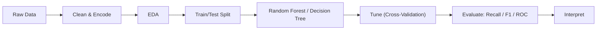

## The Data

_I worked with about 36,000 past bookings, each described by 19 details like lead time and price._

- Dataset of 36,275 bookings with 19 columns covering guest, stay, and booking attributes.
- Mix of categorical fields (meal plan, room type, market segment) and numeric fields.
- No missing values; the unique Booking_ID identifier was dropped as it adds no predictive value.
- Cleaned outliers, recoded rare children counts (9 and 10) to 3, and encoded the target.
- Created dummy variables for categoricals before splitting into train and test sets.

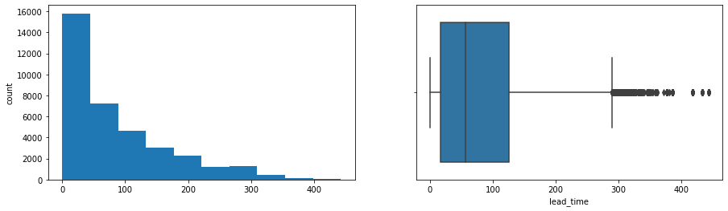

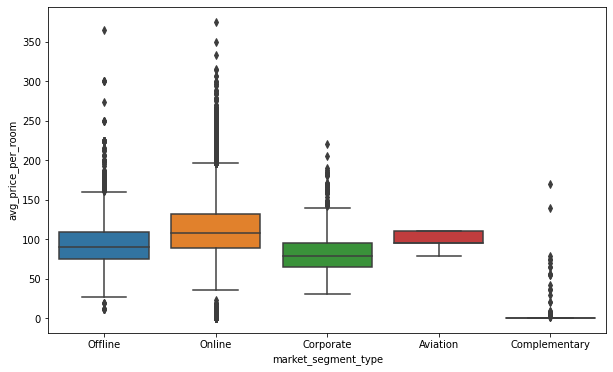

## Exploratory Analysis

_I explored how booking details relate to each other and to whether a booking was cancelled._

- About 72% of bookings were for 2 adults and 93% included no children.
- Lead-time distribution is right-skewed; most book close to arrival, but some over 400 days ahead.
- Online bookings showed the most price variation; complementary segment rooms were near-free.
- October had the most bookings but also the most cancellations; December and January cancelled least.
- A correlation heatmap confirmed only weak relationships among most numeric variables.

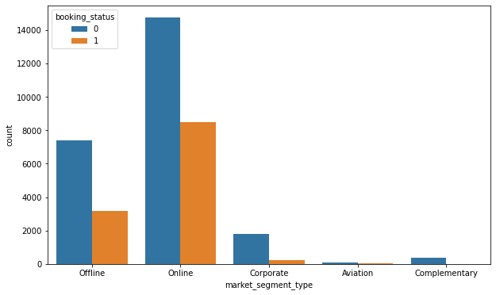

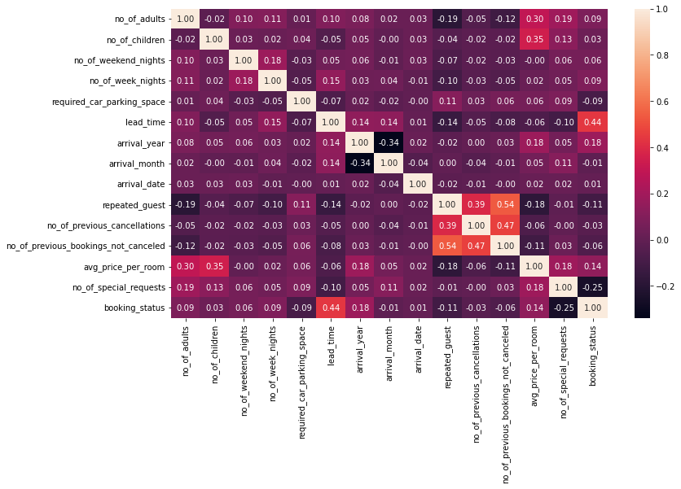

## Key Drivers of Cancellation

_A handful of factors did most of the work in separating cancelled bookings from kept ones._

- Lead time was the strongest driver: longer gaps before arrival meant much higher cancellation risk.
- Online market-segment bookings cancelled far more than offline, corporate, or complementary ones.
- Number of special requests and average price per room were the next most important features.
- Repeat guests rarely cancelled, reinforcing their value to the hotel's brand and loyalty.
- Both models agreed on the same top four drivers, lending confidence to these findings.

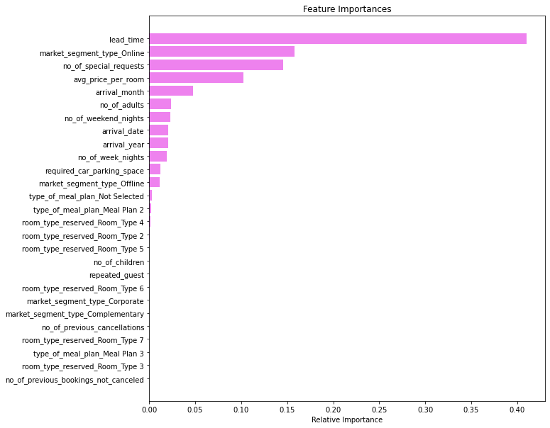

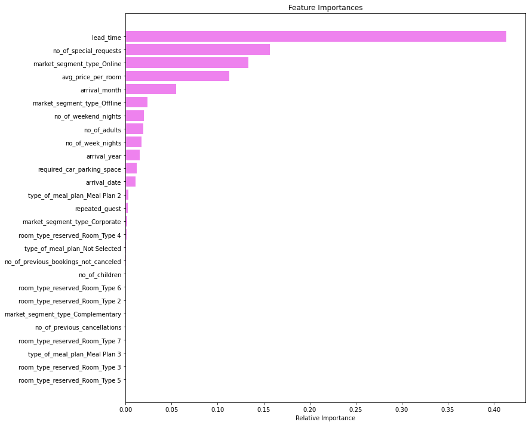

## Modeling & Results

_I trained and tuned decision tree and random forest models, with the random forest performing best._

- Built Decision Tree and Random Forest classifiers; both overfit badly when left unconstrained.
- Tuned with GridSearchCV using class weights {0:0.3, 1:0.7} to counter the class imbalance.
- Tuning cut overfitting and improved recall on the minority cancellation class.
- Tuned random forest was the best model, reaching about 85% F1-score on the test set.
- Achieved a macro average of roughly 89%, with balanced precision and recall for cancellations.

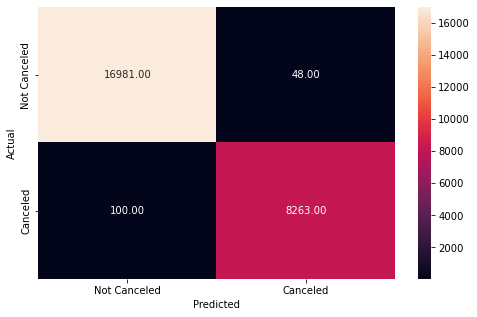

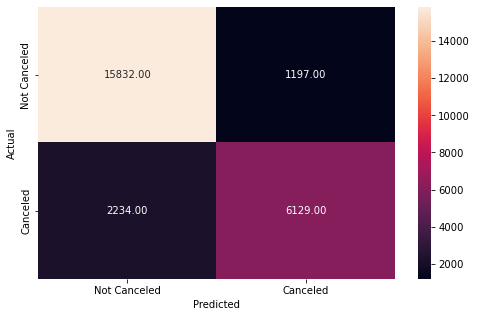

## Key Takeaways

_The hotel can now flag risky bookings early and act to reduce cancellations._

- The tuned random forest reliably predicts which bookings are likely to be cancelled.
- Lead time, online channel, special requests, and room price are the levers to watch.
- Recommendation: contact long-lead and online bookings before arrival to re-confirm.
- Cultivating repeat guests further protects against cancellations and builds brand equity.
- Built with: pandas, numpy, matplotlib, seaborn, scikit-learn.

## More Visualizations

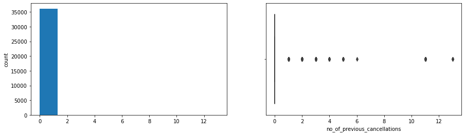
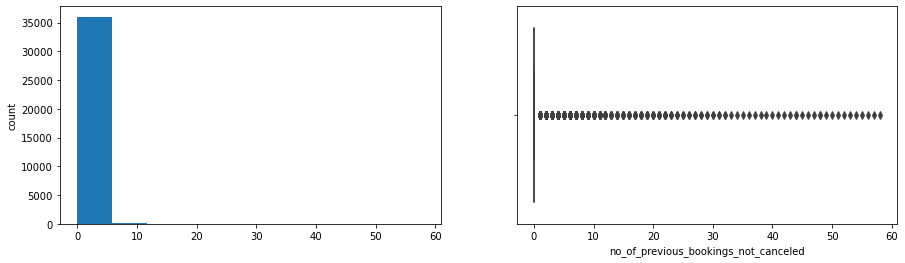
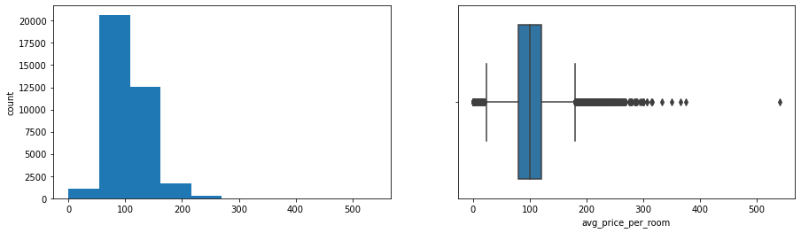
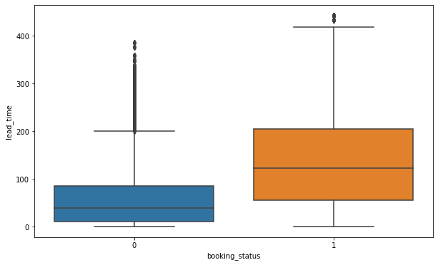


## Tech Stack

- **pandas** — data wrangling and tabular manipulation
- **numpy** — fast numerical arrays
- **scikit-learn** — modeling, pipelines, and evaluation
- **seaborn** — statistical visualization
- **matplotlib** — plotting

## How to Run

```bash
python -m venv .venv && source .venv/Scripts/activate  # Windows: .venv\\Scripts\\activate
pip install -r requirements.txt
jupyter notebook "Learner_Notebook_Practical_Data_Science_Practise_Project.ipynb"
```

> Note: large image/zip datasets are not committed; a `data/` note or download link is provided where applicable.

## Notes & Limitations

- Built on a program-provided case study; scope follows the original brief.
- Some deep-learning notebooks were re-run with reduced epochs locally (CPU) — see training curves.
- Metrics reflect the dataset as provided; production use would add monitoring and retraining.

## Attribution

This project was completed as part of the **MIT Applied Data Science Program** (MIT IDSS / Great Learning). The program provided the case-study scaffolding; the analysis, code, and results are my own. Published with permission, for portfolio use only.
