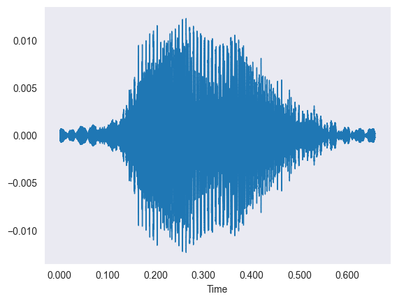
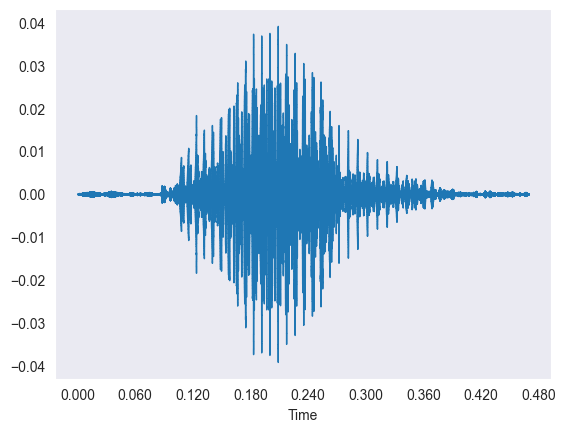
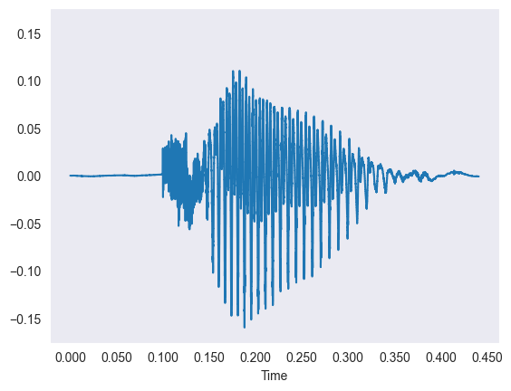
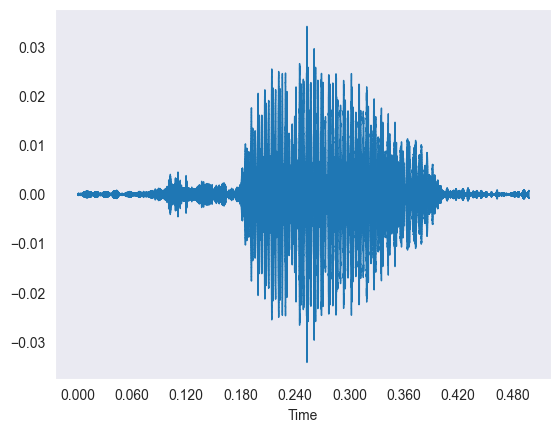
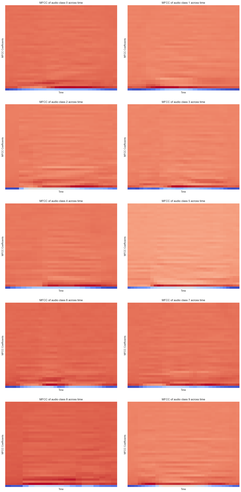
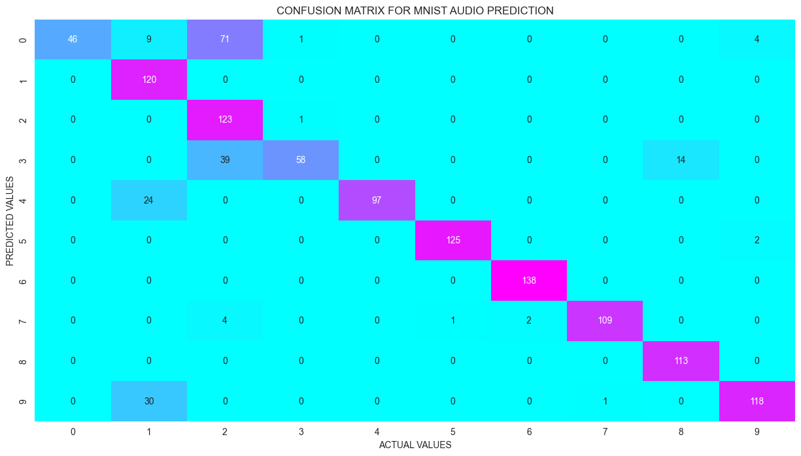
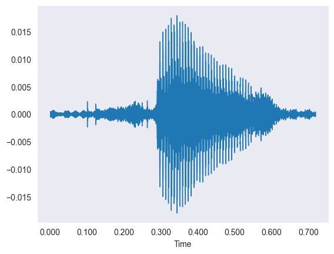
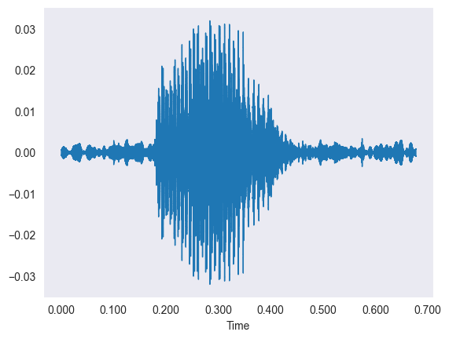
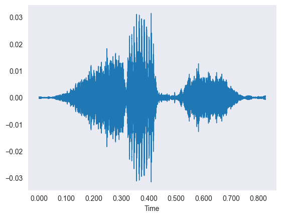
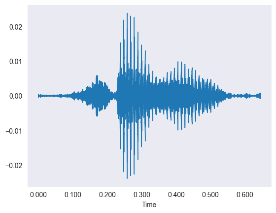

# Audio MNIST: Spoken-Digit Recognition with a Neural Network

> _Classifying spoken digits 0-9 from raw .wav audio using MFCC features and a Keras ANN_

## Overview

We taught a computer to listen to someone say a number from zero to nine and correctly recognize which digit was spoken.

- Speech recognition is a core deep-learning application; the goal here is recognizing spoken digits 0-9 from raw audio.
- Input is short .wav recordings of people pronouncing single digits, spanning many speakers, pitches, and timbres.
- Objective: build a classifier that maps an audio clip to one of 10 digit classes regardless of who is speaking.
- Challenge is converting variable-length sound waves into a fixed, model-ready numeric representation.
- Framed as a 10-class supervised classification task evaluated on held-out audio.

## Methodology


## The Data (Audio)

_The data is thousands of short sound clips of people saying digits, which we first looked at as wiggly waveforms._

- Dataset of 5,000 spoken-digit .wav clips covering all 10 classes (0-9) from multiple speakers.
- Audio loaded with librosa and resampled to a standard 22,050 Hz sample rate for consistency.
- Each waveform plots time on the X-axis against amplitude on the Y-axis of the sound vibration.
- Spectrograms reveal how signal strength is distributed across frequency and time within each clip.
- Clips vary in length, motivating a feature step that yields a fixed-size vector per recording.









## Feature Extraction (MFCC)

_Instead of feeding raw sound in, we summarized each clip into 40 numbers that capture the shape of its sound._

- Mel-Frequency Cepstral Coefficients (MFCCs) are the standard audio features for ML on speech.
- librosa.feature.mfcc extracts 40 coefficients per time step from each resampled waveform.
- Per-clip features averaged across time, collapsing variable-length audio into a fixed 40-value vector.
- MFCC spectrograms show patterns unique to each digit, so similar sounds yield similar features regardless of speaker.
- The result is a clean tabular dataset of 40 features per sample ready for the neural network.



## Model Architecture

_We used a simple neural network with several layers of artificial neurons to learn the digit from the 40 features._

- Feed-forward Artificial Neural Network (ANN) built with Keras Sequential since spatial locality is not needed for averaged MFCCs.
- Three hidden Dense layers of 100 ReLU neurons each, taking the 40-feature input vector.
- Output is a 10-neuron softmax layer producing a probability for each digit class.
- Compiled with the Adam optimizer and sparse categorical cross-entropy loss.
- Data split 75/25 into 3,750 training and 1,250 test samples; ModelCheckpoint saves the best model.

## Results

_Even after a short training run, the network correctly identified the spoken digit most of the time._

- Deck was re-run with reduced epochs (3) for speed, so accuracy reflects a brief training budget.
- Test accuracy reached roughly the mid-80s percent, with validation accuracy climbing across epochs.
- Several digits (5, 6, 7) achieved near-perfect precision and recall on the test set.
- Confusion matrix shows most clips classified correctly, with a few mix-ups (e.g. some 0s predicted as 2).
- Performance would improve further with more training epochs and tuning.



## Key Takeaways

_Turning sound into the right summary features let a small, simple network recognize spoken digits well._

- MFCC feature engineering is the key step that makes audio classification tractable for a basic ANN.
- Averaging MFCCs over time gives speaker-invariant, fixed-length inputs that generalize across voices.
- A compact 3-layer network reaches strong accuracy, showing heavy CNNs are not always required.
- More epochs and hyperparameter tuning are the clearest path to closing the remaining error gap.
- Built with: librosa, NumPy, pandas, scikit-learn, Matplotlib, and TensorFlow/Keras.

## More Visualizations







## Tech Stack

- **pandas** — data wrangling and tabular manipulation
- **numpy** — fast numerical arrays
- **scikit-learn** — modeling, pipelines, and evaluation
- **seaborn** — statistical visualization
- **matplotlib** — plotting
- **tensorflow** — deep-learning framework
- **keras** — high-level neural-network API
- **librosa** — audio feature extraction (MFCC)

## How to Run

```bash
python -m venv .venv && source .venv/Scripts/activate  # Windows: .venv\\Scripts\\activate
pip install -r requirements.txt
jupyter notebook "Audio_MNIST_Digit_Recognition.ipynb"
```

> Note: large image/zip datasets are not committed; a `data/` note or download link is provided where applicable.

## Notes & Limitations

- Built on a program-provided case study; scope follows the original brief.
- Some deep-learning notebooks were re-run with reduced epochs locally (CPU) — see training curves.
- Metrics reflect the dataset as provided; production use would add monitoring and retraining.

## Attribution

This project was completed as part of the **MIT Applied Data Science Program** (MIT IDSS / Great Learning). The program provided the case-study scaffolding; the analysis, code, and results are my own. Published with permission, for portfolio use only.
