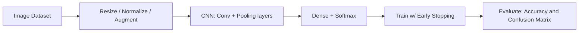
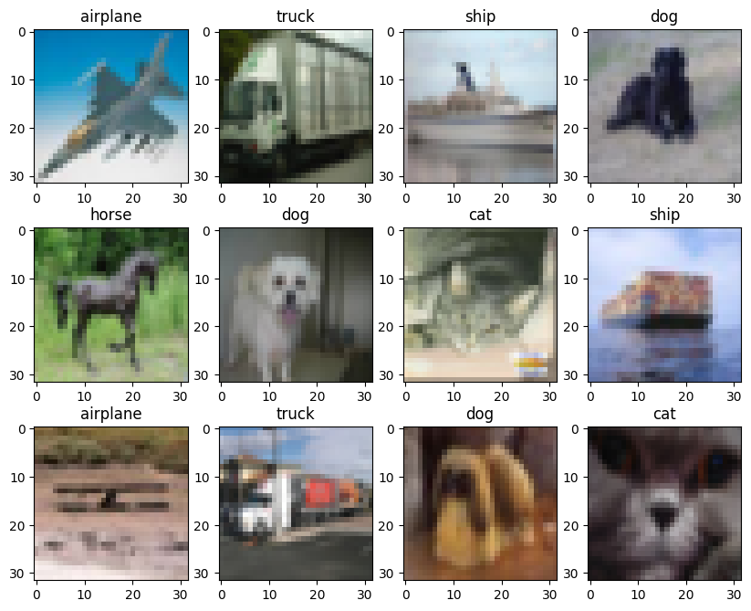
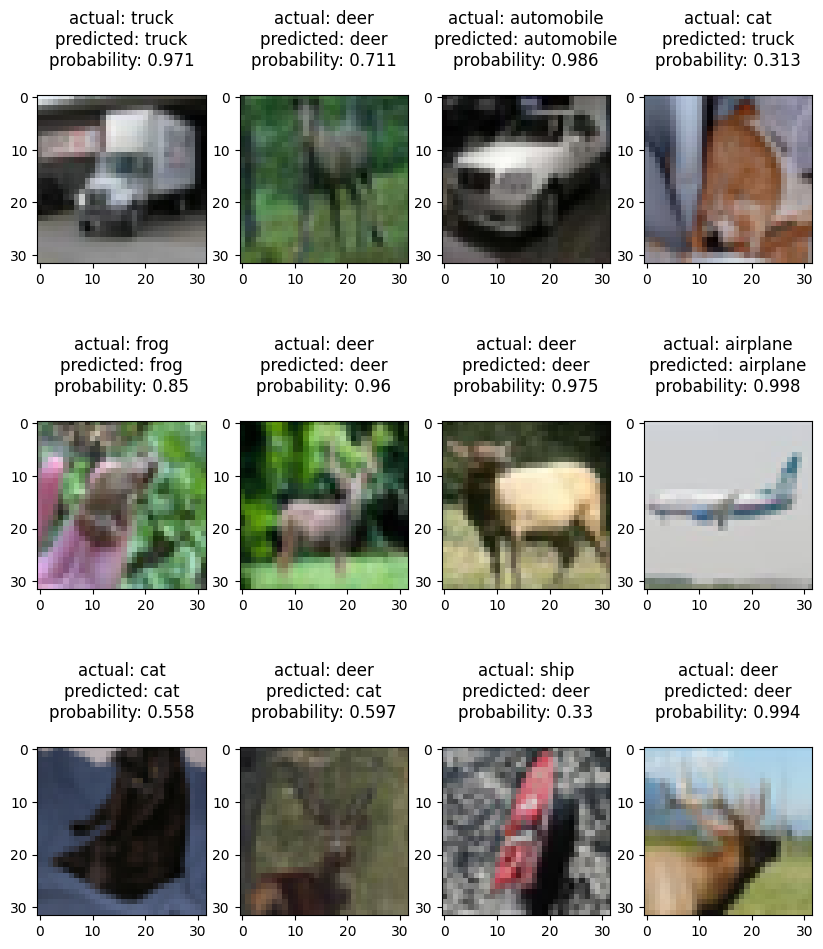
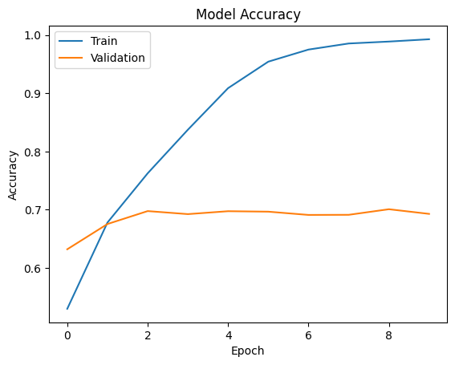
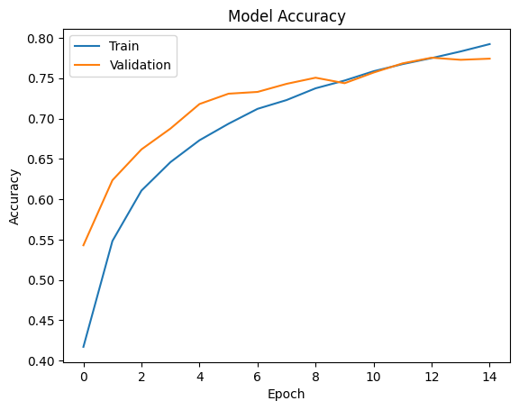
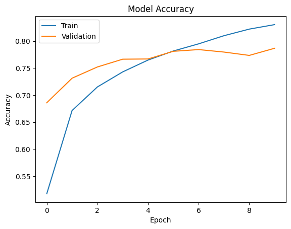
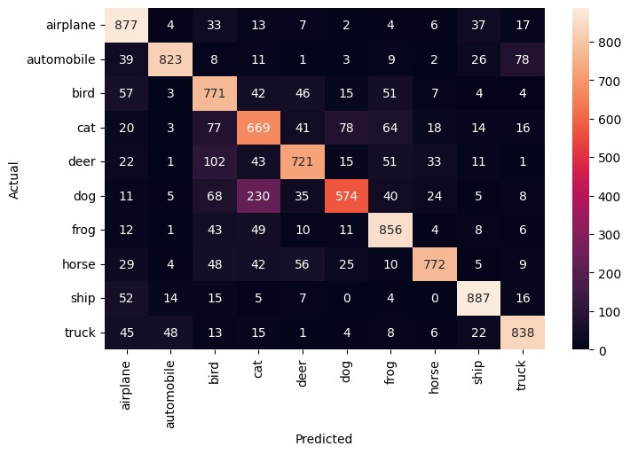
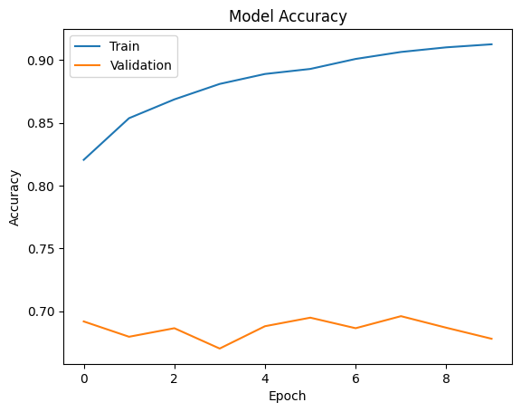

# CIFAR-10 Image Classification with CNNs

> _Classifying 32x32 color images into 10 object classes with convolutional neural networks and transfer learning_

## Overview

The goal is to teach a computer to look at a small photo and correctly name what object it shows.

- CIFAR-10 is a benchmark image dataset spanning 10 everyday object classes used to train and test computer vision models.
- Objective: build a model that takes a tiny 32x32 color image and predicts which of the 10 categories it belongs to.
- Image classification is a core deep learning task that powers vision systems in self-driving, search, and tagging.
- Approach: build a convolutional neural network (CNN) from scratch, then apply transfer learning to push accuracy higher.

## Methodology



## The Data (10 Classes)

_The dataset holds 60,000 labeled photos split across ten common object types like planes, cats, and trucks._

- 10 classes: airplanes, cars, birds, cats, deer, dogs, frogs, horses, ships, and trucks.
- 50,000 training images and 10,000 test images, loaded directly from the Keras library as NumPy arrays.
- Each image is a 32x32 grid of pixels with 3 color channels (R, G, B), stored as a 4-dimensional array.
- Labels arrive encoded as numbers (e.g. 6 = frog), mapped to readable category names for interpretation.



## Sample Images & Preprocessing

_Before training, the raw pixel values are rescaled and the labels reformatted so the network can learn efficiently._

- Random sample images are reconstructed from NumPy arrays with matplotlib's imshow to inspect the data.
- Pixel values range 0-255, so every pixel is divided by 255 to normalize inputs to a 0-1 scale.
- Normalization speeds up training, reduces the chance of getting stuck at local optima, and stabilizes weights.
- Targets are one-hot encoded into 10 columns so the output layer can produce a probability per class.



## CNN Architecture

_A network of stacked layers learns visual patterns, refined across several versions to fix overfitting._

- The first CNN, built sequentially with LeakyReLU activation, trained 2,105,066 parameters but heavily overfit.
- Compiled with categorical cross-entropy loss and accuracy as the metric for this multi-class problem.
- Dropout layers were added to curb overfitting, then more convolutional plus max-pooling layers cut parameters ~50%.
- The third iteration solved overfitting and gave generalized performance with strong validation accuracy.
- Transfer learning then reused pre-trained VGG16 (14.7M+ frozen parameters) to boost accuracy faster.





## Results & Accuracy

_The best model correctly identifies about four out of five unseen photos, performing consistently on new data._

- Transfer learning with VGG16 delivered the best validation accuracy without training any convolutional layers.
- The final model reached about 79% accuracy on the held-out test data.
- Test accuracy closely matched validation accuracy, confirming the model generalizes rather than memorizes.
- Recall varied across classes, meaning the model identifies some objects well but struggles with others.
- A confusion heatmap reveals which class pairs are most often mixed up in the predictions.





## Key Takeaways

_Combining a custom-built network with a pre-trained one produced an accurate, well-generalizing image classifier._

- A from-scratch CNN can classify CIFAR-10's 10 object classes once overfitting is controlled with dropout and pooling.
- Iterative architecture changes mattered more than raw parameter count for improving generalization.
- Transfer learning from VGG16 achieved the strongest results with far less training of the convolutional base.
- The final classifier reached ~79% test accuracy, comparable to its validation performance.
- Built with: Python, TensorFlow, Keras (VGG16), NumPy, Matplotlib, and scikit-learn.

## More Visualizations




## Tech Stack

- **numpy** — fast numerical arrays
- **scikit-learn** — modeling, pipelines, and evaluation
- **seaborn** — statistical visualization
- **matplotlib** — plotting
- **tensorflow** — deep-learning framework
- **keras** — high-level neural-network API

## How to Run

```bash
python -m venv .venv && source .venv/Scripts/activate  # Windows: .venv\\Scripts\\activate
pip install -r requirements.txt
jupyter notebook "CIFAR_10_Image_Classification.ipynb"
```

> Note: large image/zip datasets are not committed; a `data/` note or download link is provided where applicable.

## Notes & Limitations

- Built on a program-provided case study; scope follows the original brief.
- Some deep-learning notebooks were re-run with reduced epochs locally (CPU) — see training curves.
- Metrics reflect the dataset as provided; production use would add monitoring and retraining.

## Attribution

This project was completed as part of the **MIT Applied Data Science Program** (MIT IDSS / Great Learning). The program provided the case-study scaffolding; the analysis, code, and results are my own. Published with permission, for portfolio use only.
