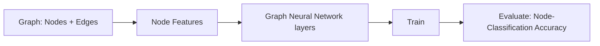
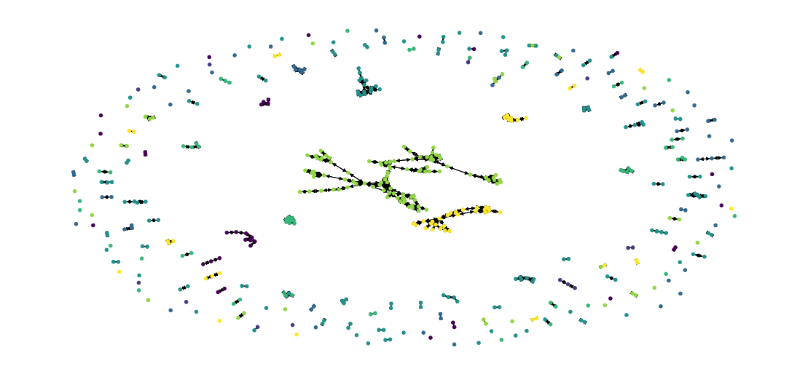

# Citation Network Classification with Graph Neural Networks

> _Predicting a paper's research topic from how it cites other papers, using a GCN on the Cora dataset_

## Overview

We want to guess what topic a research paper is about by looking at which other papers it cites.

- Goal: classify each scientific publication into one of 7 research topics using node classification on a citation graph.
- Standard ML treats each paper independently; here the citation links between papers carry signal we want to exploit.
- A Graph Neural Network learns each node's representation from its own words AND its cited/citing neighbors.
- Only 140 of 2,708 papers are labeled for training, so the model must generalize from a tiny labeled fraction.
- Stretch task: link prediction — given two papers, predict whether a citation edge should exist between them.

## Methodology



## The Data (Citation Graph)

_The data is a web of 2,708 papers connected by who cites whom, with each paper described by the words it uses._

- Cora dataset: 2,708 scientific publications (nodes) linked by 5,429 citation relationships across 7 topic classes.
- Each paper is a 1,433-length binary word vector: a 1 where a dictionary word is present, 0 where absent.
- Citations are directional (a paper cites an earlier one) and there are no self-loops — a paper cannot cite itself.
- Loaded via DGL's CoraGraphDataset, which exposes 10,556 directed edges and per-node feature/label tensors.
- Pre-split into 140 training, 500 validation, and 1,000 test nodes via boolean masks on the single graph.

## Graph Construction

_We turn the papers and citations into a graph the computer can read, then draw a slice of it to see the structure._

- The dataset is a single DGLGraph: nodes hold 1,433-dim features plus labels and train/val/test masks; edges encode citations.
- An adjacency view is a 2,708 x 2,708 matrix with an entry wherever one paper cites another (directional, no diagonal).
- Visualization converts a 500-node subgraph to NetworkX and colors each node by its topic label to reveal clustering.
- Graph convolutions pull information along edges, so a paper's neighbors directly shape its learned representation.
- For link prediction, 10% of real edges are held out as positive test cases and matched with sampled non-edges as negatives.



## GNN Model

_The model blends each paper's words with its neighbors' information over two passes, then picks the most likely topic._

- GCN architecture: GraphConv (1,433 -> 512), LeakyReLU(0.2), Linear (512 -> 512), LeakyReLU, GraphConv (512 -> 7).
- DGL's GraphConv layer handles message passing — aggregating and transforming features from each node's neighbors.
- Trained with Adam (lr=0.003, weight_decay=1e-3) for 100 epochs using cross-entropy on only the 140 training nodes.
- Validation accuracy is tracked each epoch to checkpoint the best model and report its corresponding test accuracy.
- Link-prediction variant swaps in two GraphSAGE (mean) layers plus a dot-product scorer over node embeddings.

## Results

_From just 140 labeled papers the model correctly identifies the topic of about 4 out of 5 unseen papers._

- Node classification reaches a best test accuracy of ~80.6% (validation ~80.6%) on the 1,000 held-out papers.
- Accuracy climbs fast — from ~9% to ~80% within the first ~25 epochs — showing the graph signal is highly learnable.
- Only 140 labeled nodes (5% of the graph) were needed, demonstrating the label efficiency of graph convolutions.
- Link prediction with GraphSAGE + dot-product scoring achieves an AUC of 0.87 on held-out citation edges.
- Both tasks confirm that citation structure, not just word content, carries strong predictive signal.

## Key Takeaways

_Connections between papers are powerful predictors, and graph neural networks turn those connections into accurate guesses._

- Graph convolutions let a model learn from relationships, not just isolated feature vectors — ideal for networked data.
- A compact 2-layer GCN generalizes well from very few labels by propagating information across citation edges.
- The same node embeddings support multiple tasks: topic classification (~80.6%) and link/edge prediction (AUC 0.87).
- Approach transfers directly to social, recommendation, and knowledge-graph problems framed as node or link prediction.
- Built with: DGL, PyTorch, NetworkX, scikit-learn, NumPy, and Matplotlib.

## Tech Stack

- **numpy** — fast numerical arrays
- **scikit-learn** — modeling, pipelines, and evaluation
- **matplotlib** — plotting
- **torch** — deep-learning framework
- **dgl** — graph neural networks
- **networkx** — graph / network analysis
- **scipy** — scientific computing

## How to Run

```bash
python -m venv .venv && source .venv/Scripts/activate  # Windows: .venv\\Scripts\\activate
pip install -r requirements.txt
jupyter notebook "Citation_Network_Classification.ipynb"
```

> Note: large image/zip datasets are not committed; a `data/` note or download link is provided where applicable.

## Notes & Limitations

- Built on a program-provided case study; scope follows the original brief.
- Some deep-learning notebooks were re-run with reduced epochs locally (CPU) — see training curves.
- Metrics reflect the dataset as provided; production use would add monitoring and retraining.

## Attribution

This project was completed as part of the **MIT Applied Data Science Program** (MIT IDSS / Great Learning). The program provided the case-study scaffolding; the analysis, code, and results are my own. Published with permission, for portfolio use only.
