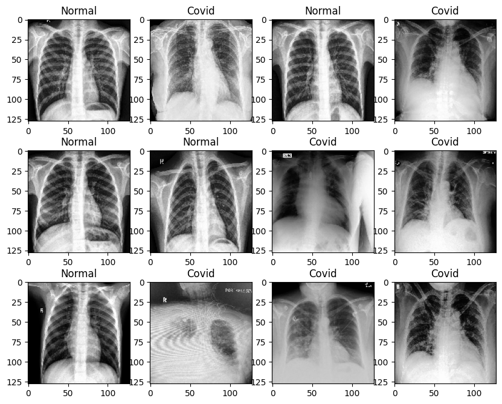
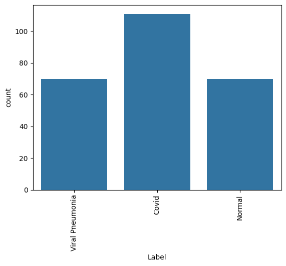
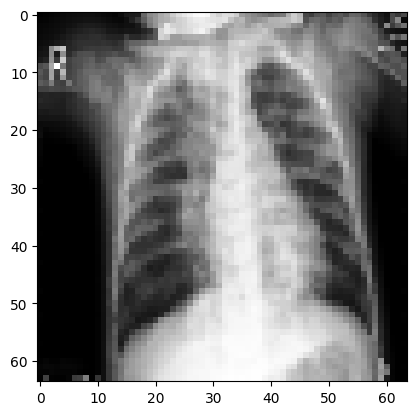
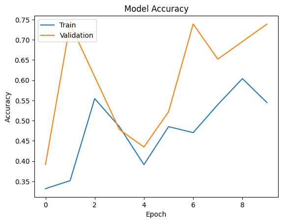
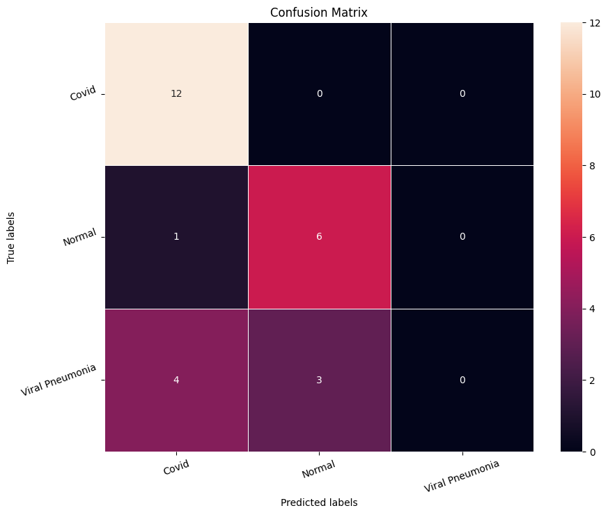
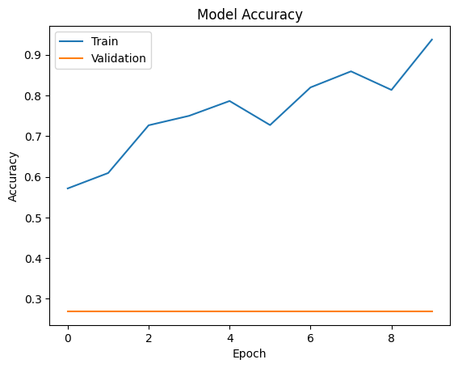
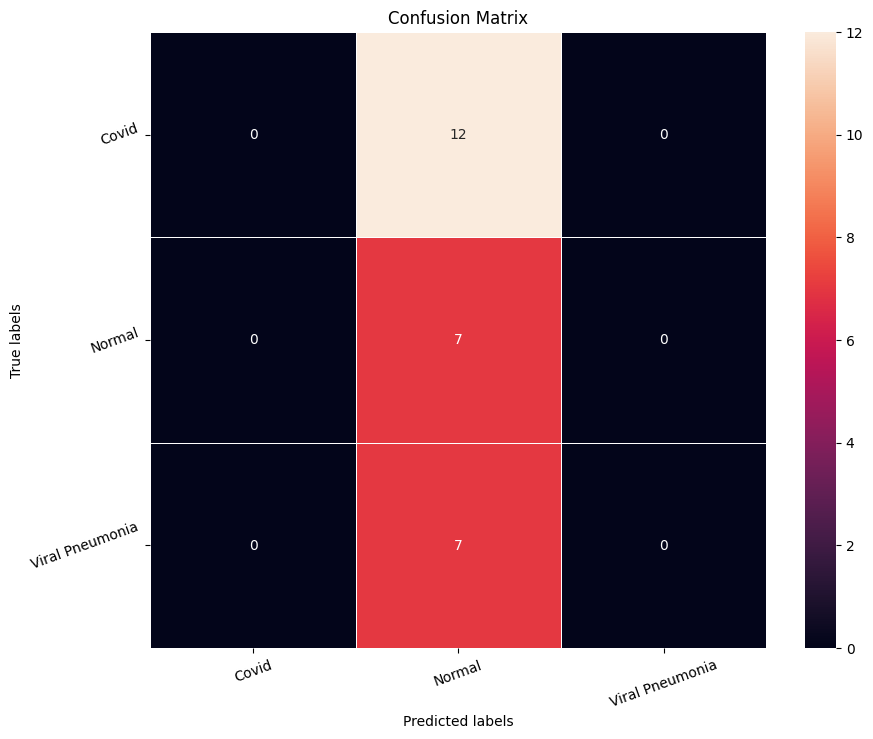
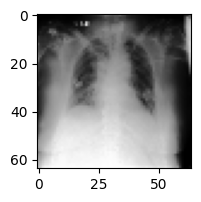
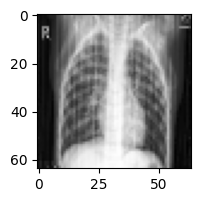
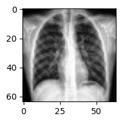

# COVID-19 Chest X-Ray Classification

> _A CNN decision-aid that triages chest X-rays into COVID, Normal, and Viral Pneumonia_

## Overview

We taught a computer to look at a chest X-ray and flag whether it looks like COVID, normal lungs, or another type of pneumonia.

- COVID-19 spread faster than radiologists could read scans, creating demand for fast automated triage support.
- Goal: classify each chest X-ray into one of three categories - COVID, Normal, or Viral Pneumonia.
- Framed as a decision-aid that prioritizes and flags scans for clinicians, not as a standalone diagnosis.
- Class imbalance matters here, so the model is judged on Precision and Recall, not accuracy alone.
- Misses are asymmetric: calling a true COVID case 'Normal' is the costly error we most want to avoid.

## Methodology


## The Data (X-ray Images)

_We started with a few hundred labeled chest X-ray pictures, each already tagged with its true condition._

- 251 labeled chest X-ray images stored as a 4-D NumPy array of pixel intensities.
- Each image arrives at 128x128 pixels across 3 color channels.
- Three target classes: COVID, Normal, and Viral Pneumonia.
- Data is mildly imbalanced - the COVID category has somewhat more images than the other two.
- Imbalance drove the choice of Precision/Recall as the primary evaluation metrics.





## Sample Images & Preprocessing

_We shrank every X-ray to a smaller size and put all the pixel values on the same scale so the model could learn efficiently._

- Visualized random samples by converting NumPy arrays back to images with Matplotlib imshow.
- Resized images from 128x128 down to 64x64 to cut training cost on the small dataset.
- Split 90% train / 10% test (225 training, 26 test images) via scikit-learn train_test_split.
- Normalized pixels by dividing by 255 so all values fall in the 0-1 range.
- One-hot encoded the 3 labels to match a 3-neuron Softmax output layer.



## CNN Architecture

_The model is built from layers that scan the X-ray for patterns, then a final layer that votes on the most likely condition._

- Sequential CNN: feature-extraction conv/pool layers feeding fully-connected classification layers.
- Base model used two Conv2D layers (128 then 64 filters, 3x3) with MaxPooling, Dropout, and ~208K params.
- Softmax output of 3 neurons returns a probability for each class.
- Base model underfit, so a second model added BatchNormalization, data augmentation, and ReduceLROnPlateau.
- Finally tested VGG16 transfer learning (ImageNet weights, frozen base) with custom Dense 256/128 head.



## Results & Accuracy

_The first simple model guessed poorly, but adding tricks and a pre-trained network made the predictions much more reliable._

- Base CNN was unstable, with both training and validation accuracy stuck around 50% - it underfit the data.
- Confusion matrix showed Normal and Viral Pneumonia frequently misclassified into each other.
- Augmented model trended up to ~85-93% training accuracy but sometimes mislabeled COVID cases as Normal - unacceptable.
- VGG16 transfer-learning model was the best, predicting most classes correctly with minimum misclassifications.
- Sample predictions confirmed the stronger models labeled held-out X-rays correctly and generalized better.





## Key Takeaways

_Pre-trained image networks gave the best, most trustworthy results, but a tool like this should support doctors rather than replace them._

- CNNs preserve the spatial structure of images and beat flattening-based ANN/ML approaches on X-rays.
- Transfer learning (VGG16) plus data augmentation delivered the strongest, most generalized model.
- On medical data, a false 'Normal' for a true COVID case is potentially fatal - recall is the metric that matters.
- Position the model as a triage decision-aid for radiologists, never as an autonomous diagnosis.
- Built with: TensorFlow, Keras, scikit-learn, NumPy, pandas, OpenCV, Matplotlib, Seaborn.

## More Visualizations







## Tech Stack

- **pandas** — data wrangling and tabular manipulation
- **numpy** — fast numerical arrays
- **scikit-learn** — modeling, pipelines, and evaluation
- **seaborn** — statistical visualization
- **matplotlib** — plotting
- **tensorflow** — deep-learning framework
- **keras** — high-level neural-network API

## How to Run

```bash
python -m venv .venv && source .venv/Scripts/activate  # Windows: .venv\\Scripts\\activate
pip install -r requirements.txt
jupyter notebook "COVID_19_Chest_X_Ray_Classification.ipynb"
```

> Note: large image/zip datasets are not committed; a `data/` note or download link is provided where applicable.

## Notes & Limitations

- Built on a program-provided case study; scope follows the original brief.
- Some deep-learning notebooks were re-run with reduced epochs locally (CPU) — see training curves.
- Metrics reflect the dataset as provided; production use would add monitoring and retraining.

## Attribution

This project was completed as part of the **MIT Applied Data Science Program** (MIT IDSS / Great Learning). The program provided the case-study scaffolding; the analysis, code, and results are my own. Published with permission, for portfolio use only.
