# Predicting Employee Attrition with Deep Learning

> _An artificial neural network that flags which data scientists are likely to switch jobs_

## Overview

A company wants to predict, after its training courses, which employees are likely to leave for a new job.

- A Big Data / Data Science firm trains candidates and needs to know who will stay versus who will move on to a new job.
- Goal: predict the binary attrition target (looking for a job change or not) directly with a deep neural network, not a classic ML model.
- Only ~25% of employees are actually seeking a change, making this an imbalanced classification problem.
- Because both false positives and false negatives are costly, F1 score (not raw accuracy) is the chosen success metric.
- An accurate model lets HR plan retention and hiring faster and more cheaply than manual review.

## Methodology

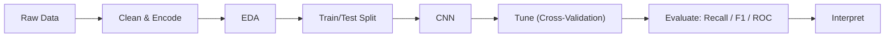

## The Data

_The dataset describes about nineteen thousand employees using demographic, education, and training details._

- 19,158 rows and 14 columns: 10 categorical (object) and 4 numerical fields describing each employee.
- Key numerics: training hours (max 336, but 75% finished within 88 hours) and city development index.
- The City column has 123 unique categories; City 103 holds the most employees.
- Heavily skewed cohort: over 90% male, ~70% with relevant data science experience, ~75% from private-sector firms.
- Missing values imputed with the column mode; categorical columns converted via Label Encoding for the network.

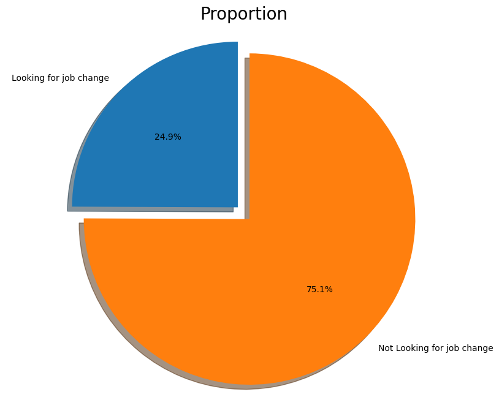

## Exploratory Analysis

_We explored how training, experience, and education relate to whether an employee wants a new job._

- Most employees trained under 100 hours, with central tendency around 70 hours despite a long right tail.
- Employees from high-development cities (index over 0.9) are far less likely to switch jobs.
- Those with non-relevant experience or under 3 years of work experience are the most likely to leave.
- Gender showed little effect on attrition, while Graduates and Master's holders were more likely to switch.
- The target itself is imbalanced (~25% positive), confirming the need for threshold tuning and F1 focus.

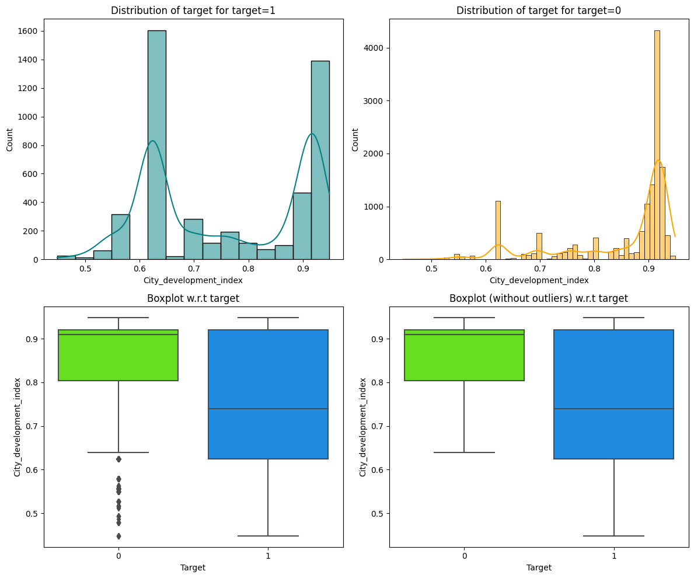

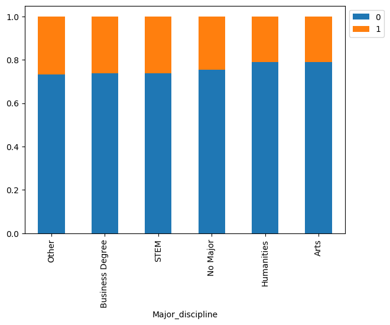

## Neural Network Architecture

_We built and refined a layered neural network, adding dropout to stop it from over-memorizing the data._

- Started with a shallow Keras model: Dense 64 -> 32 -> 1 sigmoid with SGD, trained 50 epochs.
- Deepened the network and switched to the Adam optimizer, producing smoother train/validation loss curves.
- Final model adds Dropout regularization: Dense 256 (drop 0.3) -> 128 (drop 0.3) -> 64 (drop 0.2) -> 32 -> 1 sigmoid.
- Tuned the decision threshold with the ROC-AUC curve instead of the default 0.5 to handle class imbalance.
- Explored RandomizedSearchCV, GridSearchCV, Keras Tuner, and SMOTE oversampling to push the F1 score higher.

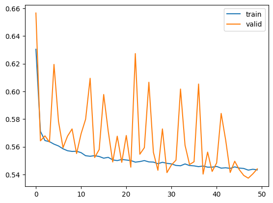

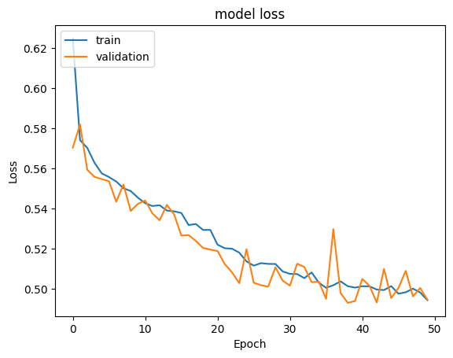

## Results & Accuracy

_The dropout network gave the best balanced performance, correctly flagging job-switchers without too many false alarms._

- The baseline SGD model reached ~75% accuracy but a poor F1 score with too many false positives.
- Adding depth and Adam raised the macro F1 score and smoothed convergence on the validation set.
- The Dropout model (Model 4) cut the false negative rate and gave smooth train/validation curves with a solid F1.
- Hyperparameter search and SMOTE were tried, but both tended to overfit and did not beat the Dropout model.
- Model 4 was selected as the final model: best F1/recall balance from confusion matrix and ROC analysis.

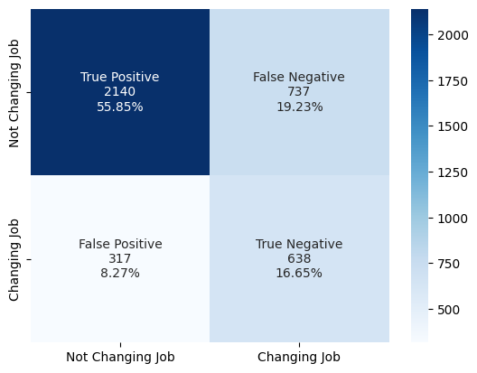

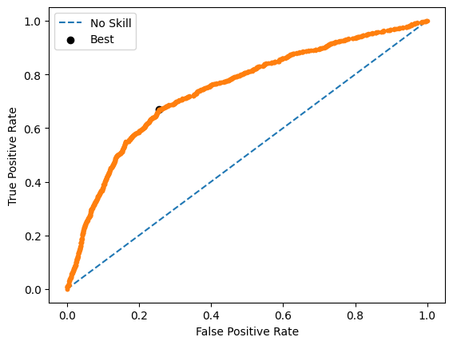

## Key Takeaways

_A well-regularized neural network can reliably predict employee attrition and support smarter HR decisions._

- Dropout regularization beat both hyperparameter search and SMOTE for this imbalanced attrition dataset.
- Optimizing F1 and ROC-tuned thresholds matters far more than raw accuracy when classes are skewed.
- HR can deploy the model to flag likely job-switchers faster and more cheaply than manual review.
- Future work: derive feature importance from a tree model and engineer skewed variables for a stronger network.
- Built with: Python, Pandas, NumPy, Matplotlib, Seaborn, Scikit-learn, TensorFlow/Keras, Keras Tuner, imbalanced-learn (SMOTE).

## More Visualizations

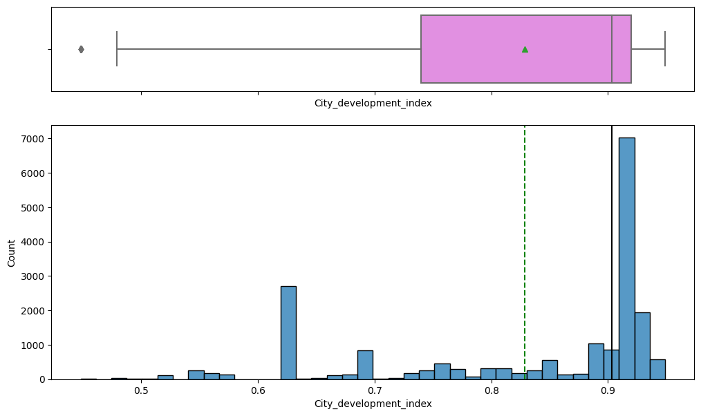
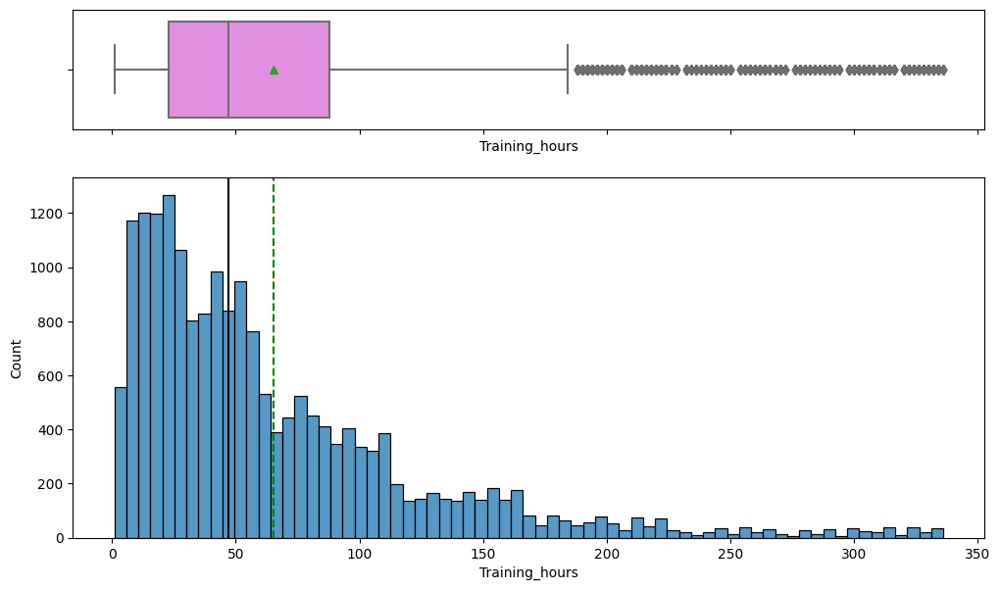
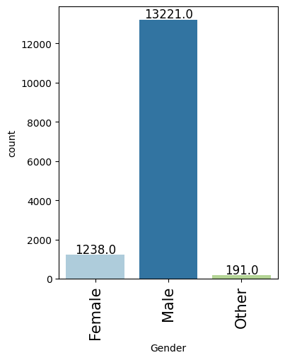
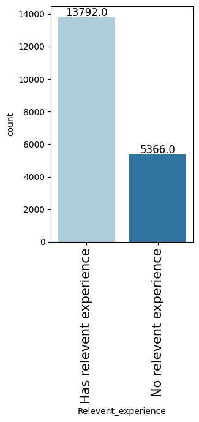


## Tech Stack

- **pandas** — data wrangling and tabular manipulation
- **numpy** — fast numerical arrays
- **scikit-learn** — modeling, pipelines, and evaluation
- **seaborn** — statistical visualization
- **matplotlib** — plotting
- **tensorflow** — deep-learning framework
- **keras** — high-level neural-network API

## How to Run

```bash
python -m venv .venv && source .venv/Scripts/activate  # Windows: .venv\\Scripts\\activate
pip install -r requirements.txt
jupyter notebook "Case_Study_Notebook.ipynb"
```

> Note: large image/zip datasets are not committed; a `data/` note or download link is provided where applicable.

## Notes & Limitations

- Built on a program-provided case study; scope follows the original brief.
- Some deep-learning notebooks were re-run with reduced epochs locally (CPU) — see training curves.
- Metrics reflect the dataset as provided; production use would add monitoring and retraining.

## Attribution

This project was completed as part of the **MIT Applied Data Science Program** (MIT IDSS / Great Learning). The program provided the case-study scaffolding; the analysis, code, and results are my own. Published with permission, for portfolio use only.
