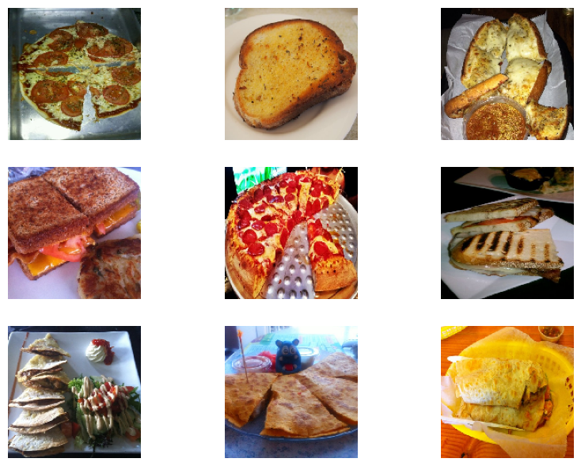
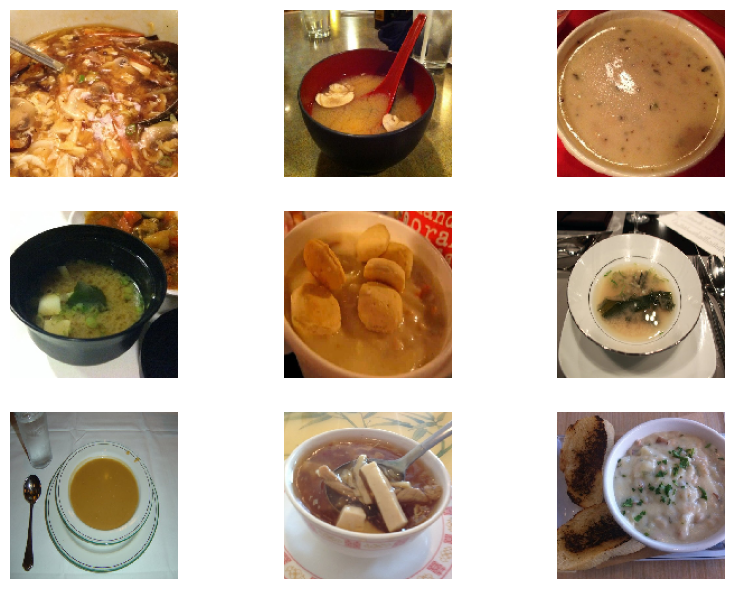
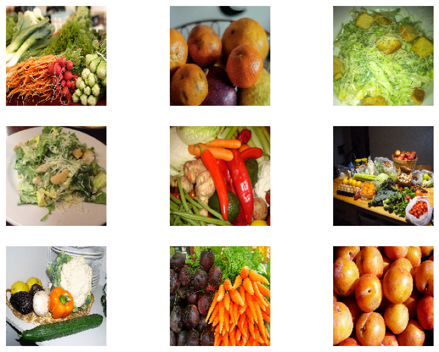
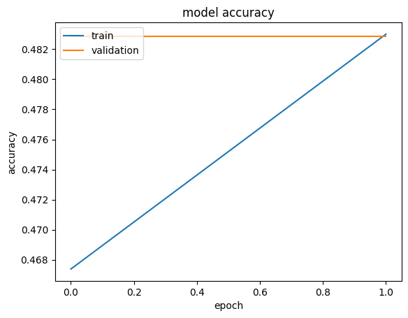
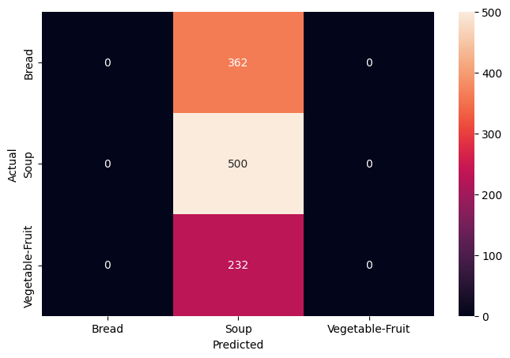
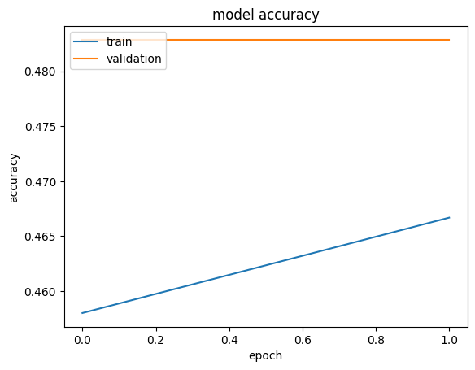
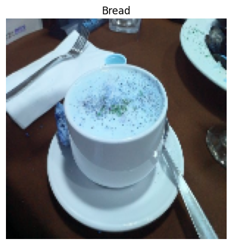

# Food Image Classification with CNNs

> _Teaching a convolutional neural network to tell Bread, Soup, and Vegetable-Fruit apart_

## Overview

We taught a computer to look at a photo of food and decide which of three food types it is.

- Goal: classify food photos into three categories - Bread, Soup, and Vegetable-Fruit - directly from raw pixels.
- Image classification is a core deep learning task enabled by larger datasets and modern compute.
- Approach: build and compare convolutional neural networks (CNNs) that learn visual features end to end.
- Success means high test accuracy with few confusions between visually similar food classes.

## Methodology


## The Data

_We started with folders of food photos already sorted into training and testing piles._

- Three balanced classes: Bread, Soup, and Vegetable-Fruit, organized into Training and Testing folders.
- Each image is read into a NumPy array and paired with its class index as a labeled tuple.
- Labels are one-hot encoded so each class becomes a vector, e.g. Bread = [1, 0, 0].
- Class distribution was checked to confirm the three categories are reasonably balanced.
- Images are resized to a common 150x150x3 RGB shape for the network input.

## Sample Images & Preprocessing

_We looked at example pictures from each food type and cleaned them up before training._

- Bread items are mostly round, oval, or elliptical and often show grilled or charred portions.
- Soup images feature liquid in a container or utensil, with a distinct glare from light reflection.
- Vegetable-Fruit images stand out with vibrant colors and repeating shapes across the frame.
- Pixel values are normalized to speed up training and reduce the risk of getting stuck in local optima.
- Utensils appearing in both Bread and Soup photos were flagged as a likely source of confusion.







## CNN Architecture

_We built two layered networks, the second one designed to avoid memorizing the training photos._

- Model 1: three convolutional blocks, each a Conv2D + MaxPooling2D layer, starting at 64 filters with 3x3 kernels.
- Model 1 learns about 1,185,107 parameters with relu activations and 'same' padding - large and prone to overfitting.
- Model 2: four convolutional blocks adding a Dropout layer after each, starting at 256 filters with 5x5 kernels.
- Model 2 trains about 1,099,171 parameters; Dropout randomly disables neurons to curb overfitting.
- Note: this run used a reduced 2-epoch schedule for speed, so accuracy figures are indicative, not final.

## Results & Accuracy

_The second network did a noticeably better job and confused fewer photos than the first._

- Model 1 overfit: training accuracy climbed steadily while validation accuracy lagged behind.
- In the full run Model 1 reached roughly 70% test accuracy, often mistaking Bread for Soup.
- Adding Dropout in Model 2 closed the train-validation gap and reduced misclassifications.
- Bread vs Soup stayed the hardest pair due to shared dishes and utensils, but errors dropped clearly.
- With the reduced 2-epoch re-run, curves and confusion matrices show the same qualitative trend, just lower numbers.








## Key Takeaways

_A well-regularized CNN can reliably sort food photos, and there is still room to push accuracy higher._

- Model 2 was the better classifier, correctly predicting a randomly chosen test image.
- Dropout and a deeper architecture were the key levers that improved generalization over Model 1.
- Visually similar classes that share objects (Bread/Soup utensils) remain the main error source.
- Next steps: more epochs, alternative architectures, and different optimizers to lift test accuracy further.
- Built with: TensorFlow, Keras, NumPy, Matplotlib, scikit-learn



## Tech Stack

- **pandas** — data wrangling and tabular manipulation
- **numpy** — fast numerical arrays
- **scikit-learn** — modeling, pipelines, and evaluation
- **seaborn** — statistical visualization
- **matplotlib** — plotting
- **tensorflow** — deep-learning framework
- **keras** — high-level neural-network API

## How to Run

```bash
python -m venv .venv && source .venv/Scripts/activate  # Windows: .venv\\Scripts\\activate
pip install -r requirements.txt
jupyter notebook "Food_Image_Classification.ipynb"
```

> Note: large image/zip datasets are not committed; a `data/` note or download link is provided where applicable.

## Notes & Limitations

- Built on a program-provided case study; scope follows the original brief.
- Some deep-learning notebooks were re-run with reduced epochs locally (CPU) — see training curves.
- Metrics reflect the dataset as provided; production use would add monitoring and retraining.

## Attribution

This project was completed as part of the **MIT Applied Data Science Program** (MIT IDSS / Great Learning). The program provided the case-study scaffolding; the analysis, code, and results are my own. Published with permission, for portfolio use only.
