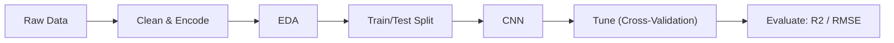
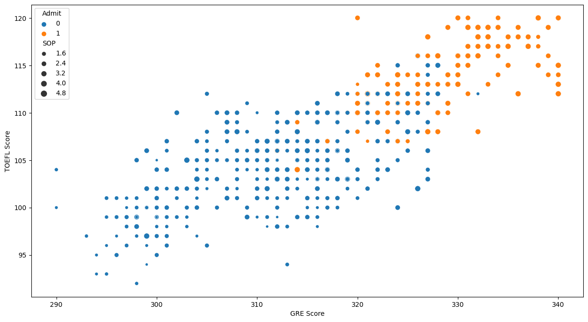
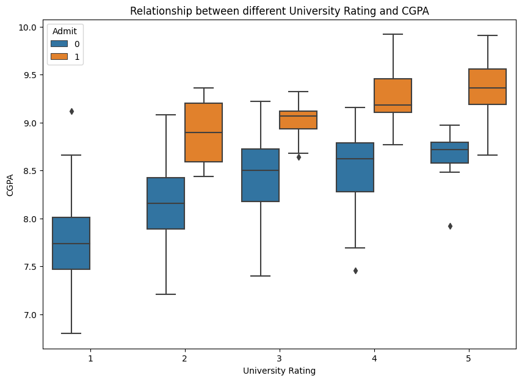
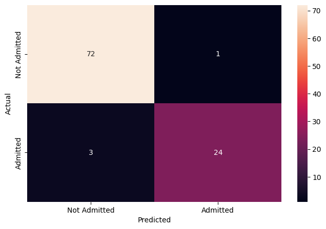
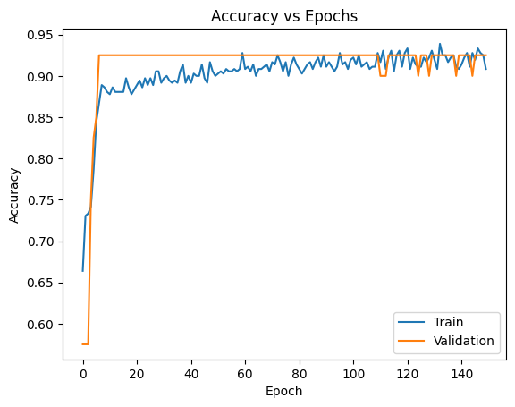
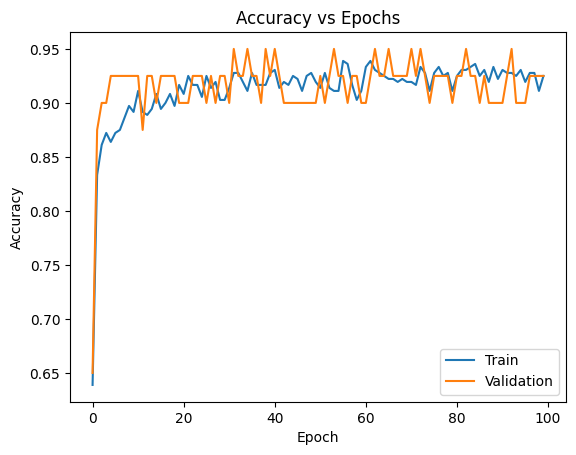
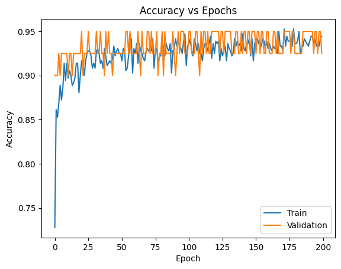

# Predicting Graduate Admission Chances

> _A neural network that flags which applicants are likely to be admitted to UCLA_

## Overview

We wanted to predict whether a graduate-school applicant is likely to be accepted based on their academic profile.

- Applicants and admissions teams need an early signal of how strong a candidate's chances really are.
- Each student's chance of admission was reframed into a yes/no call using an 80% threshold (above 80% = Admit).
- Goal: train a feed-forward neural network to classify applicants as admitted or not from their scores and ratings.
- Success means accurately separating likely admits from unlikely ones on applicants the model has never seen.

## Methodology



## The Data

_We used a clean dataset of 500 past applicants, each described by their test scores and academic ratings._

- 500 applicant records with 8 columns, all numeric, and no missing values to clean up.
- Features include GRE, TOEFL, University Rating, SOP, LOR, CGPA, and research experience.
- Average GRE was ~316 of 340 and average TOEFL ~107 of 120, with some students scoring full marks.
- Serial number was dropped, and the continuous Chance of Admit was converted into the binary Admit target.
- Data was split 80:20 into training and test sets, with numeric features scaled and ratings one-hot encoded.

## Exploratory Analysis

_We charted the data to see how test scores and ratings relate to each other and to admission._

- GRE and TOEFL scores move together: students who score high on one tend to score high on the other.
- As GRE and TOEFL rise, the strength of the statement of purpose (SOP) also tends to increase.
- Scatter plots show a visible separation between students who were admitted and those who were not.
- Higher university ratings line up with higher CGPA and stronger overall admission chances.
- Boxplots confirm admitted students carry higher CGPA than those who were not admitted.





## Key Drivers of Admission

_A few academic measures stood out as the strongest signals of who gets in._

- CGPA is the clearest differentiator: admitted students consistently show higher grades.
- Strong, correlated GRE and TOEFL scores mark the most competitive applicants.
- University rating, SOP strength, and CGPA all rise together, reinforcing one another.
- Correlation heatmap confirms CGPA, GRE, and TOEFL are the most tightly linked to admission.
- Research experience and recommendation strength add supporting, secondary signal.



## Modeling & Results

_We built and tuned a neural network until it reliably predicted admission about 95% of the time._

- Started with a feed-forward network of 2 hidden layers plus an output layer, training 9,857 parameters.
- Compiled with binary cross-entropy loss and tuned optimizers, layer count, neurons, and learning rate.
- Accuracy-vs-epoch curves showed training accuracy rising and stabilizing well after 150 epochs.
- The final tuned model reached a generalized 95% accuracy on both training and validation data.
- On unseen test data it held 95% accuracy, with most precision and recall metrics above 90%.





## Key Takeaways

_The model gives a dependable, automated read on which applicants are likely to be admitted._

- A tuned neural network classifies admission likelihood with 95% accuracy on completely unseen applicants.
- CGPA, GRE, and TOEFL scores are the dominant drivers behind a strong admission profile.
- Reframing a continuous chance into a clear yes/no makes the output easy for stakeholders to act on.
- Careful scaling, encoding, and hyper-parameter tuning were key to reaching generalized performance.
- Built with: Python, pandas, NumPy, Matplotlib, Seaborn, scikit-learn, TensorFlow, Keras

## More Visualizations




## Tech Stack

- **pandas** — data wrangling and tabular manipulation
- **numpy** — fast numerical arrays
- **scikit-learn** — modeling, pipelines, and evaluation
- **seaborn** — statistical visualization
- **matplotlib** — plotting
- **tensorflow** — deep-learning framework
- **keras** — high-level neural-network API

## How to Run

```bash
python -m venv .venv && source .venv/Scripts/activate  # Windows: .venv\\Scripts\\activate
pip install -r requirements.txt
jupyter notebook "Case_Study_Predicting_Chances_of_Admission.ipynb"
```

> Note: large image/zip datasets are not committed; a `data/` note or download link is provided where applicable.

## Notes & Limitations

- Built on a program-provided case study; scope follows the original brief.
- Some deep-learning notebooks were re-run with reduced epochs locally (CPU) — see training curves.
- Metrics reflect the dataset as provided; production use would add monitoring and retraining.

## Attribution

This project was completed as part of the **MIT Applied Data Science Program** (MIT IDSS / Great Learning). The program provided the case-study scaffolding; the analysis, code, and results are my own. Published with permission, for portfolio use only.
