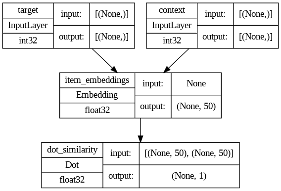
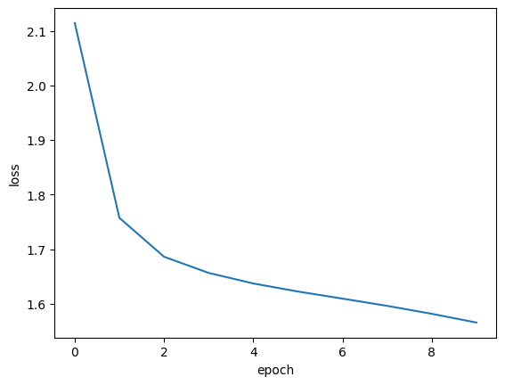

# Movie Recommendation with Graph Neural Networks

> _Learning movie embeddings from co-viewing patterns on MovieLens to suggest the next film to watch_

## Overview

Streaming services have huge catalogs, so we built a system that learns which movies go together and suggests what to watch next.

- Platforms like Netflix hold vast catalogs, making it hard for viewers to find their next movie without guidance.
- Goal: recommend the top-k most similar movies to any title a user has just watched.
- Approach: model the catalog as a graph of movies and learn embeddings that capture co-viewing behavior.
- Frames recommendation as a self-supervised task, learning purely from historical user-movie interactions.

## Methodology


## The Data (users / movies / ratings)

_We used the MovieLens dataset, which records how thousands of movies were rated across hundreds of users._

- Built on the MovieLens ratings data merged with movie titles into a single DataFrame.
- 100,836 rating observations spanning 5 columns (userId, movieId, rating, title, timestamp).
- 610 unique users provide the interaction signal used to relate movies to one another.
- 9,719 unique movies form the catalog and become the nodes of the recommendation graph.

## Graph Construction

_We connected movies that are often watched together, with stronger links for pairs that show up as a true pattern rather than chance._

- Nodes are movies; edges connect films that are frequently watched together across all users.
- Computed item frequency per movie and pair frequency for every co-watched movie pair.
- Edge weight = PMI (pointwise mutual information) index multiplied by pair frequency.
- With a minimum edge weight of 10, the graph has an average degree of 57 connections per movie.
- High connectivity assures every movie has plausible 'watch next' suggestions available.

## GNN Model

_We walked randomly through the movie graph to create training sequences, then trained a small network to learn a numeric fingerprint for each movie._

- Generated biased random walks over the graph (node2vec-style hyperparameters p=2, q=1.5) to sample movie sequences.
- Applied a skip-gram model to turn walks into positive and negative (target, context) movie pairs labeled 1 or 0.
- Model uses an Embedding layer mapping target and context movies to embedding vectors.
- Takes the dot product of the two embeddings, scaled 0 to 1, to predict whether movies belong together.
- Trained as a binary classification task, yielding a learned embedding vector per movie.





## Recommendations & Results

_Once each movie had its learned fingerprint, we could find the five most similar films to any title a viewer enjoyed._

- Extracted the trained embedding vectors so any two movies can be compared directly by similarity.
- For a query movie, convert its title to an embedding and rank all other movie embeddings.
- Returns the top-5 most similar movies, mapped back to titles via getMovieIdByTitle().
- Self-supervised embeddings successfully surface coherent 'watch next' suggestions from co-viewing data.
- A companion Part 2 cross-checks results with clustering- and content-based recommenders on the same data.

## Key Takeaways

_By turning viewing history into a graph and learning from it, the system recommends movies without anyone labeling the data._

- Reframing ratings as a graph plus self-supervised task removes the need for explicit training labels.
- PMI-weighted edges capture genuine co-viewing signal, not just raw popularity, for stronger links.
- Random walks plus skip-gram embeddings are an effective, lightweight alternative to heavy GNN stacks.
- Learned embeddings generalize: similarity search instantly returns top-k recommendations for any movie.
- Built with: TensorFlow/Keras, NetworkX, NumPy, pandas, scikit-learn

## Tech Stack

- **pandas** — data wrangling and tabular manipulation
- **numpy** — fast numerical arrays
- **scikit-learn** — modeling, pipelines, and evaluation
- **seaborn** — statistical visualization
- **matplotlib** — plotting
- **tensorflow** — deep-learning framework
- **keras** — high-level neural-network API
- **scikit-surprise** — collaborative-filtering recommenders
- **nltk** — text tokenization & stopwords
- **networkx** — graph / network analysis

## How to Run

```bash
python -m venv .venv && source .venv/Scripts/activate  # Windows: .venv\\Scripts\\activate
pip install -r requirements.txt
jupyter notebook "Notebook_Movie_Recommendation_using_Graph_Neural_Networks.ipynb"
```

> Note: large image/zip datasets are not committed; a `data/` note or download link is provided where applicable.

## Notes & Limitations

- Built on a program-provided case study; scope follows the original brief.
- Some deep-learning notebooks were re-run with reduced epochs locally (CPU) — see training curves.
- Metrics reflect the dataset as provided; production use would add monitoring and retraining.

## Attribution

This project was completed as part of the **MIT Applied Data Science Program** (MIT IDSS / Great Learning). The program provided the case-study scaffolding; the analysis, code, and results are my own. Published with permission, for portfolio use only.
