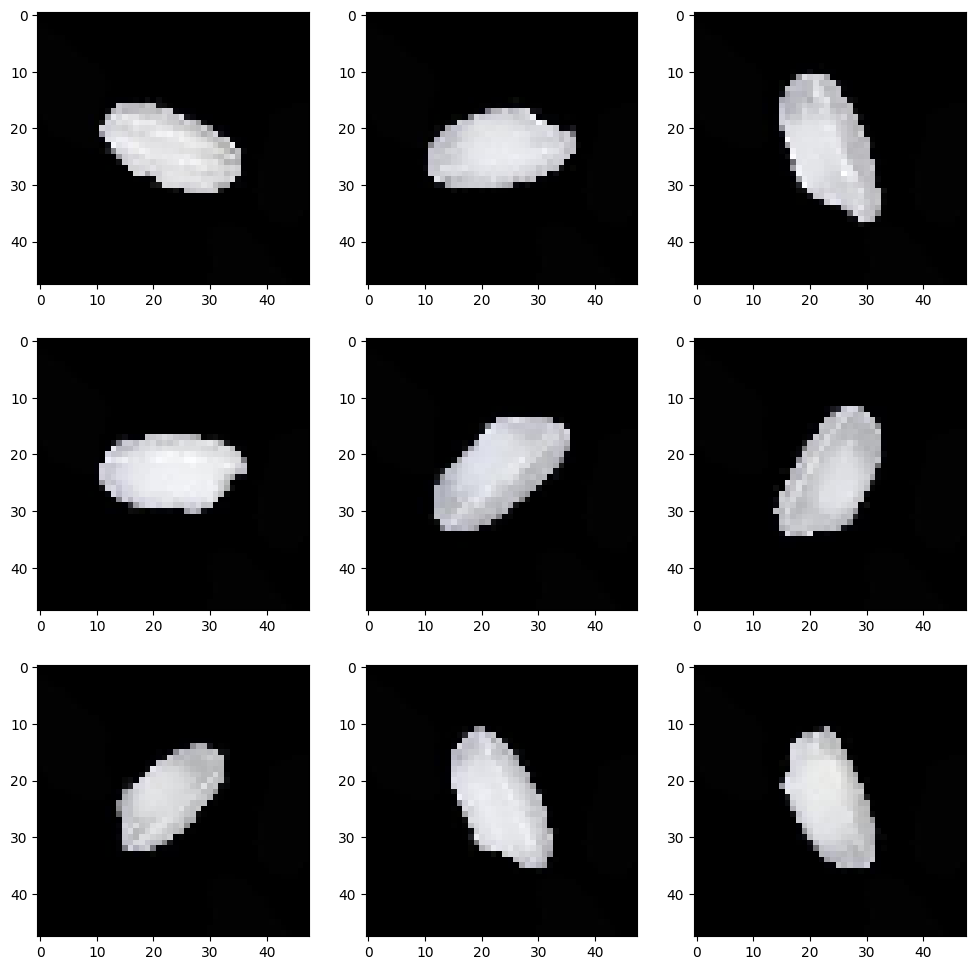
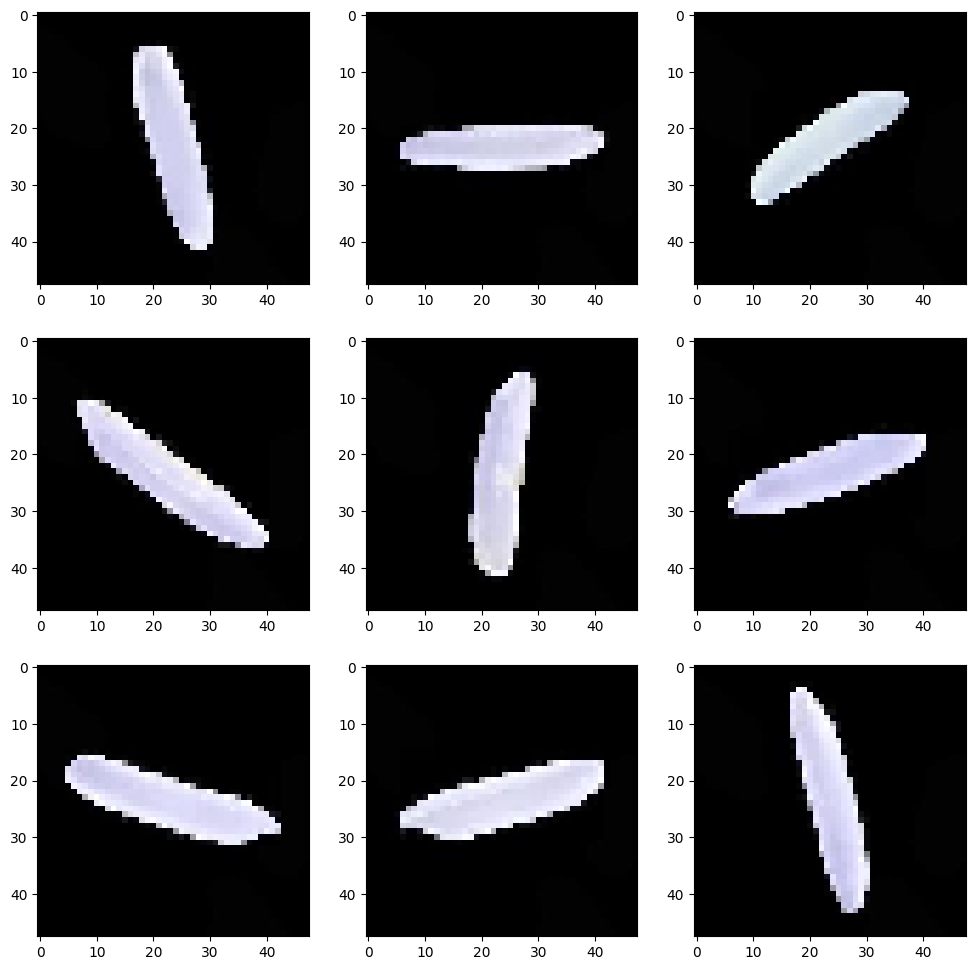
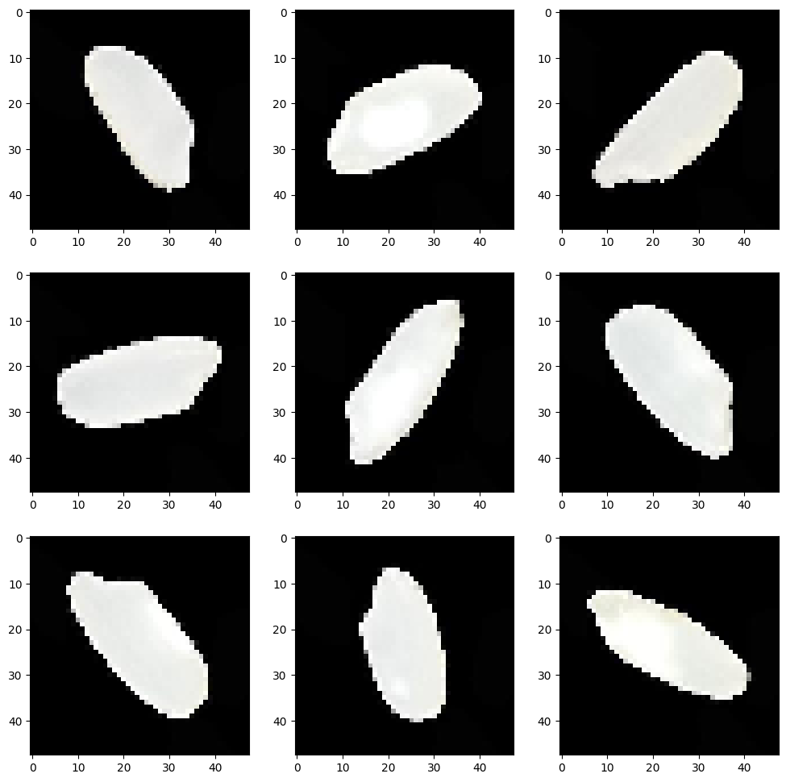
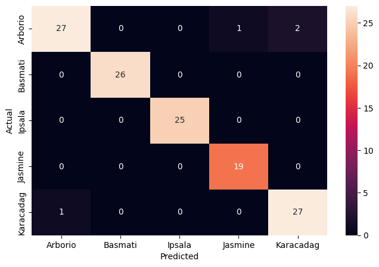
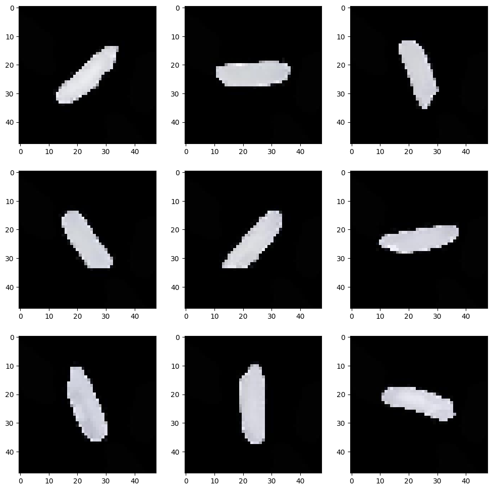
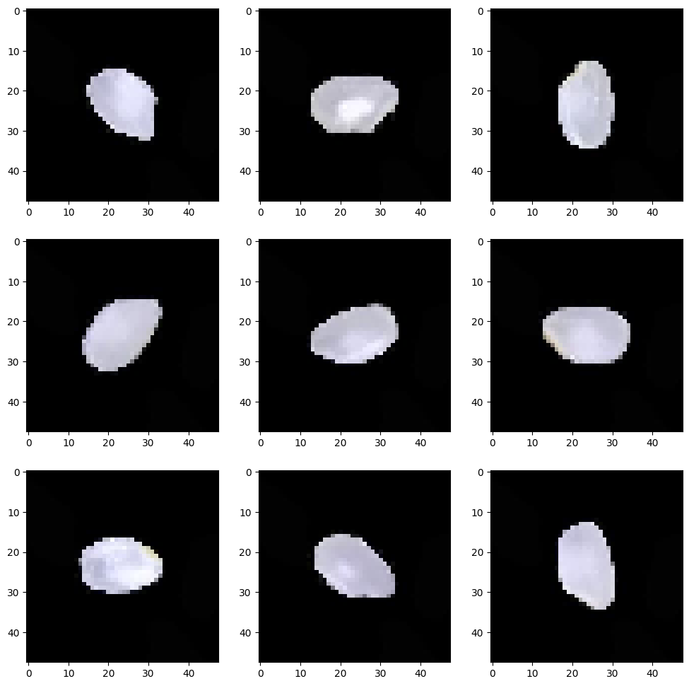

# Rice Type Classification with CNNs

> _Sorting five rice varieties from magnified grain images using deep learning_

## Overview

We taught a computer to look at a single grain of rice and name which of five varieties it is.

- Rice supplies 21% of global per-capita energy and 15% of protein, so reliable variety sorting matters at scale.
- Goal: automatically classify magnified rice-grain images into 5 types: Arborio, Basmati, Ipsala, Jasmine, Karacadag.
- Manual grading of grain type is slow and subjective; a vision model offers fast, consistent, repeatable sorting.
- Success means not only high accuracy but also low inference time, since the model is meant for real production lines.
- Framed as a 5-class image classification task benchmarking ANN versus CNN architectures.

## Methodology


## The Data (Rice Varieties)

_We started with about 74,000 labeled photos of rice grains split evenly across the five types._

- Dataset holds roughly 74K magnified images split across the 5 rice classes (Arborio, Basmati, Ipsala, Jasmine, Karacadag).
- Each image shows a single grain centered on a plain black background with no clutter or competing objects.
- Images already appear in many orientations, so rotation-based data augmentation was unnecessary.
- Data was organized into train, validation, and test folders fed through Keras ImageDataGenerator loaders.
- Grains were resized to a small 48x48 grayscale format to keep training tractable across tens of thousands of images.



## Sample Images & Preprocessing

_We looked at example grains from each type and shrank every image to a small standard size before training._

- Visualized each variety side by side to confirm shape is the main distinguishing feature of the grains.
- Images are simple: just the grain silhouette on black, with no curves or texture beyond grain shape.
- All grains are perfectly centered, which lets even a plain ANN perform surprisingly well on these images.
- Pixel values were rescaled and images standardized to 48x48 grayscale via the image data generators.
- Basmati and Jasmine share long grains and Karacadag resembles Arborio, hinting at where confusion may occur.





## CNN Architecture

_We built and compared several network designs, settling on a compact convolutional model with dropout._

- Baseline ANN flattened the 48x48 images into 2,304 inputs feeding Dense layers (512, 256) into a 5-way softmax.
- Base CNN used 4 convolutional blocks (Conv2D + MaxPooling) to learn grain shape features directly from pixels.
- Final model trimmed to 3 convolutional blocks, each paired with a Dropout layer to curb overfitting and shrink parameters.
- Models compiled with Adam and categorical cross-entropy, ending in a 5-unit softmax for the five rice classes.
- Trained for just 2 epochs to cap compute time on the ~74K-image set, trading some accuracy for speed.

## Results & Accuracy

_Even with very short training the smaller convolutional model classified most grains correctly with few mix-ups._

- With only 2 epochs, the smaller CNN still reached training accuracy near 92% and the best test accuracy of the models tried.
- Dropout layers kept the smaller CNN from overfitting, so its test accuracy edged out the larger CNN and the ANN.
- The confusion matrix shows very few misclassifications across the five varieties at this reduced epoch budget.
- Typical errors are intuitive: a Basmati read as Jasmine (both long-grained) and Karacadag confused with Arborio.
- Inference time fell from 106 ms/step for the base CNN to about 55 ms/step for the smaller model, aiding deployment.



## Key Takeaways

_A small, well-regularized convolutional network sorts rice varieties accurately and fast enough for real use._

- A compact CNN with dropout beat both a larger CNN and a plain ANN on accuracy while running noticeably faster.
- Centered, clean grain images let even simple models do well, but convolution still wins for shape-driven distinctions.
- Efficiency means both accuracy and inference speed, since the model targets real production sorting lines.
- More epochs would likely push accuracy higher; 2 epochs were used here purely to limit compute time.
- Built with: TensorFlow/Keras, NumPy, pandas, matplotlib, seaborn, PIL, and scikit-learn.

## More Visualizations





## Tech Stack

- **pandas** — data wrangling and tabular manipulation
- **numpy** — fast numerical arrays
- **scikit-learn** — modeling, pipelines, and evaluation
- **seaborn** — statistical visualization
- **matplotlib** — plotting
- **tensorflow** — deep-learning framework
- **keras** — high-level neural-network API

## How to Run

```bash
python -m venv .venv && source .venv/Scripts/activate  # Windows: .venv\\Scripts\\activate
pip install -r requirements.txt
jupyter notebook "Rice_Type_Classification_using_CNN.ipynb"
```

> Note: large image/zip datasets are not committed; a `data/` note or download link is provided where applicable.

## Notes & Limitations

- Built on a program-provided case study; scope follows the original brief.
- Some deep-learning notebooks were re-run with reduced epochs locally (CPU) — see training curves.
- Metrics reflect the dataset as provided; production use would add monitoring and retraining.

## Attribution

This project was completed as part of the **MIT Applied Data Science Program** (MIT IDSS / Great Learning). The program provided the case-study scaffolding; the analysis, code, and results are my own. Published with permission, for portfolio use only.
