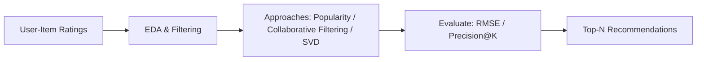
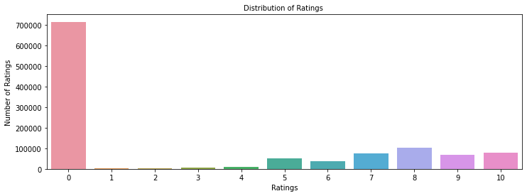
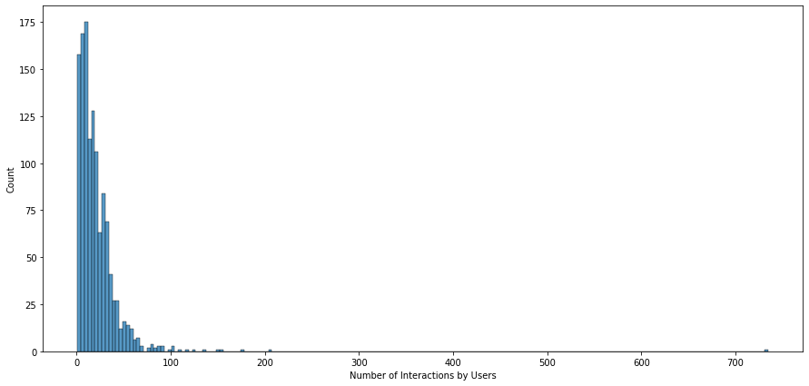
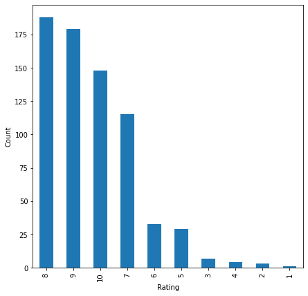
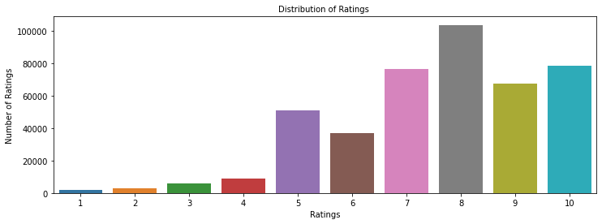

# Book Recommendation System

> _Comparing rank-based, collaborative filtering, and matrix factorization approaches to recommend books_

## Overview

I built a system that suggests books a reader is likely to enjoy based on how people have rated books in the past.

- With online retail growing, personalized recommendations drive discovery, engagement, and sales for book retailers.
- Most user-book pairs are unrated, so the goal is to predict which unseen books a user would rate highly.
- Objective: build and compare recommenders that turn sparse rating data into a ranked top-N book list per user.
- Also address the cold-start problem of recommending to brand-new users with no rating history.

## Methodology



## The Data: Users, Books & Ratings

_I started with over a million book ratings and cleaned them down to the meaningful ones before modeling._

- Merged ratings and book datasets into 1,149,780 observations across 7 columns of user, book, and rating fields.
- Ratings use a 1-10 scale; rating '0' dominated (~700K) and was treated as missing, then dropped.
- After removing the 0 ratings, 433,671 genuine ratings remained from 77,805 users across 185,973 unique books.
- Matrix is extremely sparse: only 433,671 of a possible ~14.5 billion user-book interactions are filled in.



## Exploratory Analysis

_I explored how ratings are spread out and found that a few popular books get most of the attention._

- After cleaning, rating 8 was most common (~100K), followed by ratings 10 and 7 (~80K each); ratings 1-4 were rare.
- Most-reviewed book (bookid 0316666343) drew 707 users, and was rated 8/9/10 by the majority who read it.
- Power user 11676 rated 8,524 books, showing a small set of very active raters drives much of the data.
- User-book interaction counts are heavily right-skewed: very few books have many ratings, most have few.



## Recommender Approaches

_I tried four methods, from a simple popularity ranking to advanced models that learn hidden user and book patterns._

- Model 1 - Rank-based: recommends most popular books by average rating with a minimum-interactions threshold, solving cold start.
- Model 2 - User-user collaborative filtering: cosine similarity with KNN to find like-minded users (scikit-surprise KNNBasic).
- Model 3 - Item-item collaborative filtering: similarity computed between books rather than between users.
- Model 4 - Matrix factorization (SVD): learns latent user and book features; all models tuned via GridSearchCV.
- Evaluated with RMSE plus precision@k and recall@k, using rating 7 as the relevance threshold.



## Results & Recommendations

_Tuning improved every model, and item-based filtering gave the most accurate rating predictions._

- Baseline user-user CF: RMSE 1.84 with ~0.81 precision and recall; tuning cut RMSE to 1.68 and raised F1 from 0.81 to 0.86.
- Item-item CF was strongest on accuracy: RMSE improved from 1.62 to 1.58 with F1 around 0.80 after tuning.
- Matrix factorization (SVD) F1 beat the user-user baseline but tuning yielded only marginal further gains.
- Validated predictions case by case (e.g. user 1326, book 12344 predicted ~7.99 vs actual 8) and applied corrected ratings to rank ties.



## Key Takeaways

_Combining a simple popularity baseline with personalized models gives reliable book recommendations even from very sparse data._

- Rank-based recommendations are a cheap, robust fallback for new users facing the cold-start problem.
- Personalized collaborative filtering and matrix factorization clearly outperform popularity once a user has history.
- Hyperparameter tuning with GridSearchCV consistently lowered RMSE and raised F1 across all model families.
- Corrected ratings that weight the number of raters produce more trustworthy top-N rankings than raw averages.
- Built with: pandas, numpy, matplotlib, seaborn, scikit-learn, scikit-surprise

## Tech Stack

- **pandas** — data wrangling and tabular manipulation
- **numpy** — fast numerical arrays
- **scikit-learn** — modeling, pipelines, and evaluation
- **seaborn** — statistical visualization
- **matplotlib** — plotting
- **scikit-surprise** — collaborative-filtering recommenders

## How to Run

```bash
python -m venv .venv && source .venv/Scripts/activate  # Windows: .venv\\Scripts\\activate
pip install -r requirements.txt
jupyter notebook "Book_Recommendation_Systems.ipynb"
```

> Note: large image/zip datasets are not committed; a `data/` note or download link is provided where applicable.

## Notes & Limitations

- Built on a program-provided case study; scope follows the original brief.
- Some deep-learning notebooks were re-run with reduced epochs locally (CPU) — see training curves.
- Metrics reflect the dataset as provided; production use would add monitoring and retraining.

## Attribution

This project was completed as part of the **MIT Applied Data Science Program** (MIT IDSS / Great Learning). The program provided the case-study scaffolding; the analysis, code, and results are my own. Published with permission, for portfolio use only.
