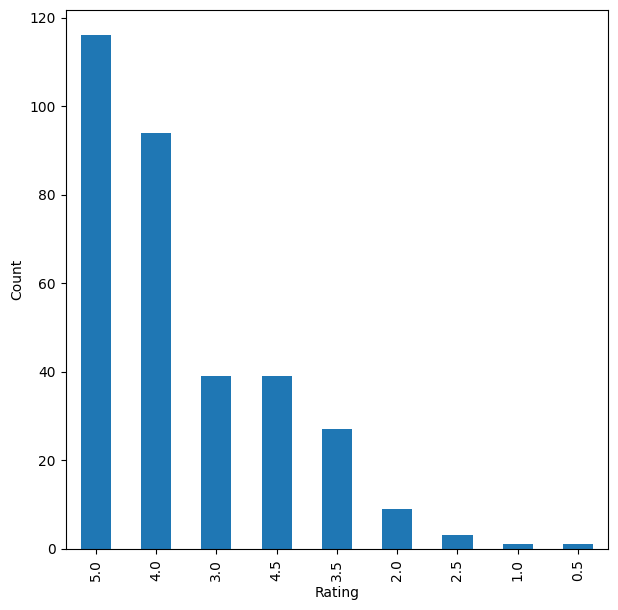

# MovieLens Movie Recommendation System

> _Recommending relevant movies from user rating history with popularity, collaborative filtering, and SVD_

## Overview

I built a system that suggests movies people are likely to enjoy based on how they and others have rated films before.

- Streaming platforms hold huge movie catalogs, so surfacing the right titles to each user directly drives engagement and retention.
- Goal: predict which unrated movies a user would rate highly and recommend the top few personalized picks.
- I framed it as a rating-prediction task, then ranked the highest predicted ratings into a top-N list per user.
- I also tackled the cold-start problem, where a brand-new user has no history to personalize from.
- Success was judged on predicted-vs-actual accuracy (RMSE) plus precision@k, recall@k, and F1@k on recommendations.

## Methodology


## The Data (MovieLens)

_I worked with a real set of 100,836 movie ratings from 610 people covering thousands of films._

- The MovieLens ratings dataset has 100,836 rows across userId, movieId, rating, and timestamp columns.
- It spans 610 unique users and 9,724 unique movies, all on a 0.5-to-5 star rating scale.
- 610 users x 9,724 movies allows ~5.93M possible ratings, but only 100,836 exist, so the matrix is highly sparse.
- Each user-movie pair appears exactly once, confirming there are no duplicate interactions to clean up.
- I dropped the timestamp column since it was not needed for rating prediction.

## Exploratory Analysis

_I explored who rates the most, which movies are most watched, and how lopsided the activity is._

- The most-interacted movie (movieId 356) drew 329 ratings, still short of all 610 users, leaving room to recommend it further.
- Its ratings skewed toward 4s and 5s, signaling a genuinely well-liked title rather than just a frequently-watched one.
- The most active user (userId 414) rated 2,698 movies, far more than the typical viewer.
- User-movie interactions are highly uneven, with a few heavy raters and many films rated only a handful of times.
- This sparsity and skew motivated combining popularity-based and personalized approaches.




## Recommender Approaches

_I compared four ways of recommending, from a simple popularity ranking up to a learned matrix-factorization model._

- Rank-based: averaged each movie's ratings with a minimum-interaction threshold to handle cold start for new users.
- User-user collaborative filtering: cosine similarity with KNNBasic from the surprise library to find like-minded users.
- Item-item collaborative filtering: the same KNN approach but measuring similarity between movies instead of users.
- Matrix factorization (SVD): learned latent user and movie features to predict ratings for unseen pairs.
- I tuned each model with GridSearchCV on RMSE and evaluated recommendations using precision, recall, and F1 at k=10.

## Results & Recommendations

_Tuning the user-based model gave the strongest, most reliable recommendations of the approaches I tested._

- The baseline user-user model reached recall ~0.54 and precision ~0.76 at a 3.5 relevance threshold.
- Hyperparameter tuning lifted the user-user F1 score and lowered its RMSE, beating the baseline.
- The item-item baseline scored F1 ~0.53 and also improved with tuning of its KNN hyperparameters.
- The SVD matrix-factorization model trailed the similarity-based models on F1 and barely improved after tuning.
- I recommend the tuned user-user collaborative filter as the primary engine, with rank-based fallback for new users.

## Key Takeaways

_A well-tuned similarity-based recommender, backed by a popularity fallback, delivered the best movie suggestions here._

- Personalized collaborative filtering outperformed matrix factorization on this sparse 100K-rating dataset.
- Popularity-based ranking is a simple, effective answer to the cold-start problem for users with no history.
- Hyperparameter tuning via GridSearchCV consistently cut RMSE and raised F1 for the KNN-based models.
- Correcting ratings by interaction count produced more trustworthy top-N rankings than raw averages alone.
- Built with: Python, pandas, NumPy, scikit-learn, scikit-surprise, Matplotlib, Seaborn

## Tech Stack

- **pandas** — data wrangling and tabular manipulation
- **numpy** — fast numerical arrays
- **scikit-learn** — modeling, pipelines, and evaluation
- **seaborn** — statistical visualization
- **matplotlib** — plotting
- **scikit-surprise** — collaborative-filtering recommenders
- **nltk** — text tokenization & stopwords

## How to Run

```bash
python -m venv .venv && source .venv/Scripts/activate  # Windows: .venv\\Scripts\\activate
pip install -r requirements.txt
jupyter notebook "Recommendation_Systems_Case_Study_Notebook_Part1-2 (1)-1.ipynb"
```

> Note: large image/zip datasets are not committed; a `data/` note or download link is provided where applicable.

## Notes & Limitations

- Built on a program-provided case study; scope follows the original brief.
- Some deep-learning notebooks were re-run with reduced epochs locally (CPU) — see training curves.
- Metrics reflect the dataset as provided; production use would add monitoring and retraining.

## Attribution

This project was completed as part of the **MIT Applied Data Science Program** (MIT IDSS / Great Learning). The program provided the case-study scaffolding; the analysis, code, and results are my own. Published with permission, for portfolio use only.
