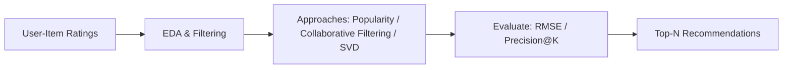
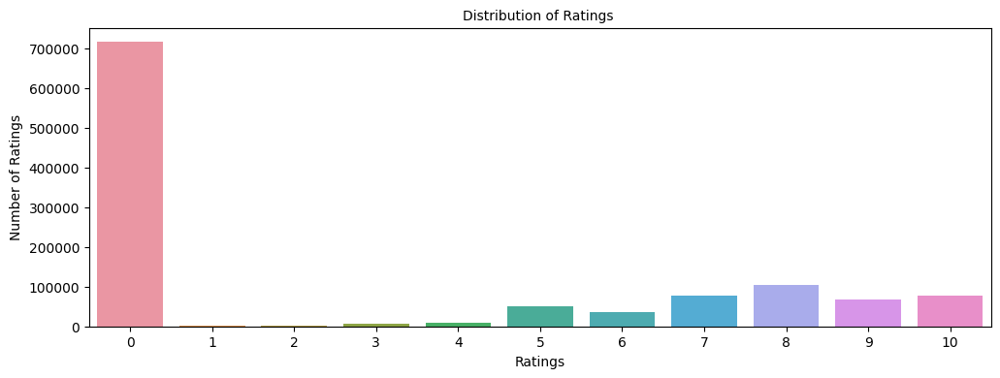
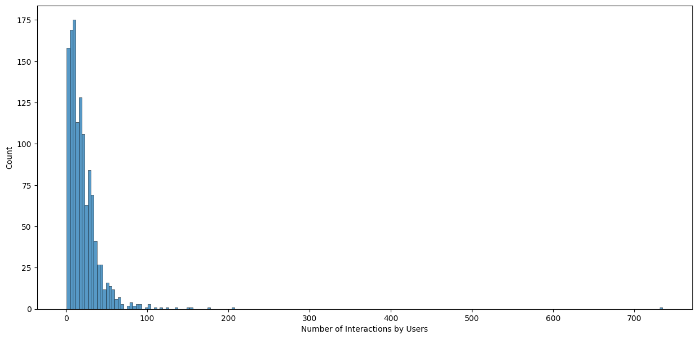
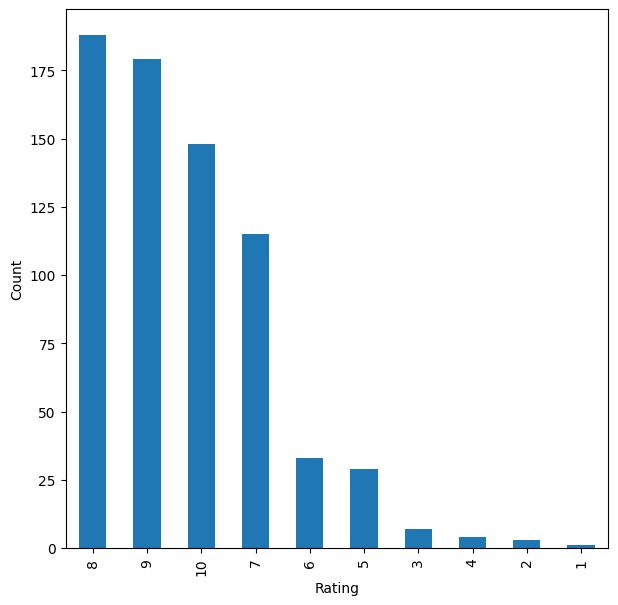
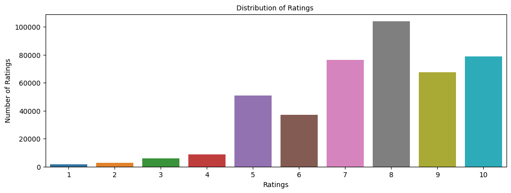

# Building a Product Recommender at Scale

> _Comparing rank-based and collaborative-filtering recommenders on millions of user ratings_

## Overview

I set out to figure out which products to suggest to each shopper so they keep finding things they actually want.

- E-commerce growth makes personalized recommendations a core driver of engagement, conversion, and repeat purchases.
- Goal: predict how a user would rate an unseen item and surface the top items most likely to be relevant to them.
- I treat relevance with a threshold rating of 7 (on a 1-10 scale) to score recommendations as relevant or not.
- I compare four recommender families to see which best balances accuracy and useful top-N ranking.
- Success is measured by RMSE on held-out ratings plus precision@k and recall@k for the recommended lists.

## Methodology



## The Data

_I started with over a million product ratings and cleaned them down to the ones that actually carry signal._

- Raw ratings data held 1,149,780 observations across 7 columns, merged from the ratings and item tables.
- Ratings of 0 dominated (~700K) and represent missing values, so I dropped them, leaving 433,671 real ratings.
- The cleaned set spans 77,805 unique users and 185,973 unique items on a 1-10 explicit rating scale.
- A full user-item matrix would hold ~14.5 billion cells, so the data is extremely sparse with one rating per user-item pair.
- The most-rated item drew 707 ratings and the most active user rated 8,524 items, showing a long-tail of activity.



## Exploratory Analysis

_I looked at how ratings and activity are spread out before deciding how to model them._

- After removing zeros, rating 8 is most common (~100K), followed by 10 and 7 (~80K each); 1-4 are rare.
- This positive skew means relevance (>=7) is common, which shapes how precision and recall behave.
- The user-item interaction distribution is heavily right-skewed: few items get many ratings, most get very few.
- To make modeling tractable I filtered to active users and well-rated items rather than the full sparse matrix.
- These patterns motivate a popularity baseline plus personalized collaborative filtering on the dense core.



## Recommender Approaches

_I built four kinds of recommender, from a simple popularity ranking to a learned matrix-factorization model._

- Model 1 - Rank-based: ranks items by average rating with a minimum-interaction threshold, solving cold start.
- Model 2 - User-user collaborative filtering with KNNBasic and cosine similarity over shared ratings.
- Model 3 - Item-item collaborative filtering, computing similarity between items instead of users.
- Model 4 - Matrix factorization with SVD, learning latent user and item factors via regularized SGD.
- I tuned each model with GridSearchCV and evaluated with RMSE plus precision@k and recall@k.



## Results & Recommendations

_Tuning sharpened every model, and item-based and matrix-factorization approaches gave the most accurate predictions._

- User-user baseline scored RMSE 1.84 with ~0.81 precision and recall; tuning cut RMSE to 1.68 and lifted F1 from 0.81 to 0.86.
- Item-item baseline scored RMSE 1.62 (F1 0.80); tuning improved it to RMSE 1.58 with a slightly better F1.
- SVD matrix factorization beat the user-user baseline on F1, with tuning adding only marginal gains.
- For a known user-item pair the tuned model predicted 7.99 against an actual rating of 8 - a very close fit.
- I recommend rank-based for cold-start and item-based or SVD for personalized top-N once interaction history exists.



## Key Takeaways

_A layered recommender that mixes popularity and learned similarity serves new and returning shoppers alike._

- No single model wins everywhere: popularity covers cold start while CF and SVD personalize for active users.
- Hyperparameter tuning delivered consistent RMSE and F1 gains, justifying GridSearchCV on every algorithm.
- Correcting average ratings by interaction count produced fairer, more trustworthy item rankings.
- Working at ~434K ratings, 78K users, and 186K items proved these methods scale to real e-commerce sparsity.
- Built with: pandas, NumPy, Matplotlib, Seaborn, and scikit-surprise (Reader, Dataset, KNNBasic, SVD, GridSearchCV).

## More Visualizations


## Tech Stack

- **pandas** — data wrangling and tabular manipulation
- **numpy** — fast numerical arrays
- **scikit-learn** — modeling, pipelines, and evaluation
- **seaborn** — statistical visualization
- **matplotlib** — plotting
- **scikit-surprise** — collaborative-filtering recommenders

## How to Run

```bash
python -m venv .venv && source .venv/Scripts/activate  # Windows: .venv\\Scripts\\activate
pip install -r requirements.txt
jupyter notebook "Recommendation_Systems_Practice_Project_Learner_Notebook.ipynb"
```

> Note: large image/zip datasets are not committed; a `data/` note or download link is provided where applicable.

## Notes & Limitations

- Built on a program-provided case study; scope follows the original brief.
- Some deep-learning notebooks were re-run with reduced epochs locally (CPU) — see training curves.
- Metrics reflect the dataset as provided; production use would add monitoring and retraining.

## Attribution

This project was completed as part of the **MIT Applied Data Science Program** (MIT IDSS / Great Learning). The program provided the case-study scaffolding; the analysis, code, and results are my own. Published with permission, for portfolio use only.
