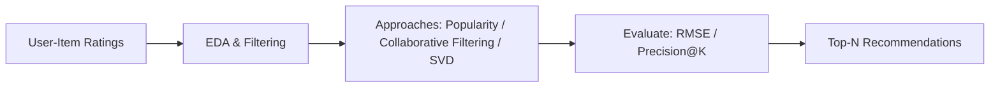
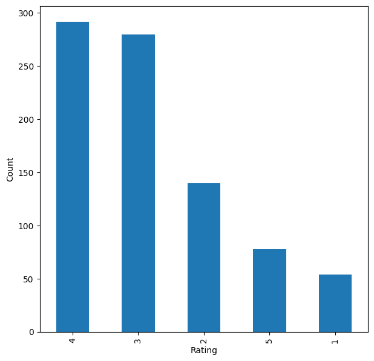
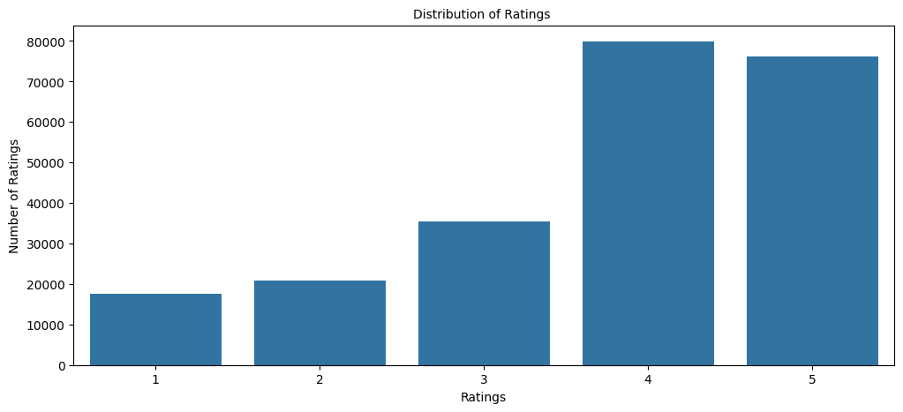

# Yelp Restaurant Recommendation System

> _Recommending restaurants from Yelp reviews using both collaborative filtering and content-based NLP_

## Overview

Help Yelp users discover restaurants they will love by learning from the reviews and ratings other diners have already left.

- Yelp (founded 2004) publishes crowd-sourced reviews of local businesses; the goal is to surface restaurants a user is likely to enjoy.
- Frame the task two ways: predict a user's rating for unseen restaurants, and find restaurants similar to one a user already likes.
- Address the cold-start problem (new users with no history) with a rank-based popularity fallback.
- Optimize both precision and recall so recommendations are relevant and few good restaurants are missed.
- Compare multiple algorithm families to find the strongest recommender for this data.

## Methodology



## The Data (Yelp Reviews)

_The dataset is hundreds of thousands of Yelp restaurant ratings, where each row is one diner rating one restaurant._

- 229,907 rating observations, each a single user-restaurant interaction with no duplicate visits.
- 45,981 unique users and 11,537 unique restaurants, giving an extremely sparse user-item matrix.
- Only ~229K of a possible ~53 x 10^7 ratings exist, so the vast majority of pairs are unrated.
- Part 1 uses a 3-column ratings table; Part 2 adds review text (5 columns) for content-based modeling.
- Data filtered to active users and frequently-rated restaurants to keep modeling computationally efficient.

## Exploratory Analysis

_Looking at the ratings shows most diners only post when they love a place, and a handful of restaurants dominate the reviews._

- Ratings are heavily skewed toward 4 and 5 stars; very few users give 1-3, so people mostly rate places they like.
- Most-reviewed restaurant (businessid hW0NeHTHEAgGF1rAdmR-g) was rated 844 times, yet 45,137 users still haven't seen it.
- Most-active user (fczQCSmaWF78toLEmb0Zsw) rated 588 restaurants, leaving 10,949 unvisited to recommend.
- High-interaction restaurants skew toward 3-4 stars, showing popularity does not guarantee high ratings.
- Rank-based model recommends top restaurants by average rating with a minimum-interaction threshold for cold start.






## Collaborative Filtering

_These models predict how a user would rate a restaurant by learning patterns from similar users and similar restaurants._

- Built with the scikit-surprise library: KNNBasic user-user and item-item similarity models plus SVD matrix factorization.
- Baseline user-user KNN reached ~42% recall and ~80% precision; evaluated with precision@10/recall@10 at a 3.5 threshold.
- GridSearchCV tuned k, similarity metric, and SVD's n_epochs, lr_all, and reg_all to lift performance and lower RMSE.
- Tuned item-item and SVD models clearly beat their baselines; SVD gave the best result at ~51% F1 score.
- Corrected ratings (subtracting 1/sqrt(n)) re-rank top picks so confidence in popular restaurants is rewarded.

## Content-Based (TF-IDF / NLP)

_This approach reads the actual review text to recommend restaurants that are described in similar ways._

- Uses review text as the feature; recommends businesses whose reviews read most similarly to a chosen restaurant.
- Text cleaned with nltk: lowercasing, removing stopwords, punctuation, and non-ASCII characters to reduce noise.
- TF-IDF vectorization extracted 9,729 features from the review corpus.
- Cosine similarity over the TF-IDF vectors ranks the most similar restaurants for a given business.
- For top-rated Asian Cafe Express, most recommendations were 4-5 star restaurants, confirming the system works.

## Key Takeaways

_Combining what diners rate with what they write about produces stronger, more flexible restaurant recommendations._

- Built five recommenders: rank-based, user-user KNN, item-item KNN, SVD matrix factorization, and co-clustering.
- SVD matrix factorization was the best collaborative model (~51% F1); tuning consistently improved item-item and SVD.
- Content-based TF-IDF handles cold-start items and adds recommendations that ratings-only models cannot.
- Collaborative and content-based approaches are complementary and can be blended into a hybrid recommender.
- Built with: pandas, numpy, matplotlib, seaborn, scikit-learn, scikit-surprise, nltk.

## Tech Stack

- **pandas** — data wrangling and tabular manipulation
- **numpy** — fast numerical arrays
- **scikit-learn** — modeling, pipelines, and evaluation
- **seaborn** — statistical visualization
- **matplotlib** — plotting
- **scikit-surprise** — collaborative-filtering recommenders
- **nltk** — text tokenization & stopwords

## How to Run

```bash
python -m venv .venv && source .venv/Scripts/activate  # Windows: .venv\\Scripts\\activate
pip install -r requirements.txt
jupyter notebook "Recommendation_System_Yelp_Part1.ipynb"
```

> Note: large image/zip datasets are not committed; a `data/` note or download link is provided where applicable.

## Notes & Limitations

- Built on a program-provided case study; scope follows the original brief.
- Some deep-learning notebooks were re-run with reduced epochs locally (CPU) — see training curves.
- Metrics reflect the dataset as provided; production use would add monitoring and retraining.

## Attribution

This project was completed as part of the **MIT Applied Data Science Program** (MIT IDSS / Great Learning). The program provided the case-study scaffolding; the analysis, code, and results are my own. Published with permission, for portfolio use only.
