# Used Cars Price Prediction (Capstone)

> _Pricing 7,253 used cars for Cars4U with regression on log price_

## Overview

We built a tool that estimates a fair resale price for any used car so the company can buy and sell with confidence.

- Cars4U, a used-car platform, needs a data-driven way to price inventory instead of relying on manual guesswork and gut feel.
- Goal: predict resale Price from car attributes (year, mileage, engine, brand, location) to spot good deals and price listings fairly.
- Mispricing is costly: overpricing stalls sales while underpricing leaves margin on the table on every transaction.
- Framed as a supervised regression problem on a heavily right-skewed target, modeled on log price to stabilize the distribution.
- Success measured by R-squared and RMSE on a held-out test set across competing model families.

## Methodology


## The Data

_We started with about 7,250 used-car records and cleaned them into a reliable set of roughly 6,000 cars ready for modeling._

- Raw dataset: 7,253 cars across 14 columns including Year, Kilometers_Driven, Fuel_Type, Transmission, Mileage, Engine, Power, Seats and New_price.
- Fixed clear data-entry errors, e.g. a 2017 car logged at 6,500,000 km, and treated impossible 0-value Mileage as missing.
- Imputed missing Mileage, Engine, Power and Seats using brand- and model-level medians extracted from the Name field.
- Engineered a Brand feature from 2,041 unique car names so the model could learn brand value without overfitting to names.
- Final modeling set split 70/30 into 4,212 train and 1,806 test rows with 200 one-hot encoded features.

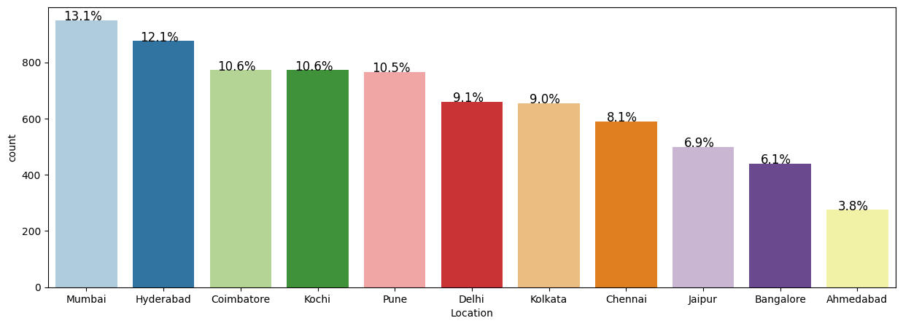

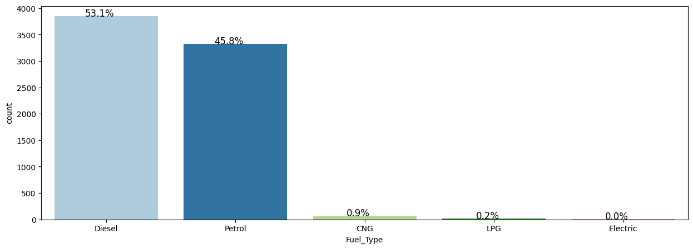

## Exploratory Analysis

_Prices and mileage were extremely lopsided, so we used a log transform to make the patterns clearer and easier to model._

- Both Price and Kilometers_Driven were strongly right-skewed, so log transforms (price_log, kilometers_driven_log) were applied.
- Box plots and histograms exposed long upper tails and luxury-car outliers driving the raw price spread.
- Categorical breakdowns showed listings concentrated in a few cities and dominated by petrol/diesel manual cars.
- Newer manufacturing years and lower kilometers consistently aligned with higher resale prices.
- Log-scaled relationships were far more linear, justifying log price as the modeling target.

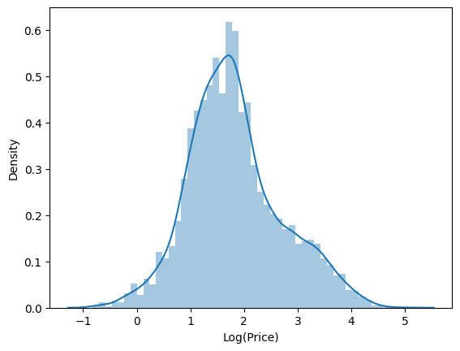

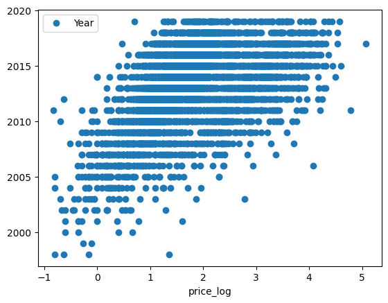

## Key Drivers of Price

_A car's age, how far it's been driven, its power and engine size, brand, and fuel type were the biggest factors in its price._

- Correlation heatmap confirmed Power, Engine and Year are the strongest numeric predictors of log price.
- Newer Year and higher Power/Engine push price up; higher Kilometers_Driven pulls it down.
- Random Forest feature importance flagged Fuel_Type, Mileage, Year and Power/Engine as the dominant signals.
- Brand carries real premium: luxury marques command markedly higher resale value than mass-market brands.
- Location and transmission add secondary, city-level pricing effects on top of the core drivers.

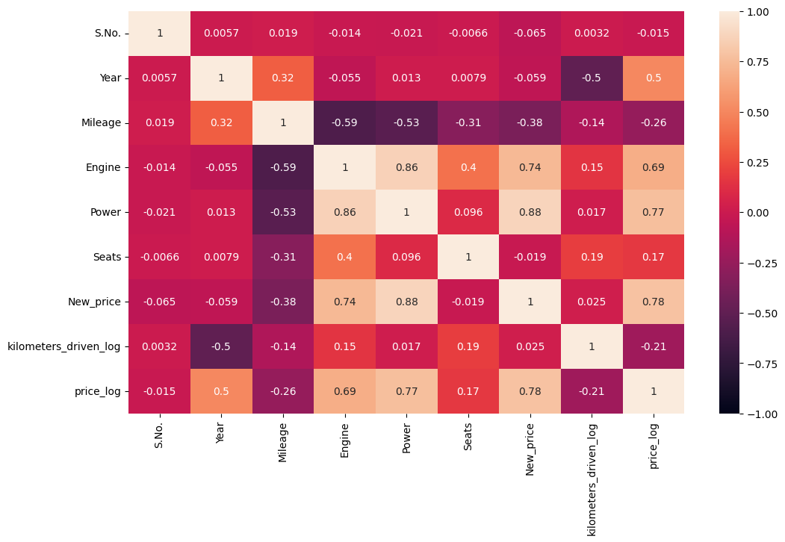

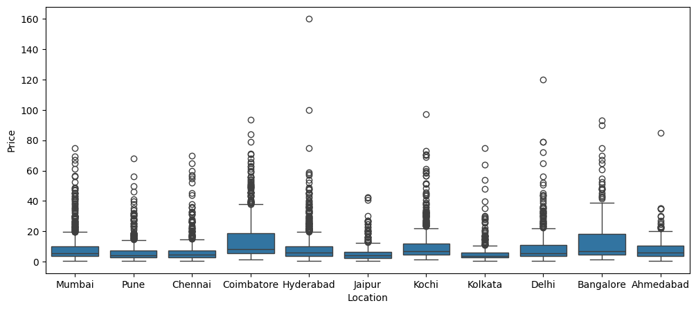

## Modeling & Results

_We tested several prediction methods; the simplest regression on log price was the most accurate and reliable._

- Compared Linear, Ridge and Lasso regression, a Decision Tree and a Random Forest, with tuning for the tree models.
- On log price, Linear/Ridge Regression won: test R-squared 0.948 and RMSE 0.200, explaining ~95% of price variation.
- Random Forest was a close second at test R-squared 0.940 (RMSE 0.214) and strong without heavy tuning.
- Decision Tree hit perfect training R-squared 1.0 but dropped to 0.884 on test, a clear overfitting signal.
- GridSearch/RandomizedSearch tuning controlled tree depth and split size to narrow the train-test gap.

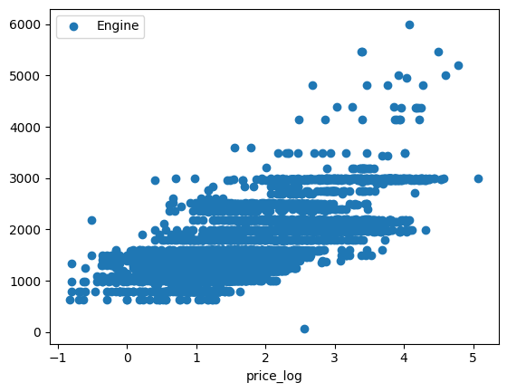

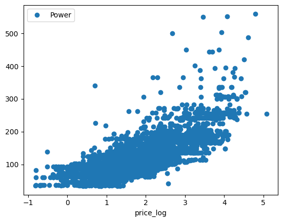

## Business Recommendations

_Adopt the regression pricing model to set listings instantly and flag mispriced cars, with the tree model as a backup._

- Deploy Ridge/Linear Regression on log price (test R-squared 0.948) as the production pricing engine for fast, accurate quotes.
- Use predicted vs. listed price gaps to auto-flag underpriced buys to acquire and overpriced inventory to re-price.
- Prioritize capturing Year, Power, Engine, Mileage, Brand and Fuel_Type cleanly, the features that move price most.
- Keep Random Forest as a robust fallback and retrain periodically on fresh listings to track market drift.
- Built with: pandas, numpy, scikit-learn, statsmodels, matplotlib, seaborn.

## More Visualizations

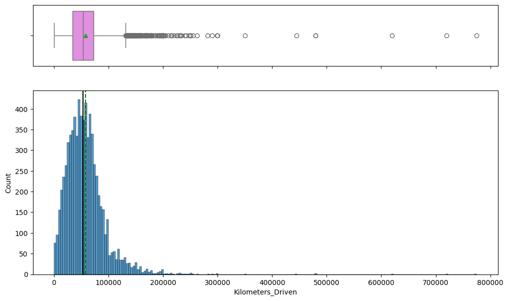
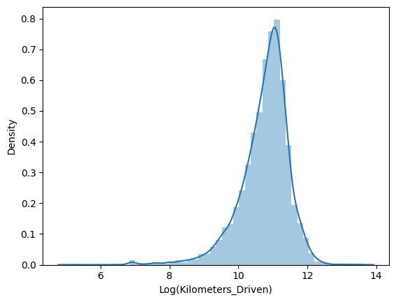
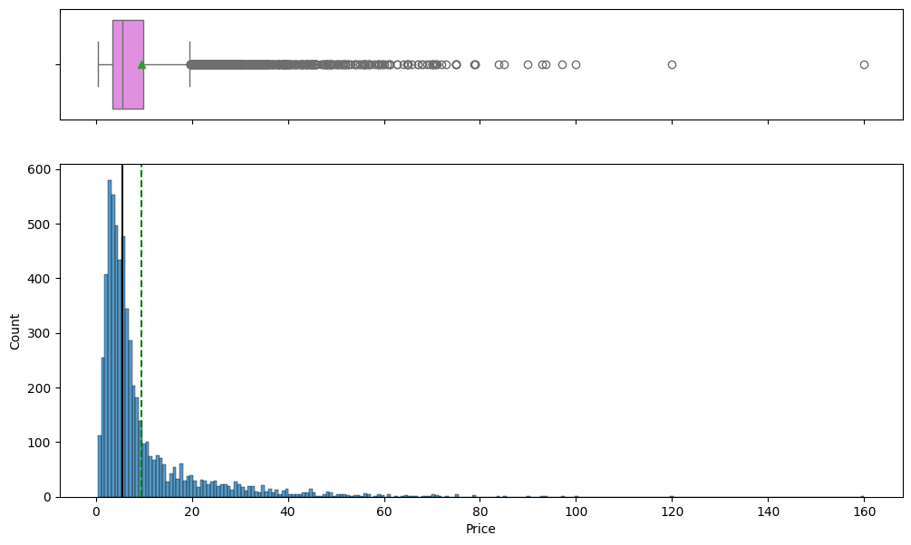
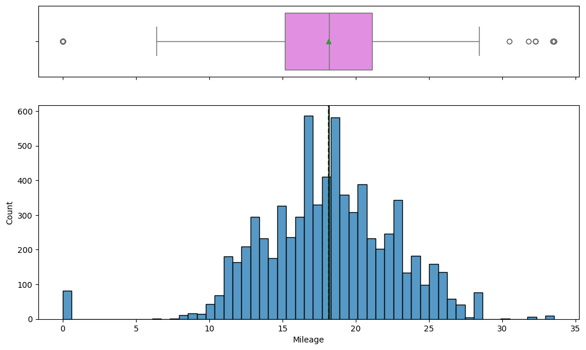


## Tech Stack

- **pandas** — data wrangling and tabular manipulation
- **numpy** — fast numerical arrays
- **scikit-learn** — modeling, pipelines, and evaluation
- **seaborn** — statistical visualization
- **matplotlib** — plotting
- **statsmodels** — OLS / statistical inference & VIF

## How to Run

```bash
python -m venv .venv && source .venv/Scripts/activate  # Windows: .venv\\Scripts\\activate
pip install -r requirements.txt
jupyter notebook "CARS4U_COMPLETED.ipynb"
```

> Note: large image/zip datasets are not committed; a `data/` note or download link is provided where applicable.

## Notes & Limitations

- Built on a program-provided case study; scope follows the original brief.
- Some deep-learning notebooks were re-run with reduced epochs locally (CPU) — see training curves.
- Metrics reflect the dataset as provided; production use would add monitoring and retraining.

## Attribution

This project was completed as part of the **MIT Applied Data Science Program** (MIT IDSS / Great Learning). The program provided the case-study scaffolding; the analysis, code, and results are my own. Published with permission, for portfolio use only.
